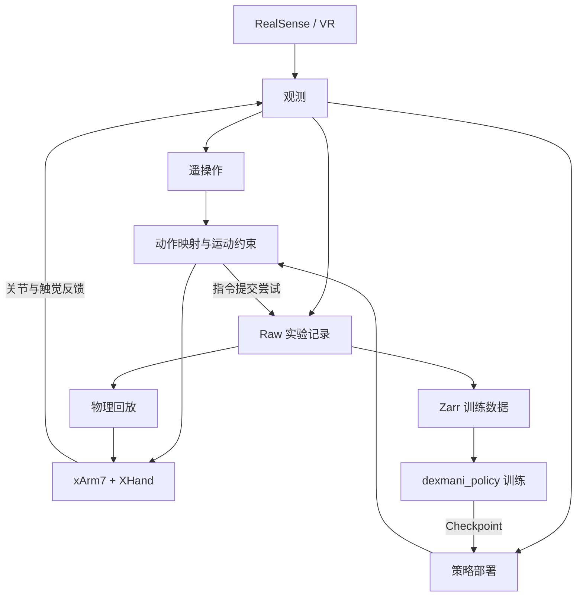

# DexMani Real

面向 xArm7 + XHand 真机灵巧操作实验的 Python 研究代码，使用 RealSense RGB-D 与 VR 采集示教，支持数据导出、策略评估和物理回放。

配套项目 [dexmani_policy](https://github.com/haoyangzhanglab/dexmani_policy) 负责策略训练与模型推理，本仓库负责设备交互、观测构建与动作执行。

## 整体架构


```mermaid
flowchart TD
    sensors[RealSense / VR] --> observation[观测]
    robot[xArm7 + XHand] -->|关节与触觉反馈| observation
    observation --> teleop[遥操作] --> control[动作映射与运动约束] --> robot
    observation --> deployment[策略部署] --> control
    observation --> raw[Raw 实验记录]
    control -->|指令提交尝试| raw
    raw --> export[Zarr 训练数据] --> training[dexmani_policy 训练]
    training -->|Checkpoint| deployment
    raw --> replay[物理回放] --> robot
```

遥操作与策略部署共用设备、观测、控制和录制组件。关节动作直接形成关节目标，末端动作通过局部逆运动学（IK）转换为关节目标。Raw、HOI 和 Zarr 的读取与导出规则见[实验数据](docs/data.md)。

## 实验流程

先完成[相机标定](scripts/calibrate_camera.py)与 [VR 朝向标定](scripts/calibrate_vr_heading.py)。场景点云需要去桌面时，运行[点云工具](scripts/tools/view_pointcloud.py)并选择桌面标定。以下命令在 `real_robot` 环境下从仓库根目录运行。将 `TASK`、`EPISODE`、`CHECKPOINT` 替换为实际任务、录制目录与模型路径。

| 要做的实验 | 命令 |
| --- | --- |
| 查看采集配置（不连接设备） | `python scripts/collect_teleop.py TASK --print-config` |
| VR 采集 / 仅遥操作 | `python scripts/collect_teleop.py TASK` / 加 `--no-record` |
| 键盘调整姿态 | `python scripts/keyboard_teleop.py` |
| 查看记录 | `python scripts/visualize_episode.py EPISODE`（`--no-hoi` 绕过标注，`--max-frames N` 按需读取前 N 帧） |
| 导出训练数据 | `python scripts/export_zarr.py episodes/TASK --output datasets/TASK.zarr --fields joint_state action` |
| 策略评估并录制 | `python scripts/run_policy.py CHECKPOINT --record-raw` |
| 回放臂和手目标完整的 VR 示教 | `python scripts/replay_episode.py episodes/pick/episode_001 --segment 0`（替换实际采集目录，段号从 0 开始） |

HOI 数据先完成[物体资产准备与离线标注](docs/object_reconstruction.md)。具体选项见各入口的 `--help`。

### 从示教训练并部署 CordViP

以下命令使用 `dexmani_policy` 提交 `d87b937` 中的接口。从本仓库根目录运行。示例 Raw 的 `meta.task_label` 为 `pick`，训练命令的 `task_name` 须与它一致。将前三个路径改为实际的 VR 采集目录、已准备好米制网格和 `task.json` 的资产目录、新的实验输出目录。标注和现场部署需要配好 HOI 跟踪后端，完整训练使用带 GPU 的 Policy 环境。

```bash
RAW=/data/episodes/pick
ASSETS=/data/tasks/pick
RUN=/data/experiments/pick_01

python scripts/cordvip/sample_template.py --task-dir "$ASSETS"
python scripts/cordvip/annotate_episodes.py "$RAW" --task-dir "$ASSETS"
python scripts/export_zarr.py "$RAW" --output "$RUN/pick.zarr" \
    --fields joint_state hand_pointcloud object_pointcloud action
python -m dexmani_policy.train --config-name cordvip task_name=pick \
    zarr_path="$RUN/pick.zarr" hydra.run.dir="$RUN/train"
python scripts/run_policy.py "$RUN/train/checkpoints/latest.pt" \
    --task-dir "$ASSETS" --output "$RUN/evaluation"
```

`run_config.yaml` 保存训练处理参数和部署实际使用的场景、手部点云处理参数。场景点云去桌面时记录归一化平面系数。场景点云过滤为空时，在线继续使用最近一次非空结果，直到其来源过期。

物理回放要求先将机器人就位到所选示教段的起点。回放按 Raw 标称频率顺序重发臂和手的绝对目标，慢槽会延长播放时间。目标含 NaN 或越限时，启动检查给出动作字段和 Raw 内从 0 开始的绝对行号。结尾日志的会话耗时包含连接、播放、末端留驻和关闭。

Raw 动作列记录尝试提交的绝对关节目标，实际关节位置由反馈列给出。失败尝试和缺失目标的记录规则见[时间与动作](docs/data.md#时间与动作)。主机时间戳记录采样过程，视频 PTS 取自相对首帧的控制采样时间，两者都无法给出设备执行时延。

实验配置由 [RealConfig](dexmani_real/config/real.py) 组装。用一个可信本地 Python 文件导出 `CONFIG`，将实际设备、工作空间、运动参数集中保存；采集、部署、导出和回放均可传 `--config experiment.py`。例如下面只改变采集周期，其余配置仍须符合实际设备：

```python
from dataclasses import replace
from dexmani_real.config.real import RealConfig

base = RealConfig()
CONFIG = replace(base, teleop=replace(base.teleop, control_hz=20.0))
```

先用 `python scripts/collect_teleop.py TASK --config experiment.py --print-config` 检查声明值；策略的有效配置还会结合 checkpoint 在启动时解析。

VR 朝向标定复用 `CONFIG.vr`：`python scripts/calibrate_vr_heading.py --config experiment.py`，临时端口可用 `--port` 覆盖。相机离线求解须指定候选文件，例如 `python scripts/calibrate_camera.py solve samples/run1 --output candidate_cameras.json`；合法可解的结果即使残差超过经验阈值也会保存并警告。采集或部署用 `--camera-calibration candidate_cameras.json` 选择采用它。

策略的运行预算、动作接续与 HOI 恢复见[策略部署](docs/policy_deployment.md)。

VR 和键盘启动时各自检查控制周期严格短于 `target_max_age_s`。默认 16 Hz 和 30 Hz 均使用 0.25 秒命令租约。

## 核心模块

以下目录均位于 `dexmani_real/` 下。

| 模块 | 职责 |
| --- | --- |
| [sensor](dexmani_real/sensor/) / [ipc](dexmani_real/ipc/) | 采集传感器数据，通过共享内存向消费者提供观测。 |
| [robot](dexmani_real/robot/) / [control](dexmani_real/control/) | 连接设备，读取反馈，完成动作映射、IK 与运动约束。 |
| [runtime](dexmani_real/runtime/) | 组织共享观测、会话状态、资源生命周期、回位与点动。 |
| [teleop](dexmani_real/teleop/) | 将 VR 腕部与手部运动映射为机器人动作，采集示教。 |
| [geometry](dexmani_real/geometry/) / [perception](dexmani_real/perception/) | 提供相机几何、正运动学及场景、手部和物体点云。 |
| [data](dexmani_real/data/) | Raw 录制与读取、HOI 数据写入、Zarr 导出。 |
| [deployment](dexmani_real/deployment/) | 构建模型输入，调度推理与动作序列，组织多段评估。 |
| [replay](dexmani_real/replay/) | 按 Raw 中的连续区间回放关节目标。 |

[config](dexmani_real/config/) 保存实验配置，[utils](dexmani_real/utils/) 提供标定与可视化工具，[assets](assets/) 保存机器人模型和几何模板。

### 修改实验时从哪里入手

| 需求 | 代码入口与职责 |
| --- | --- |
| 改采集过程 | `scripts/collect_teleop.py` → `teleop/run.py` 装配资源 → `TeleopLoop` 运行示教 |
| 改策略执行 | `scripts/run_policy.py` → `PolicySession` 管会话资源 → `Rollout` 管单段控制；`schedule.py` 只计算动作窗口 |
| 改模型观测 | `runtime/observation.py` 读取并检查来源 → `ObservationBuilder.project()` 投影 → `Rollout` 保存历史 → `ObservationBuilder.build()` 构建模型输入。字段依赖见 `FIELD_DEPENDENCIES`。 |
| 改训练数据 | `RawReader` 按需读取并校验输入 → `export.py` 分块派生 → 完整产物发布；失败录制由 `EpisodeRecorder` 向运行层报告 |

直接从 Python 启动策略使用 `PolicySession(runtime, checkpoint, record_raw=True).run()`（从 `dexmani_real.deployment.session` 导入）。HOI 策略还须传 `task_dir="/data/tasks/pick"`。启用 Raw 时默认写入当前工作目录下的 `rollouts/`，可通过 `output_root` 指定其他输出位置。

主进程持有会话与 XHand I/O；机械臂 SDK、相机、VR 与启用的感知任务运行在子进程；策略推理和录制各有自己的工作线程。设备 SDK 留在驱动层，动作映射只生成目标，实际发送归 `Robot`。新增实验优先修改配置和对应流程，独立算法放入现有几何或感知模块。

## 主题文档

- [手部重定向](docs/hand_retargeting.md)：人体关键点到 XHand 关节目标的映射。
- [策略部署](docs/policy_deployment.md)：观测、推理、动作执行与多段评估流程。
- [实验数据](docs/data.md) · Raw 记录、时间、动作与 Zarr 导出。
- [物体重建与 HOI](docs/object_reconstruction.md)：物体资产、固定点云模板及训练与部署流程。
