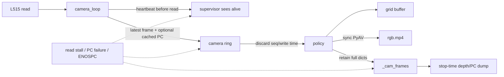
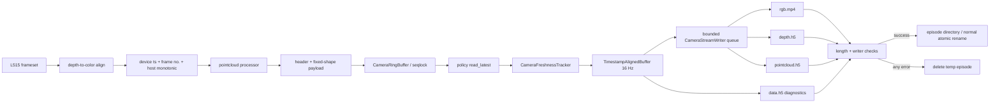

# L515 与相机录制链路完整深度复核及整改说明

> 审查对象：DexMani Real 当前工作树中的 L515、相机共享内存、policy 对齐录制、HDF5 sidecar、质量检查和标定链路
>
> 固定代码基线：`167f15a5f76b798ea5a90e44fe3e478eecc266d2` 及其上的未提交相机整改
>
> 分支：`feat/collection-hardening-r1-o1-i1-a4-r3`
>
> 审查日期：2026-08-09
>
> 安全边界：只进行了静态检查、mock、共享内存和文件 round-trip；未连接、探测或运行 L515、xArm7、XHand、Quest 或 RealSense 真机入口

## 1. 执行摘要

这次整改解决的不是“视频能否写出来”，而是一个更严格的问题：**每一个发布出去的 episode，能否证明其相机数据来自新的、时龄受控的采集帧，点云是否真实有效，所有模态是否与 16 Hz 控制网格严格同长，以及任何写盘失败是否都不会留下貌似完整的目录。**

整改前，整体架构方向是正确的：相机独立进程、seqlock 共享内存、policy 统一拥有 recorder、RGB/深度对齐、保存原始 `uint16` 深度和 `depth_scale`。但链路中存在四个会共同造成“错误数据看起来像好数据”的缺口：

1. 相机 worker 心跳只能证明进程循环仍活着，不能证明有新帧；旧 ring 帧会被 policy 反复复制并静默录制。
2. 点云处理失败会写零数组，但有效性没有贯穿到 recorder；跨 episode 还可能复用上一次点云。
3. `EpisodeRecorder` 同时承担控制网格、PyAV 编码、HDF5 写盘和完整相机数组缓存，热路径阻塞且内存随 episode 线性增长。
4. freshness、帧号、writer 状态、sidecar 长度和实际相机配置没有成为可验证的数据契约。

当前整改已将这些缺口改造成 fail-closed 行为：

- 相机帧携带设备帧号、ring sequence、设备时间戳和 host monotonic 接收时间；
- policy 在每个 episode 内独立判断 freshness，短暂缺帧显式标无效，连续 2 秒停滞则废弃当前 episode，但不把相机数据问题升级为机器人 `FAULT`；
- 逐帧点云处理失败时固定保存零占位，同时 `flag_pointcloud_valid=False`；
- 新增有界 `CameraStreamWriter`，队列满、codec/HDF5/ENOSPC/关闭异常全部视为 episode 级致命错误；
- schema 升级到 v14，RGB、depth、pointcloud 和控制网格必须一一等长，成功前必须完成 writer drain、长度核对和关文件；正常发布路径使用同目录 rename；
- reader 兼容 v14、v13 和 legacy；质量检查和默认过滤器直接消费 freshness/validity，而不是猜测图像内容；
- 标定脚本在多 RealSense 环境下要求显式序列号，并记录实际 profile、畸变、固件和 SDK 信息。

**复核结论：原计划中“坏数据被静默当成好数据发布”的 P0 数据完整性风险已经闭环，内存也已从无界增长改为有界队列。当前没有已知仍开放的 P0 相机录制问题。** P1 层面仍有真机吞吐、标定初始化清理、发布 fallback 非严格原子、点云处理器初始化失败，以及 writer 超时后无法强制终止线程等开放项。

但这不等价于“已经完成真机验收”。仍需重点验证 L515 + 点云处理 + H.264 + 两个 HDF5 sidecar 在目标主机上能否长期稳定满足 16 Hz，以及整改后发现的若干 P1/P2 残余风险。第 13 节单独列出了这些开放项。

## 2. 审查范围、方法与证据等级

### 2.1 覆盖范围

本报告覆盖以下完整链路：

```text
L515 / librealsense
  -> RealSense.read()
  -> camera_loop + pointcloud processor
  -> CameraRingBuffer / SharedStorage
  -> policy CameraFreshnessTracker
  -> TimestampAlignedBuffer
  -> CameraStreamWriter
  -> rgb.mp4 + depth.h5 + pointcloud.h5 + data.h5
  -> EpisodeReader
  -> EpisodeQuality / filter / visualizer / calibration metadata
```

主要源码位置：

- `dexmani_real/config/defaults.py`
- `dexmani_real/sensor/realsense.py`
- `dexmani_real/sensor/camera_process.py`
- `dexmani_real/shm/ring_buffer.py`
- `dexmani_real/shm/shared_storage.py`
- `dexmani_real/policy/vr_teleop_policy.py`
- `dexmani_real/recording/camera_stream_writer.py`
- `dexmani_real/recording/episode_recorder.py`
- `dexmani_real/recording/episode_reader.py`
- `dexmani_real/tools/episode_quality.py`
- `dexmani_real/tools/visualize_episode.py`
- `examples/real/calibrate_camera.py`
- `tests/test_camera_recording.py`

### 2.2 方法

本次使用以下证据：

- 当前工作树与基线 commit 的逐文件 Git diff；
- producer、IPC、consumer、recorder、reader、quality 的正向和反向调用链；
- NumPy dtype/shape、seqlock、时间域、队列容量和原子发布不变量；
- mock camera frame/freshness tracker、并发 ring、慢编码、ENOSPC、v14/v13/legacy round-trip；
- RealSense 和 LeRobot 官方资料，用于核对 L515 版本基线、帧龄、流式编码、depth/color 对齐和遮挡语义。

`understand-diff` 所需的 `.ua/knowledge-graph.json` 当前不存在，因此本次没有生成知识图谱 diff overlay。报告中的影响面来自直接源码调用链，而不是 dashboard 推断。

### 2.3 证据等级

| 等级 | 含义 | 本报告中的例子 |
|---|---|---|
| A | 代码和确定性离线测试直接证明 | writer queue full 会锁存错误；v14 sidecar 与控制长度一致 |
| B | 代码路径明确，但实际频率/时延依赖目标机器 | 8 帧队列最多允许约 0.5 秒编码积压 |
| C | 必须用 L515/USB/磁盘/CPU 真机裁决 | 60 秒 fresh rate、点云有效率、编码 p99、固件兼容性 |

本文不会用 A/B 级静态证据替代 C 级硬件结论。

## 3. 严重度与状态定义

| 等级 | 定义 |
|---|---|
| P0 | 会静默发布错误数据、破坏 episode 完整性，或使坏数据无法与好数据区分 |
| P1 | 可能阻塞控制、导致长录制失败、留下不完整数据或产生明显硬件清理风险 |
| P2 | 降低复现性、诊断能力、兼容性或在特定部署条件下触发错误 |
| P3 | 文档、命名、遥测或防御性改进，不直接破坏主路径 |

状态含义：

- `resolved`：代码、数据契约和离线验证均已闭环；
- `partial`：核心风险已处理，但仍有明确边界未覆盖；
- `open`：本次只识别和记录，没有实现修复；
- `hardware-pending`：静态实现完成，但结论仍需要真机数据。

## 4. 整改前架构及失效机制

整改前的关键问题不是单个函数错误，而是多个“best effort”行为叠加：



这条链路允许以下错误组合：

```text
L515 不再给新帧
-> camera worker 仍更新 heartbeat
-> supervisor 不报 camera death
-> ring 保留旧帧
-> policy 反复读取相同 RGB/depth/pointcloud
-> recorder 没有权威 freshness 字段
-> episode 正常发布
-> 质量工具只看前 10 帧是否全零
-> 冻结数据被判成可用数据
```

同样，点云失败路径会把零数组写入固定形状槽位，但 recorder 没有可靠传播 `pc_num_points=0`；“形状存在”被误当成“数据有效”。

## 5. 全部原始问题索引与整改状态

| ID | 严重度 | 原始问题 | 影响 | 当前状态 |
|---|---:|---|---|---|
| CAM-01 | P0 | worker 心跳和新帧 freshness 混为一谈 | 冻结画面静默进入 episode | resolved |
| CAM-02 | P0 | `frame_number`、ring sequence、采集 monotonic 时间未贯穿 | 无法区分新帧、重复帧和旧 episode 帧 | resolved |
| CAM-03 | P0 | 点云失败写零，但 recorder 默认按有效处理 | 零点云污染训练数据 | resolved/partial（初始化失败可用性） |
| CAM-04 | P0 | `_last_pc` 跨 episode 复用 | 新 episode 首帧可能属于旧 episode | resolved |
| REC-01 | P1 | `add_frame()` 同步 PyAV 编码和 MP4 mux | policy 热路径受 codec/磁盘抖动影响 | resolved |
| REC-02 | P1 | `_cam_frames` 保留 RGB/depth/pointcloud 全数组 | 录制内存随时间线性增长 | resolved |
| REC-03 | P1 | writer queue/drop/error 没有统一致命语义 | 可发布缺帧或半成品目录 | resolved/partial（发布 fallback） |
| DATA-01 | P1 | `camera_health` 从错误层级读取，freshness 注释未执行 | 健康元数据链路名存实亡 | resolved |
| DATA-02 | P1 | RGB/depth/pointcloud/filter 时间轴可能不同长 | 同一 index 不再代表同一控制时刻 | resolved |
| DATA-03 | P1 | synthetic grid-fill 可能继承相机有效标志 | 未来样本/补帧被标成 source-valid | resolved（相机字段） |
| CFG-01 | P2 | 运行采集 640×480，SHM 默认 848×480 | 容量、内存和元数据不一致 | resolved |
| META-01 | P2 | 未记录实际 profile、固件、SDK、对齐和编码参数 | episode 无法复现实验条件 | resolved/partial |
| CAL-01 | P2 | 标定脚本默认选择第一台 RealSense | 多相机时可能标定错误设备 | resolved（标定入口） |
| IPC-01 | P2 | ring 对 dtype/shape/容量使用截断式写入 | 错误配置可能静默截断 payload | resolved |
| ALIGN-01 | P2 | depth-to-color 对齐的洞、遮挡和点云失败没有明确语义 | 物理无效数据与正常数据混淆 | partial |

## 6. 详细问题复核

### 6.1 CAM-01 / CAM-02：进程活着不等于相机有新帧

#### 原始行为

旧 `camera_loop` 在调用 `cam.read()` 前更新 `camera_heartbeat_s`。当 `wait_for_frames()` 持续失败时，worker 循环仍可以活着并不断刷新心跳；supervisor 因而只能看到“进程没有死”，无法看到“帧源已经停了”。

旧 policy 又把 `CameraRingBuffer.read_latest()` 返回的 sequence 丢掉，也没有使用 ring 写入时间、设备帧号或 host monotonic 时间。只要 ring 中曾经写过一帧，后续读取就可能无限返回同一帧。

#### 整改

相机帧契约现在同时携带：

- `frame_number`：RealSense depth frame 的设备帧号；
- `ring_sequence`：每次成功发布到 camera ring 的逻辑序号；
- `camera_device_timestamp_s`：RealSense 设备时间戳；
- `camera_capture_monotonic_s`：host 在 `align.process()` 后接收该 frameset 的 monotonic 时间；
- `camera_age_s`：policy 读取时计算的 host 帧龄；
- `camera_health`、`flag_camera_fresh`。

`CameraFreshnessTracker` 的 fresh 条件是以下条件全部成立：

```text
ring_sequence > 0
and ring_sequence != last_ring_sequence
and frame_number > 0
and frame_number != last_frame_number
and capture_monotonic_s >= episode_started_s
and now - capture_monotonic_s <= max_frame_age_s
and camera_health == 0
```

这组条件分别阻断：没有发布、重复 ring 槽、设备帧冻结、跨 episode 旧帧、过龄帧和显式故障。

#### 心跳语义的最终决定

相机 heartbeat 现在被明确解释为 **worker liveness**，不是 source freshness。读帧失败时仍更新 heartbeat，是为了避免单纯的数据源停滞把整个机器人错误升级到 `FAULT`。source freshness 由帧内 monotonic 时间和 policy tracker 独立判断。

这是一项有意的安全策略：

- 相机进程死亡：supervisor 可按 worker death/heartbeat fault 处理；
- 相机进程活着但帧停滞：当前录制废弃，遥操作继续；
- 没有录制时相机停滞：不触发 camera-only `FAULT`。

#### 2 秒策略

短暂 stale slot 会保留固定形状，并写 `flag_camera_fresh=False`。连续 stale 达到 `recording_stall_abort_s=2.0` 后，policy 调用 `stop_episode(success=False, reason="camera_stall")`，清除 `shared.is_recording`，但不修改 `SafetyState.RUNNING`。

### 6.2 CAM-03 / CAM-04：无效点云和跨 episode 污染

#### 原始行为

点云处理失败时 camera 端会写全零 fixed-shape 数组，并在 header 中设置 `pc_num_points=0`。但旧 recorder 没有可靠读取嵌套 header 中的有效性，`pointcloud_valid` 的默认行为可能把零数组视作正常点云。

更严重的是，旧 camera loop 使用 `_last_pc` 缓存，在 `is_recording` 从 False 切换到 True 后优先复用上一次点云。这跨越了 episode 边界，使新 episode 的第一帧可能含有上一个 episode 的空间场景。

#### 整改

- `_last_pc` 和 `_was_recording` 跨 episode 缓存已删除；
- 每个录制 episode 必须等待本 episode 内实际处理得到的点云；
- processor 已成功初始化、但单帧 `process()` 返回 `None` 或抛异常时，ring 写固定 shape 零数组，header 写 `pc_num_points=0`、`pointcloud_valid=0`；
- policy 将 header validity 提升到顶层，并且 freshness 为 False 时强制令 pointcloud validity 为 False；
- recorder 对每个控制 slot 写入 `flag_pointcloud_valid`；
- sidecar 始终保持固定 `(2048, 6)` 形状，无效行保存全零占位；
- 默认训练过滤 mask 同时要求 camera fresh 和 pointcloud valid。

这里保留零占位而不删除行，是为了维护 `T_control == T_rgb == T_depth == T_pointcloud`。**零值只是结构占位，唯一有效性来源是 flag。**

但反向追踪发现一个可用性边界：如果 `PointCloudProcessor` 在 camera worker 启动时就初始化失败，`zero_pc` 会是 `None`；而 `SharedStorage` 中的 camera ring 仍然按 `(2048, 6)` 点云容量创建。严格 `write()` 会拒绝 `None` payload，因而 RGB/depth 也不会入 ring，episode 最终因 camera stall 废弃。这是 fail-closed，不会污染数据，但没有达到“PC 不可用时仍可录 RGB-D + invalid PC”的降级目标，见 R-15。

### 6.3 REC-01 / REC-02：热路径阻塞与无界内存

旧实现一方面在 `add_frame()` 中同步调用 PyAV，另一方面又把完整 `camera_frame` dict 放入 `_cam_frames`，直到 stop 时再批量写 depth 和 pointcloud。

按当前默认配置计算：

| 单帧载荷 | 字节数 | MiB |
|---|---:|---:|
| RGB `640×480×3 uint8` | 921,600 | 0.879 |
| Depth `640×480 uint16` | 614,400 | 0.586 |
| Pointcloud `2048×6 float32` | 49,152 | 0.047 |
| 合计 | 1,585,152 | 1.512 |

在 16 Hz、60 秒下共有 960 个控制 slot，仅原始数组就约为：

```text
1.512 MiB/frame × 960 frame = 1451.25 MiB ≈ 1.42 GiB
```

这还不包括 Python 容器、编码器、HDF5 chunk cache 和中间数组。

#### 整改

新增 `CameraStreamWriter`：

- 单独 daemon thread；
- `queue.Queue(maxsize=8)`；
- policy `submit()` 只做严格校验、连续化、复制和 `put_nowait()`；
- writer 顺序负责 RGB H.264、depth gzip-1 HDF5、pointcloud gzip-1 HDF5；
- recorder 不再保留 `_cam_frames`、`_cam_grid_end`、`_rgb_encoder`、`_depth_file`。

默认队列的相机数组上界约为：

```text
1.512 MiB/frame × 8 frame = 12.09 MiB
```

因此相机缓冲从“随 episode 时长增长”变为“由配置固定上限”。

需要注意：有界不代表零开销。每个 recording slot 仍要在 `submit()` 中复制约 1.512 MiB，相当于约 24.2 MiB/s 的 policy 本地复制；真机 p99 仍需测量。

### 6.4 REC-03：writer 失败必须让 episode 失败

DexMani 的 16 Hz grid 要求每个控制 slot 都有一个结构对应的 camera slot。与允许视频单独掉帧的系统不同，这里不能在 encoder queue 满时只丢 RGB，因为那会破坏 index 语义。

当前错误策略：

| 故障 | writer 行为 | recorder/policy 行为 | 最终目录 |
|---|---|---|---|
| queue 满 | 锁存 `queue full`，不静默 drop | 下一 policy tick 废弃 episode | 不发布 |
| shape/dtype 错 | 锁存校验错误 | 废弃 episode | 不发布 |
| H.264 codec 异常 | worker 锁存异常 | stop 失败并清理 temp | 不发布 |
| HDF5/ENOSPC | worker 锁存异常 | stop 失败并清理 temp | 不发布 |
| resource close 失败 | 锁存 close error | stop 失败 | 不发布 |
| stop 超时 | 锁存 timeout | stop 失败 | 不发布 |
| 正常 stop | sentinel 排在已提交帧之后，drain 完成 | 校验 writer/control 逻辑计数 | 正常 rename 原子发布 |

`EpisodeRecorder` 只在以下条件全部成立后发布：

```text
writer.close() success
and writer.frame_count == TimestampAlignedBuffer.size
and remaining non-camera HDF5 flush success
and metadata write success
and all files close success
```

正常成功路径使用同一父目录中的 `.tmp_episode_* -> episode_*` `os.rename()`；writer/长度/关文件失败路径删除 temp。但 `_try_rename()` 对任意 `OSError` 都退化到 `copytree()`，该罕见分支可暴露部分 final 目录，所以不能把所有发布路径都称为严格原子，见 R-14。

LeRobot 官方也采用“capture -> bounded queue -> encoder thread -> MP4”的流式编码模式，但其通用数据集 writer 可以在 queue full 时记录并丢帧。DexMani 此处选择更严格的“queue full 即废弃 episode”，因为本项目将 RGB、depth、pointcloud 和机器人控制网格视作一个原子样本集合。参考：[LeRobot Streaming Video Encoding](https://huggingface.co/docs/lerobot/streaming_video_encoding)。

### 6.5 DATA-01：健康元数据链路从注释变成数据契约

旧 recorder 从 `camera_frame` 顶层读取 `camera_health`，但旧 policy 只把 header 作为嵌套字段传递；这使 recorder 得到默认值而非真实 header 内容。freshness 也只有未完成的注释，没有形成数据集。

当前 policy 在 `_read_camera_frame()` 中显式展开 header，并把以下字段传给 recorder：

- `ring_sequence`
- `frame_number`
- `device_timestamp_s`
- `capture_monotonic_s`
- `camera_health`
- `pointcloud_valid`

recorder 再写入 v14 数据集。状态不再依赖“某个 reader 是否知道 header 的嵌套结构”。

### 6.6 DATA-02 / DATA-03：模态同长和 synthetic grid 语义

`TimestampAlignedBuffer` 可能因为 policy 调度抖动一次推进多个 grid slot。单个真实 source sample 会填充前面的 synthetic slot，并且只有最后一个 slot 的 `flag_sample_valid=True`。

相机整改新增以下不变量：

```text
flag_camera_fresh = observed_fresh AND flag_sample_valid
flag_pointcloud_valid = observed_pc_valid AND flag_sample_valid
```

因此一个未来到达的新相机帧即使被数值 forward-fill 到过去 slot，也不会把过去 slot 标成 fresh/valid。

writer 对每一个新增 grid slot 都提交一组 shape-stable payload：

- 真实 fresh slot：写该帧 RGB/depth；点云按 validity 写真实值或零；
- duplicate/stale slot：可以保留相同 RGB/depth，但 freshness=False；点云强制零；
- 完全没有 camera frame：RGB/depth/pointcloud 都写零；两个 validity flag 都为 False；
- synthetic grid-fill：RGB/depth 保持形状，两个 validity flag 都为 False。

当前发布前的强制逻辑检查是：

```text
CameraStreamWriter.frame_count == TimestampAlignedBuffer.size
```

由于 writer 对 RGB encode、depth append 和 pointcloud append 是串行的，且只在三者都返回后增加计数，这个检查能发现明确中断。schema 契约仍然要求四模态物理长度均等于 T；质量工具会在发布后重新打开 sidecar 并解码 RGB 做独立长度校验，发布前物理 round-trip 缺口见 R-16。

### 6.7 CFG-01 / META-01：单一配置源和复现元数据

`CameraParams` 现在统一定义：

| 字段 | 默认值 | 语义 |
|---|---:|---|
| `serial` | `None` | canonical 相机序列号，可由配置覆盖 |
| `width`, `height` | `640`, `480` | color/depth 和 SHM 的共同图像平面 |
| `fps` | `30` | RealSense stream profile |
| `align_mode` | `depth_to_color` | 输出几何和点云 RGB 对应关系 |
| `warmup_frames` | `10` | pipeline 预热 |
| `max_frame_age_s` | `0.25` | 单帧 freshness 上限 |
| `recording_stall_abort_s` | `2.0` | 连续 stale episode 废弃阈值 |
| `ring_maxlen` | `5` | camera seqlock ring 容量 |
| `pointcloud_num_points` | `2048` | fixed-shape 点数 |
| `writer_queue_size` | `8` | recorder 后台写队列上限 |

SHM shapes、camera process、recorder writer 和 metadata 均从这一对象派生，不再出现运行 640×480、SHM 却按 848×480 分配的分裂。

v14 `/meta` 记录：

- requested config：width、height、fps、align mode、freshness/stall threshold；
- actual camera：serial、firmware、SDK version、active color/depth profile JSON；
- geometry：`camera_K`、`depth_scale`、标定外参；
- writer：queue size、codec、CRF、preset、pixel format、编码宽高和 fps；
- sidecar：depth `uint16/gzip-1`、pointcloud `float32/gzip-1`。

RealSense 官方 release notes 明确指出 L515 最后经过验证的 librealsense 版本是 2.50.0；较新的 2.54.2 虽保留支持但未验证，2.55.1 已移除 L515 支持。因此项目应记录实际版本并避免盲目升级，而不是把“能 import pyrealsense2”当成兼容证明。参考：[librealsense Release Notes](https://github.com/realsenseai/librealsense/wiki/Release-Notes)。

当前 `real_robot` 环境的 `conda list pyrealsense2` 和 `python -m pip show pyrealsense2` 均查不到包管理元数据。这不能证明 runtime module 一定不存在，但说明不能从 conda/pip manifest 追溯实际 SDK 版本；本次遵守硬件安全边界，没有为此导入 SDK 或枚举设备。

### 6.8 CAL-01：标定相机身份和 provenance

标定入口新增 `--serial`：

- 显式序列号不存在时立即失败；
- 未指定序列号且连接设备数不是 1 时立即失败；
- `rs.config.enable_device(selected_serial)` 固定设备；
- pipeline 启动后再次核对实际 serial；
- 写 `calibration_capture`，包括采集时间、固件、SDK、实际 color profile、内参和 distortion model/coefficients。

`CameraCalib` runtime 仍以 live hardware intrinsics 为准；`calibration_capture` 只用于 provenance，不改变既有 eye-to-hand 坐标系和标定质量门限。

### 6.9 IPC-01：ring 禁止静默截断

旧 ring 使用 `min(payload.nbytes, capacity)`，错误 shape 或超容量时可能只写一部分 payload。当前 `CameraRingBuffer.write()` 在改变 sequence 之前验证：

- header 必须是 shape `(1,)` 且 dtype 精确等于 `CAMERA_FRAME_HEADER_DTYPE`；
- RGB 必须是 `(H,W,3) uint8`、depth 必须是 `(H,W) uint16`；
- payload 必须 C-contiguous；
- shape 和 nbytes 必须精确等于 ring capacity；
- pointcloud 必须是配置的 `(N,6) float32`；
- header 中的 shape/size 必须与 payload 一致；
- `pc_num_points` 不得超过容量；
- `pointcloud_valid` 必须与 `pc_num_points > 0` 一致；
- 没有 PC capacity 的 ring 不接受 PC header 或 payload。

seqlock 仍保持 odd -> payload -> even 协议，reader 在复制后复核 sequence，出现覆盖或 torn read 时返回 `None`，而不是混合帧。

### 6.10 ALIGN-01：depth-to-color 对齐的真实边界

当前 pointcloud 需要 RGB 和 depth 在同一像素平面，因此默认 `depth_to_color` 是合理选择。但对齐不是“数据天然完美”：depth 和 RGB 传感器位置不同，遮挡处可能映射错误；depth 投影到更高密度 color 平面时还会产生空洞。RealSense 官方说明了这些遮挡、重投影和空洞机制：[Projection, Texture-Mapping and Occlusion](https://dev.realsenseai.com/docs/projection-texture-mapping-and-occlusion-with-intel-realsense-depth-cameras/)。

本次整改解决的是 **整帧级** 语义：

- 点云 pipeline 整体失败 -> `flag_pointcloud_valid=False`；
- 点云存在 -> fixed-shape 数据和 flag 同步发布；
- stale RGB-D -> 点云不得继续标有效。

它没有增加 per-pixel depth-valid mask、occlusion mask 或点云有效点比例。因此“flag=True”表示 pointcloud processor 成功产出了 fixed-size 样本，不表示每个原始 depth pixel 都有有效测量，也不表示所有 RGB 纹理都没有遮挡误投影。

## 7. 整改后的端到端架构



### 7.1 时间域

| 字段 | 时钟域 | 用途 | 是否用于 freshness |
|---|---|---|---|
| `camera_device_timestamp_s` | RealSense device clock | 设备侧诊断、掉帧/重置分析 | 否，未做 host clock 映射 |
| `camera_capture_monotonic_s` | host monotonic，align 后接收时刻 | 跨进程 age 和 episode boundary | 是 |
| `camera_age_s` | policy monotonic - capture monotonic | 每个控制 slot 的实时帧龄 | 是 |
| `timestamp` | recorder 合成 16 Hz grid | 多模态训练 index | 否，它是目标网格而非相机采集时刻 |
| ring slot write ns | host monotonic ns | seqlock ring 内部诊断 | 当前未持久化 |

必须特别说明：当前名为 `capture_monotonic_s` 的值是在 `align.process()` 之后读取的 host 时间，更准确地说是 **host receive-after-align time**，不是曝光时刻。它适合检测“缓存多久”和跨 episode 旧帧，但不能替代相机硬件曝光时间做亚帧级多传感器同步。

### 7.2 freshness 状态序列

```text
episode start
  -> reset(last seq/frame, stale timer)
  -> old ring frame captured before start: stale
  -> first new seq + new device frame within 250 ms: fresh
  -> repeated seq or repeated frame number: stale
  -> new frame arrives: stale timer reset
  -> continuous stale >= 2.0 s: discard episode
  -> teleoperation state remains RUNNING
```

### 7.3 发布协议

```text
start_episode
  -> create .tmp_episode_*
  -> start CameraStreamWriter

add_frame × N
  -> advance control grid
  -> write camera diagnostics to TimestampAlignedBuffer
  -> submit exactly k camera items for k new grid slots

stop_episode
  -> immediately reject further add_frame
  -> async stop thread drains writer
  -> flush data.h5
  -> compare camera_frame_count with grid size
  -> write final metadata and close all files
  -> normal path: same-directory os.rename temp directory to final name

any exception
  -> latch stop_error
  -> best-effort close
  -> delete temp directory
  -> never publish final directory
```

上图是应当保持的发布协议。当前 `_try_rename()` 的 `copytree()` fallback 是例外：它不满足“final 名称下不可见中间状态”，应按 R-14 修复后才能宣称所有发布路径严格原子。

## 8. Schema v14 完整语义

### 8.1 目录布局

```text
episode_YYYYMMDD_HHMMSS/
├── data.h5
├── depth.h5
├── pointcloud.h5
└── rgb.mp4
```

### 8.2 新增逐帧字段

| Dataset | dtype/shape | 语义 | 无效值 |
|---|---|---|---|
| `flag_camera_fresh` | `(T,) bool` | 本 slot 是否来自本 episode 内、未重复、未过龄的健康新帧 | `False` |
| `flag_pointcloud_valid` | `(T,) bool` | 本 slot 的 pointcloud 是否真实有效且 camera fresh | `False` |
| `camera_frame_number` | `(T,) int` | RealSense depth device frame number | `0` |
| `camera_ring_sequence` | `(T,) int` | camera ring 逻辑发布序号 | `0` |
| `camera_device_timestamp_s` | `(T,) float` | RealSense device timestamp | `NaN` |
| `camera_capture_monotonic_s` | `(T,) float` | host receive-after-align monotonic time | `NaN` |
| `camera_age_s` | `(T,) float` | policy 读取时的 host age | `NaN/inf` |
| `camera_health` | `(T,) int` | 当前相机帧健康码；缺帧默认非零 | `1` |

### 8.3 Sidecar 语义

| 文件 | Dataset/stream | dtype | 长度规则 |
|---|---|---|---|
| `rgb.mp4` | RGB frames | decode 后 `uint8 (T,H,W,3)` | 必须等于控制 T |
| `depth.h5` | `/depth` | `uint16 (T,H,W)` | 必须等于控制 T |
| `pointcloud.h5` | `/pointcloud` | `float32 (T,N,6)` | 必须等于控制 T |
| `data.h5` | control/state/flags | 多 dtype | 所有时序 dataset 首维为 T |

无效点云行必须为零。stale RGB/depth 可以保留上一 payload 以维持形状和可视诊断，但必须依赖 `flag_camera_fresh=False` 排除；没有任何 camera payload 时使用零占位。

上表是 schema 契约。当前 recorder 发布前校验的是 writer 成功处理计数与 control T，quality 会在发布后重新打开/解码文件检查物理长度。recorder 本身尚未在 rename 前重新打开 HDF5 sidecar 或解码 MP4，见 R-16。

### 8.4 兼容性

`EpisodeReader` 支持：

- legacy 单 HDF5：所有 dataset 在一个文件中；
- v13 目录：pointcloud 在 `data.h5`，depth 在 `depth.h5`，RGB 在 MP4；
- v14 目录：pointcloud 移到 `pointcloud.h5`，其他 sidecar 同上。

`MergedH5File` 按 key 路由 sidecar，所以下游使用 `reader.h5f["depth"]` 和 `reader.h5f["pointcloud"]` 时不需要知道物理文件位置。旧 episode 缺少 v14 flags 时，reader 不伪造“有效”，由上层采用 legacy fallback。

这次没有迁移到 LeRobot Dataset v3。DexMani 仍保留 policy 单时钟所有权、16 Hz 合成控制网格和现有 episode 目录格式。

## 9. 质量检查和训练过滤

### 9.1 v14 权威指标

质量工具不再用“前十帧不是全零”推断相机健康，而是直接统计：

- camera fresh percentage；
- stale slot 数量和最长连续 stale run；
- 相邻重复 device frame number 次数；
- invalid pointcloud slot 数量；
- writer error metadata；
- RGB/depth/pointcloud/control 首维长度。

静态场景可能产生内容相同的连续 RGB，因此 v14 不再把像素内容重复率当作 source freeze 的权威证据。device frame number 和 freshness flag 更接近真实采集状态。

### 9.2 默认过滤

`build_filter_mask()` 默认：

```text
drop_camera_stale = True
drop_invalid_pointcloud = True
```

这意味着外部训练流程若使用官方质量过滤入口，会自动排除冻结、过龄、跨 episode 和无效点云 slot。

### 9.3 过滤后的 sidecar

旧 filter 只过滤 `data.h5`，却直接复制完整 depth/RGB sidecar，导致过滤后 index 错位。当前实现：

- 按同一 mask 重写 `depth.h5`；
- 按同一 mask 重写 `pointcloud.h5`；
- 解码 RGB、按 mask 选择并重新编码 MP4；
- 更新 `num_frames`、grid duration 和 `camera_stream_frames`。

在 RGB 解码/重编码成功的正常路径上，过滤后的四个模态共享同一时间轴。异常路径目前只记 warning 仍可留下不完整输出，见 R-07。

## 10. 外部实现对照与设计取舍

### 10.1 LeRobot camera freshness

LeRobot 相机 API 区分 blocking read、等待未消费新帧的 async read，以及带 `max_age_ms` 的 nonblocking `read_latest()`；过龄帧会显式超时，而不是被当成新帧。参考：[LeRobot Cameras](https://huggingface.co/docs/lerobot/main/en/cameras) 和 [RealSense implementation](https://raw.githubusercontent.com/huggingface/lerobot/main/src/lerobot/cameras/realsense/camera_realsense.py)。

DexMani 没有直接替换现有独立进程 + seqlock 架构，而是把同样的原则映射为：camera producer 发布 host monotonic 时间，policy reader 执行 age/sequence/frame-number gate。

### 10.2 LeRobot streaming encoding

LeRobot 的核心经验是把实时编码放到有界后台队列，避免 episode stop 时一次性编码所有帧。DexMani 采用相同的资源隔离思路，但在 queue overflow 策略上更严格：

| 行为 | LeRobot 通用 writer | DexMani v14 |
|---|---|---|
| queue 满 | 可记录并丢视频帧 | episode 致命错误 |
| 数据目标 | 通用多相机数据集 | 控制/RGB-D/PC 原子网格 |
| stop | drain encoder | drain 后核对 writer/control 计数；quality 再验物理长度 |
| 缺帧容忍 | 由数据集统计表达 | 不允许发布长度不一致 episode |

### 10.3 RealSense alignment

RealSense 官方资料说明 color/depth 来自不同光学中心，重投影需要处理遮挡、多个 depth pixel 映射同一 color pixel、空洞等问题。DexMani 当前保留 `depth_to_color`，是因为 pointcloud 需要按 RGB 像素取色；但训练时仍应尊重 depth zero、pointcloud validity 和场景相关的过滤质量。

## 11. 自动化验证与结果

### 11.1 新增相机专项测试

`tests/test_camera_recording.py` 当前包含 11 个确定性测试：

| 测试 | 覆盖不变量 |
|---|---|
| freshness duplicate/old/cross-episode/recovery | sequence、frame number、age、episode boundary、stale timer reset |
| ring metadata round-trip | header、RGB、depth、PC 和 logical sequence 完整传播 |
| ring strict validation | 错 dtype、错误 header shape、错误 PC capacity 明确失败 |
| concurrent ring read | writer 覆盖期间不返回 torn RGB/depth/PC 混合帧 |
| writer normal close | RGB/depth/PC 写入数量一致，资源正常关闭 |
| slow encoder queue full | 有界队列满时锁存致命错误，不静默 drop |
| writer ENOSPC/OSError | 线程异常传播到 recorder |
| schema v14 round-trip | flags、frame number、metadata、sidecar 和零 PC 占位 |
| grid backfill | synthetic slot 的 camera/PC validity 必须为 False |
| v13 + legacy reader | 旧格式继续可读 |
| writer failure cleanup | writer 失败时不生成 final 目录，temp 被清理 |
| quality/filter flags | freshness/PC 统计和默认训练 mask |

其中测试函数数量为 11；上表把一个综合测试的多个断言拆开描述，因此显示为更多覆盖项。

### 11.2 已运行命令

```text
conda run -n real_robot pytest -q tests
  101 passed in 1.65s

conda run -n real_robot mypy dexmani_real/
  Success: no issues found in 58 source files

conda run -n real_robot python -m compileall -q dexmani_real examples/real
  passed

black --check <本次 16 个 Python 改动/新增文件>
  16 files would be left unchanged

isort --check-only <本次 16 个 Python 改动/新增文件>
  passed

git diff --check
  passed
```

仓库级 Black 仍报告 5 个本次未修改的既有文件需要格式化：

- `dexmani_real/teleop/tag_retargeting/pin_grad.py`
- `dexmani_real/teleop/hand_retarget.py`
- `examples/real/test_pointcloud_process.py`
- `dexmani_real/sensor/pointcloud_processor.py`
- `examples/real/replay_traj.py`

仓库级 isort 检查通过。

### 11.3 未运行

- RealSense 设备枚举、连接、硬件 reset、profile resolve；
- L515 60 秒稳定录制；
- USB 3 带宽和断流测试；
- xArm/XHand/VR 进程；
- 遥操作、回放、归位、相机/VR 标定；
- 真机 ENOSPC、真实拔线或固件异常注入；
- 完整 mocked `camera_loop` 的启动失败、连续 read error/恢复、processor 初始化失败和进程退出集成路径；
- 成功发布时 `os.rename()` 异常分支及部分 `copytree()` 的故障注入；
- 长时间录制的 RSS 稳定性和 writer queue high-water mark。

## 12. 已确认不需要改变的架构决策

以下设计在本次反向复核中仍然成立：

1. 相机保持独立 process，SDK 对象不跨进程共享。
2. 所有相机 payload 通过 `SharedStorage` 和 seqlock ring 传递。
3. policy 继续唯一拥有 `EpisodeRecorder`，保持一个录制时钟域。
4. recorder 继续以 `1/control_hz` 的合成网格对齐，不改成 arrival-time dataset。
5. camera ring 是 latest-wins；writer queue 是 ordered/bounded，两者语义不同。
6. 相机 source stall 只废弃数据 episode，不改变机器人运行安全状态。
7. invalid payload 保留固定 shape，但必须有独立 validity；不能用数组是否存在推断有效。
8. 旧 v13/legacy episode 继续通过 reader 兼容，不原地改变旧数据含义。
9. 不迁移 LeRobot Dataset v3，只吸收 freshness 和流式编码原则。

## 13. 整改后仍开放的风险

以下问题是本次完整复核中新确认或明确保留的边界。它们没有推翻 v14 整改，但不能在交付时被隐藏。

### R-01 — P1 / hardware-pending：16 Hz 真机吞吐尚未证明

camera loop 的注释显示 pointcloud 处理约 46 ms；此外还需要 RealSense 等帧、align、RGB 转换、SHM 写入、policy 读取复制、H.264 和两个 HDF5 append。writer queue 只有 8 帧，即 16 Hz 下约 0.5 秒余量。

当前测试证明“跟不上时会安全失败”，不证明“目标主机一定跟得上”。若稳定 fresh rate 低于控制网格，episode 会出现大量 `flag_camera_fresh=False`；若 writer 持续落后，整个 episode 会被废弃。

建议：真机记录 capture/process/ring-read/submit/encode/HDF5 各阶段 p50/p95/p99、queue peak 和进程 RSS，再决定是否调整 codec、压缩、线程或 queue。

### R-02 — P1 / open：标定脚本的启动失败清理窗口

`calibrate_camera.py` 在 arm worker 已启动并进入 `ARMED` 后才执行 `pipeline.start()`、profile/firmware 读取、warmup 和 GUI 初始化，而主 `try/finally` 从这些步骤之后才开始。

因此 pipeline start、firmware/profile 查询、warmup 或 `cv2.namedWindow()` 若抛异常，可能绕过脚本内的 `shutdown_processes()` 和 `pipeline.stop()`。arm process 是 daemon，主进程退出通常会终止它，但这不是协调停机，也不应作为硬件安全保证。

建议：把 camera pipeline、keyboard 和 GUI 建立全部纳入统一资源栈；任何初始化异常都先停止 arm command、切回安全状态、shutdown worker，再释放 camera/GUI。

### R-03 — P2 / open：policy 仍无条件复制完整 camera ring payload

policy 主循环每 tick 都调用 `_read_camera_frame(shared)`，即使 `recording_active=False`。camera process 虽然只在录制时写 ring，但一旦完成过一次录制，ring 会保留最后一帧；之后 policy 仍可能在每个 tick 复制约 1.512 MiB 的 stale payload，约 24.2 MiB/s。

建议：先读小 header/sequence，只有 recording 或下游明确需要时再复制 RGB/depth/PC；至少在 VR-only 非录制路径跳过 camera payload。

### R-04 — P2 / open：canonical 采集仍可默认选择第一台 RealSense

标定入口已经要求唯一设备或显式 `--serial`，但 canonical camera `CameraParams.serial=None` 时，`RealSense._find_default_serial_in_context()` 仍选择 `query_devices()[0]`。当前“单 L515”假设下可接受，多 RealSense 环境下仍可能连接非预期设备。

建议：canonical 入口也采用“显式 serial 或恰好一台设备”的规则；启动日志和 episode metadata 核对 requested serial 与 actual serial。

### R-05 — P2 / open：JSON override 不会重新运行 dataclass 校验

`CameraParams.__post_init__()` 校验 width/height/fps、age/stall 和容量关系，但 `load_config_json()` 在对象构造后直接 `setattr()`，不会重新执行 `__post_init__()`。因此 JSON 可以注入 `width<=0`、`stall<=max_age` 或不合法 align mode，错误会推迟到子模块甚至硬件启动阶段。

建议：所有 override 应先建立候选 dataclass 或调用统一 `validate()`，整组验证成功后再原子更新 singleton。
### R-06 — P2 / open：失败 episode 没有持久化 aborted manifest

writer 错误会正确删除 temp episode，并通过日志/`StopResult.error` 报告；但删除后没有一个小型、持久化的 manifest 记录 episode id、失败原因、已写帧数、queue depth 和磁盘状态。

这不会污染数据集，但降低批量采集后的失败率统计和根因追溯能力。

建议：在独立 `failed_episodes.jsonl` 或运行日志中写小型原子事件，不保留大 payload 和半成品目录。

### R-07 — P2 / open：质量 filter 输出不是原子事务

录制发布本身是 fail-closed 的，但 `EpisodeQuality.filter()` 先创建输出 `data.h5`/sidecar，再尝试重编码 RGB。RGB 异常被捕获为 warning，当前仍可能留下缺少或未正确过滤 RGB 的输出目录，并设置 `result.output_path`。

输出名固定沿用输入 episode 名，也没有在写入前拒绝已存在的目标；`h5py.File(..., "w")` 可覆盖旧 `data.h5`。因此该问题同时涉及半成品可见性和重复运行的覆盖风险。

建议：filter 也使用临时目录、四模态长度校验和原子 rename；RGB 重编码失败应删除临时输出，而不是仅 warning。

### R-08 — P2 / partial：host freshness 不能发现所有积压和帧号异常

host monotonic 时间在 frameset 从 SDK 返回并完成 align 后采样。它能发现重复帧和 policy 持有旧帧，但如果 SDK 持续返回 frame number 递增、实际却积压很久的帧，新的 host receipt time 仍可能看起来 fresh。

`CameraFreshnessTracker` 对 frame number 的条件是“与上一帧不等”，而不是单调递增；这避免了简单 `>` 对设备计数器回卷的误判，但也会接受反复切换的回退帧号。当前 quality 只统计相邻相等的 frame number，不统计回退、跳号和与名义 30 Hz 不一致的 cadence。

`camera_device_timestamp_s` 已保存，但尚未建立 device clock 到 host monotonic 的映射，也未在 quality 中检查设备 timestamp 的跳变、回退或长期速率偏差。

建议：真机测量 device timestamp delta 与 host receive delta；若发现 backlog，增加设备时钟映射或 pipeline queue/arrival latency 指标。

### R-09 — P2 / partial：点云有效性仍是整帧二值

header 有 `pc_num_points`，但 v14 没有逐 slot 持久化它；当前 processor 成功时通常固定采样 2048 点。没有记录：

- 原始有效 depth pixel 数；
- workspace crop 后点数；
- duplicate padding 比例；
- depth zero/空洞比例；
- occlusion 或 RGB texture projection 质量。

因此 `flag_pointcloud_valid=True` 只表示 pipeline 成功返回 fixed-size 数组，不表示几何质量完全相同。

建议：增加轻量诊断字段，如 `pc_source_points`、`pc_valid_depth_ratio`、`pc_padded_points`，而不是扩大主 payload。

### R-10 — P2 / contract risk：外部 consumer 必须尊重 validity

官方 quality/filter 已默认排除 stale 和 invalid PC，但任何绕过 `EpisodeReader`/filter、直接打开 sidecar 的外部训练代码仍可能把 stale RGB/depth 或零 PC 当作数据。

建议：训练 dataset adapter 在 schema>=14 时强制要求两个 flag；缺 flag 的 v14 episode 应拒绝加载，而不是默认 True。

### R-11 — P3 / open：metadata 固定长度和 SDK unknown

SharedStorage 用 64 字节保存 firmware/SDK、2048 字节保存 profile JSON。当前 profile 足够小，但代码以切片截断；一旦 JSON 变大，可能产生不可解析的半个 JSON。某些 pyrealsense2 构建也没有 `__version__`，最终只能记录 `unknown`。

本次对 `real_robot` 环境的 conda 和 pip 包元数据查询都没有找到 `pyrealsense2`，因此现有环境不具备可由包管理器复现的 SDK 版本证据。

建议：增加 `camera_profile_valid`/长度检查，超过容量时启动失败；SDK version 尝试 runtime API、module version 和构建 manifest 多来源解析。

### R-12 — P3 / open：writer 性能遥测不足

`CameraStreamWriter` 暴露当前 `queue_depth` 和最终 `frame_count`，但没有保存 queue high-water mark、单帧 encode/HDF5 duration、close drain duration 和吞吐分位数。这使真机调参只能依赖外部采样。

建议：维护轻量累计计数和 p95/p99 近似值，在 episode meta 中写入最终统计。

### R-13 — P3 / documentation：ring docstring 与严格行为有一处不一致

`CameraRingBuffer.write()` 的参数说明仍写“无 PC capacity 时 pointcloud ignored”，实际实现会拒绝 payload/header。这不影响运行语义，但容易误导新调用者。

建议：把 docstring 改为“without PC capacity, both payload and `pc_num_points` must be absent/zero”。

### R-14 — P1 / open：发布 rename 的通用 `OSError` fallback 破坏严格原子性

temp 和 final 在同一父目录，正常 `os.rename()` 具有原子名称切换语义。但 `_try_rename()` 捕获任意 `OSError` 后直接调用 `shutil.copytree(src, dst)`，不只是针对 `EXDEV`。

如果错误来自权限、目标冲突、I/O 错误或中途磁盘失败，`copytree()` 可在 final 名称下留下部分文件；外层异常处理只清理 temp，不会清理这个部分 final。这与“不发布半成品 episode”的核心不变量直接冲突。

建议：同文件系统发布不做 copy fallback，rename 失败就废弃并报错；若真需跨文件系统，先 copy 到目标文件系统中的第二个隐藏 staging 目录，校验完整后再在目标文件系统内 rename。增加 rename 失败和 copy 中断的故障注入测试。

### R-15 — P1 / open：点云处理器初始化失败时 RGB-D 也无法入 ring

camera worker 只在 processor 初始化成功后根据 processor config 建立 `zero_pc`。初始化失败时 `zero_pc=None`，但 `SharedStorage.camera_ring` 始终带有 `(2048, 6)` 容量；严格 ring 会拒绝 `None` 点云。结果是每帧 ring write 失败，RGB-D 也无法发布，episode 在 2 秒后因 stall 废弃。

该行为对数据完整性是安全的，但与源码中“pointcloud best-effort”的意图不一致，也不满足“保留固定 shape 并显式标 invalid”的降级策略。

建议：从 `camera.pointcloud_shape` 无条件创建 zero placeholder，processor 是否可用只决定 `pc_num_points/pointcloud_valid`；新增 processor import/标定加载/构造失败的 mocked camera-loop 测试，验证 RGB-D 继续入 ring、PC 为零且 validity=False。

### R-16 — P2 / partial：发布前长度核对是逻辑计数，不是物理文件 round-trip

`CameraStreamWriter.frame_count` 在一次 `encoder.write_frame()`、depth append 和 pointcloud append 都返回后增加；`EpisodeRecorder` 在发布前把该计数与 control buffer size 比较。这能发现明确中断和少写，resource close 异常也会失败。

但 recorder 不会在 rename 前重新打开 `depth.h5`/`pointcloud.h5` 检查 dataset shape，也不会解码 `rgb.mp4` 确认真实可读帧数。物理文件的四模态长度核对是由后续 `EpisodeQuality.validate()` 完成的，届时 final 目录已经可见。

建议：HDF5 sidecar 在 close 后、rename 前快速 reopen 检查 shape/dtype；MP4 至少核对容器可打开、stream 参数和解码帧数，或设计一个无需全量保存图像的 muxed-frame 完成性证明。在性能测试前不要盲目把全 MP4 解码加到 stop 热路径。

### R-17 — P3 / observability：`camera_health` 链路已打通，但健康码语义仍很稀疏

camera producer 只在成功得到帧并尝试写 ring 时填 `camera_health=0`；read error 和 ring write error 不会发布新 header，点云失败则由独立 validity 表达。recorder 在没有 camera frame 时默认写 `camera_health=1`。

因此该字段目前主要表示“有帧 0 / 无帧 1”，无法区分 SDK timeout、align 失败、ring 拒绝、处理器不可用等原因。这不影响 freshness 的 fail-closed 结果，但“健康码”不应被解读为完整的错误 taxonomy。若需识别根因，应额外持久化运行级计数器，而不要把失败时的旧 payload 重新发布到 ring。

### R-18 — P1 / open：writer 超时后不能终止卡死的 Python 线程

`CameraStreamWriter.close()` 在 join 超时后会锁存错误并抛异常，但 Python 无法安全强制终止一个正卡在 codec 或文件 I/O 里的 thread。recorder 随后会清理 temp 目录并丢弃 writer 引用；在 Unix 上，旧线程可继续持有已 unlink 文件的打开句柄。

数据不会被发布，但卡死线程、codec 和文件描述符可能残留到 policy 进程退出；若允许后续启动新 episode，还可能累积资源。现有测试覆盖慢 encoder 的 queue full，没有覆盖永不返回的 `write_frame()`/`close()`。

建议：若需覆盖不可信 codec/文件系统卡死，把 camera writer 放到可终止的独立 process，或在超时后禁止新录制并要求 policy 协调退出；不要在旧 writer 尚活着时把“已清理 temp”误当成资源已完全回收。

## 14. 真机验收矩阵

所有以下项目都需要单独授权并确认机器人工作区安全。不得在机器人运动时通过拔线制造故障。

### 14.1 启动前

| 项目 | 方法 | 通过条件 |
|---|---|---|
| 设备身份 | 显式序列号与实际 serial 对照 | 完全一致 |
| USB | 直连主板 USB 3，检查拓扑 | 不经过低速 hub；实际为 USB 3 |
| SDK | 记录 librealsense/pyrealsense2 | 明确版本；L515 基线优先 2.50.0 |
| 固件 | 记录实际 firmware | 与项目验证清单一致，不盲目升级 |
| profile | 启动后读取 color/depth | 两者均为预期 640×480@30 Hz、格式正确 |
| align | metadata 与运行配置 | `depth_to_color` |
| depth scale | live hardware + episode meta | 非零、单位明确、round-trip 一致 |

### 14.2 60 秒稳定录制

建议至少做静态场景和常规操作场景各一次：

- `camera_writer_error == ""`；
- 四模态长度与 `num_frames` 完全一致；
- `camera_frame_number` 对 fresh slot 单调变化；
- `camera_age_s` 的 p95/p99 明显低于 0.25 秒门限；
- 无连续 stale 接近 2 秒；
- fresh rate、pointcloud valid rate、grid-fill rate 有明确统计；
- policy/control loop 不因编码出现明显 overrun；
- policy RSS 在稳定队列下不随时间线性增长；
- episode 结束后的 writer drain 时间可接受；
- RGB/depth 对齐、遮挡边缘、depth holes 和 PC 空间位置人工抽查通过。

在获得真实基线之前，不建议武断设定 PC valid rate 阈值；它取决于桌面标定、workspace crop、场景反射和点云过滤器。camera fresh 则应以接近全量有效为目标，任何规律性重复都需要解释。

### 14.3 故障测试

优先使用 mock 或相机-only、机器人 DISARMED 环境：

| 注入 | 期望 |
|---|---|
| 停止产生新 frame number，worker heartbeat 继续 | freshness=False，2 秒后 episode discard，无机器人 FAULT |
| 短暂 read error 后恢复 | stale timer 复位，后续新帧恢复 fresh |
| pointcloud processor 返回 None/异常 | PC 行全零，flag=False，episode 可继续 |
| pointcloud processor 启动初始化失败 | 当前会 stall/discard；R-15 修复后应为 RGB-D 继续、PC 全零且 flag=False |
| 人为放慢 encoder | queue depth 上升；满时 episode discard，不丢单个 slot 后继续 |
| encoder `write_frame()` 永不返回 | 当前 stop 超时但 thread 可残留；R-18 修复后不得再开新 episode 或必须终止 writer process |
| 模拟 ENOSPC | 无 final episode，temp 清理，错误对 operator 可见 |
| `os.rename()` 失败/`copytree()` 中断 | 当前可留部分 final；R-14 修复后 final 不存在且错误可见 |
| stop 后立即 start | 新 episode 等待旧 stop 完成，不串帧、不复用旧 PC |
| 进程 shutdown 发生在 recording | episode discard，writer 被 join 或明确报 timeout |

### 14.4 数据验收命令

```bash
conda run -n real_robot python -m dexmani_real.tools.episode_quality <episode_dir>
```

应重点检查：

- camera freshness；
- repeated frame number transitions；
- longest stale run；
- invalid pointcloud slots；
- camera stream lengths；
- writer clean；
- synthetic grid-fill rate。

## 15. 运维和升级原则

1. L515 已退役，SDK/固件升级必须先在隔离机器和非运动场景验证。
2. 每次采集都保留实际 serial、firmware、SDK、profile、depth scale 和 encoding metadata。
3. USB 必须直连 USB 3；“进程心跳正常”不能作为相机数据正常的证据。
4. 不删除或修改 validity flag 来提高表面通过率。
5. 不允许训练代码用 `pointcloud != 0`、RGB 非全零或 dataset 存在性替代 validity。
6. queue 满优先调查 CPU/磁盘/codec 和点云 p99，不直接无限增大 queue。
7. 不把 LeRobot 的 drop-on-overflow 策略直接移植到 DexMani 的原子控制网格。
8. schema v14 的新字段是 additive 语义；旧 episode 继续只读兼容，不能回写伪造 flags。

## 16. 最终结论

本次整改完成了三项关键转变：

1. **从“进程健康”转为“数据源可证明新鲜”**：heartbeat、设备帧号、ring sequence、host monotonic age 各自承担清晰职责。
2. **从“尽量保存”转为“先校验、后发布”**：相机 writer 的缺帧、积压、线程或磁盘错误会使 episode 整体失败；正常发布使用同目录 rename，但 R-14 指出的 copy fallback 仍需移除才能宣称全路径严格原子。
3. **从“数组存在即有效”转为“payload 与 validity 分离”**：零占位只维护结构，freshness 和 pointcloud validity 决定样本能否参与训练。

就静态实现和离线验证而言，原先最危险的冻结画面、无效点云被标有效、跨 episode 污染和相机数组无界内存问题已经得到实质性解决。schema v14 也建立了能够被 reader、quality 和训练过滤器共同执行的相机完整性契约。但发布 fallback 和 processor 初始化失败降级仍是明确开放项，不应被包含在“已全部闭环”的口径中。

当前最重要的下一步不是继续扩展 schema，而是先修复 R-14、R-15 和 R-18（发布原子性、processor 初始化降级与 writer 卡死生命周期），收紧 R-02 的标定清理窗口，然后完成 R-01 的 60 秒真机性能与数据验收。R-03 的非录制期 payload 复制是紧随其后的性能优化。只有这些证据完成后，才能把“代码主路径 fail-closed”进一步提升为“目标硬件上稳定可用且全发布路径原子”。

## 17. 参考资料

- [librealsense Release Notes](https://github.com/realsenseai/librealsense/wiki/Release-Notes)
- [RealSense Projection, Texture-Mapping and Occlusion](https://dev.realsenseai.com/docs/projection-texture-mapping-and-occlusion-with-intel-realsense-depth-cameras/)
- [LeRobot Cameras](https://huggingface.co/docs/lerobot/main/en/cameras)
- [LeRobot RealSense implementation](https://raw.githubusercontent.com/huggingface/lerobot/main/src/lerobot/cameras/realsense/camera_realsense.py)
- [LeRobot Streaming Video Encoding](https://huggingface.co/docs/lerobot/streaming_video_encoding)
