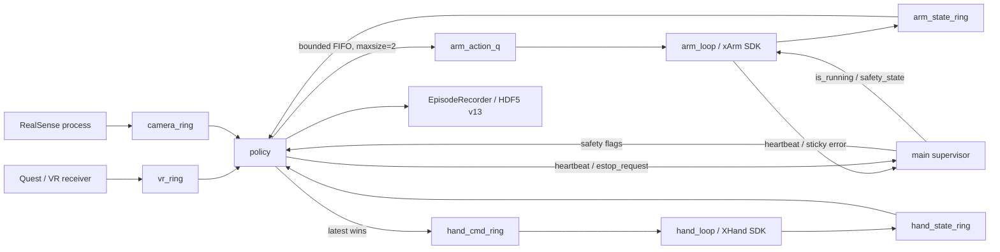

# xArm7 完整闭环深度审查报告

> 审查对象：`dexmani_real@167f15a5f76b798ea5a90e44fe3e478eecc266d2`
>
> 审查日期：2026-08-09（Asia/Shanghai）
>
> 审查方式：静态代码审查、固定版本对照、离线测试；未连接任何硬件
>
> 报告状态：已完成审查，问题尚未修复
>
> 放行结论：**禁止在修复 P0 前执行 live replay；P1 闭环修复前，不应宣称软件状态机能够完整代表控制器状态或提供可确认的软件急停；F-11 修复前，不放行跨越姿态 ±π 表示边界的 VR 旋转操作。**

## 1. 执行摘要

本次审查围绕 xArm7 从命令产生到硬件反馈、故障传播和数据落盘的完整闭环展开，覆盖：

- xArm Python SDK 连接、使能、Mode 0/6、state 0/4、错误清除和返回码语义；
- `policy/entry point → arm_action_q → arm_loop → arm_state_ring → supervisor/recorder`；
- VR、键盘、回放、相机标定和回零等所有机械臂命令生产者；
- IK、角度等价带、关节限位、工作空间、自碰撞和 arm-hand 碰撞；
- heartbeat、sticky fault、软件急停、worker 死亡和 shutdown；
- HDF5 v13 中状态、动作、命令时序、grid-fill 与 replay/quality 消费语义；
- xArm7 目标流的平滑性、Mode 6 重规划节奏、速度/加速度/jerk 配置、关节跟踪精度、FK 模型精度与端到端可测性。

审查确认 16 项问题：1 项 P0、7 项 P1、8 项 P2。

| ID | 等级 | 主题 | 当前结论 |
|---|---:|---|---|
| F-01 | P0 | replay 绕过碰撞与工作空间检查 | 修复前禁止 live replay |
| F-02 | P1 | Mode 6 进入/恢复顺序及后置条件错误 | 可能假 ready 或恢复失败 |
| F-03 | P1 | `DISARMED` 未映射到控制器 state 4 | 软件安全状态失真 |
| F-04 | P1 | 状态读取失败刷新 timestamp | 陈旧反馈被伪装为新鲜状态 |
| F-05 | P1 | 阻塞队列、退出优先级和软件急停竞态 | 故障可能被记为正常退出，stop 不可确认 |
| F-06 | P1 | C24 自动恢复重发原故障目标 | 未消除故障原因 |
| F-07 | P1 | canonical `--no-hand` 启动依赖错误 | 约 1 秒后 policy heartbeat FAULT |
| F-08 | P2 | `action_arm_joint_sent` 语义不是真正 SDK accepted | 数据、回放和质量指标失真 |
| F-09 | P2 | 回零收敛忽略 qvel | 可能运动中提前 ACK/切换 Mode |
| F-10 | P2 | JSON 动力学配置被 CLI 默认值覆盖且绕过校验 | 配置源与真实运行不一致 |
| F-11 | P1 | 姿态 EMA 在 ±π 分支处选择长旋转路径 | 2° 输入可生成 89.5° 中间目标 |
| F-12 | P2 | arm worker 以 30 Hz 重发旧目标 | 可能反复触发 Mode 6 重规划，需实机确认 |
| F-13 | P2 | 平滑参数绑定名义 16 Hz，陈旧动作无 TTL | 抖动/积压会改变目标速度与相位滞后 |
| F-14 | P2 | jerk 未受控，replay 未复现完整动力学 | 运行间和回放间平滑性不可比 |
| F-15 | P2 | tracking/replay 指标未做命令—反馈时齐 | 不能据此声称跟踪精度 |
| F-16 | P2 | FK 使用通用 URDF，缺少机身专属运动学校准 | 不能据内部 FK 声称绝对笛卡尔精度 |

其中 F-11 由确定性离线算例直接复现；F-12 的“重复 SDK 调用”是代码确定事实，但控制器是否对相同目标去重以及对实际速度曲线的影响仍需实机 trace。其余新增项主要影响运动品质、复现性和精度结论的证据充分性。

同时，以下核心路径经反向检查未发现阻断性问题：C22/C31 sticky fault、关节限位与等价带、canonical VR IK 的 workspace/collision gate、回零规划的密集碰撞检查、HomeRequest/HomeResult 关联、seqlock、16 Hz grid-aligned 录制，以及“由 Mode 6 固件负责轨迹平滑、应用层不再做 arm-side 插值”的总体模式选择。

## 2. 审查边界与证据标准

### 2.1 固定基线

| 项目 | 固定提交/版本 | 用途 |
|---|---|---|
| DexMani Real | [`167f15a`](https://github.com/haoyangzhanglab/dexmani_real/tree/167f15a5f76b798ea5a90e44fe3e478eecc266d2) | 主审查对象 |
| lerobot_robot_ufactory | [`e263288`](https://github.com/xArm-Developer/lerobot_robot_ufactory/tree/e2632889b30b392d28a2131e525571db00e76a25) | Mode 6、首次同步、停止策略对照 |
| Xarm7- | [`74d510f`](https://github.com/Awilekong/Xarm7-/tree/74d510fca00fe06dd829fef9c0e7553d3137b3d7) | 返回码封装、Mode 1、stop/e-stop 对照 |
| pi-r2-flow | [`3af52ca`](https://github.com/pi-r2-flow/pi-r2-flow/tree/3af52ca400a6ec7d141416879aa531a6f62f697a) | 多次恢复、流式状态读取对照 |
| xarm-python-sdk | `1.18.4` | 本机真实 SDK 实现与包装层语义 |

参考项目只用于证明某种做法确实存在，不默认其正确。例如，`lerobot_robot_ufactory` 和 `pi-r2-flow` 同样存在返回码漏查，`Xarm7-` 也依赖部分缓存属性。本报告只有在当前实现、SDK 源码、官方文档和运行链路能够互相印证时才确认问题。

### 2.2 风险等级

- **P0**：可能产生未经验证的运动、危险恢复或软件急停失效；修复前停止相关真实硬件操作。
- **P1**：故障未能 fail-closed、控制器 mode/state 与软件状态不一致，或停止结果不可确认。
- **P2**：数据质量、时序、恢复可靠性或操作可观测性显著受损。
- **P3**：维护性、低风险文档或诊断一致性问题。

### 2.3 结论置信度

每项发现使用以下证据类型：

- **代码确定事实**：由当前提交的控制流直接推出，不依赖硬件特性。
- **SDK 确定事实**：由本机 SDK 1.18.4 源码直接推出。
- **官方语义**：由 UFACTORY 官方 Mode、State、错误码或示例支持。
- **实机待确认**：受固件版本、控制箱状态或机械装配影响，不能从 mock 外推。

## 3. 当前闭环架构



正常机械臂命令的真实顺序是：

```text
VR/keyboard/replay/calibration
    → make_arm_action(sequence, created_monotonic_s, qpos)
    → arm_action_q.put(...)
    → arm_loop 接收并更新 last_target
    → set_servo_angle(wait=False, Mode 6)
    → SDK 返回
    → arm_loop 更新 last_cmd_* 诊断
    → get_joint_states()
    → arm_state_ring
    → policy / recorder / supervisor-side consumers
```

这个顺序意味着至少存在五个不能混用的时间点：

1. policy 生成目标；
2. 目标成功入队；
3. arm worker 收到目标；
4. SDK 对运动命令返回成功；
5. 编码器反馈逐步接近目标。

SDK 返回成功不是“机械臂已经执行完毕”。本机 SDK 的 `set_servo_angle(wait=False)` 调用 `move_joint`，成功返回只证明控制器接受了命令；实际到位必须由后续反馈判断。

## 4. xArm SDK 与官方语义核验

### 4.1 Mode 0、1、6

| Mode | 官方用途 | 对应接口 | 本项目用途 |
|---:|---|---|---|
| 0 | 控制器位置规划、点到点关节运动 | `set_servo_angle()` | 回零 milestone |
| 1 | 高频外部 servo 轨迹 | `set_servo_angle_j()` | 未使用 |
| 6 | 关节在线轨迹规划；新目标中断旧目标并从当前位置重规划 | `set_servo_angle(wait=False)` | 正常遥操作、键盘、标定、回放 |

官方来源：

- [UFACTORY 机械臂状态与模式说明](https://docs.ufactory.cc/zhHans/user_manual/ufactoryStudio/10.motion_mode_and_state.html)
- [UFACTORY Mode 6 官方示例](https://github.com/xArm-Developer/xArm-Python-SDK/blob/master/example/wrapper/common/2006-joint_online_trajectory_planning.py)
- [xarm_ros Mode 0/1/6 说明](https://github.com/xarm-developer/xarm_ros#57-xarm_apixarm_msgs-online-planning-modes-added)

官方 Mode 6 示例使用：

```python
arm.set_mode(6)
arm.set_state(0)
```

本项目启动和错误恢复却使用 `set_state(0) → set_mode(6)`；回零恢复又使用了正确的 `set_mode(6) → set_state(0)`，形成内部矛盾。

### 4.2 State 0、2、4、5

| State | 类型 | 语义 |
|---:|---|---|
| 0 | 可设置 | 开启运动；随后反馈通常转为 READY/state 2 |
| 2 | 反馈 | READY，可接收并执行运动指令 |
| 4 | 可设置/反馈 | 立即停止、清空缓存、拒绝新运动命令 |
| 5 | 反馈 | 模式、负载、偏移、灵敏度等系统配置变化；需再次 `set_state(0)` |

因此，模式切换后的必要后置条件不是“setter 返回 0”，而是：

```text
live error == 0
AND live mode == target mode
AND live state == READY/state 2
```

### 4.3 SDK 返回码陷阱

UFACTORY 公共 API 文档区分：

- `0`：成功；
- `-1`：断连；
- `-2`：未 ready；
- `1/2`：仍有错误/警告；
- `3`：响应超时；
- `8`：发送异常；
- `9`：state 不可运动。

来源：[xArm SDK API Code](https://github.com/xArm-Developer/xArm-Python-SDK/blob/master/doc/api/xarm_api_code.md)。

但本机 SDK 1.18.4 的 `_check_code(..., is_move_cmd=False)` 会把底层 controller `ERR_CODE`、`WAR_CODE` 和 `STATE_NOT_READY` 映射为 0。相关本机源码：

```text
/home/zhanghaoyang/miniconda3/envs/real_robot/lib/python3.10/
site-packages/xarm/x3/base.py:2165-2179
```

这意味着配置类 setter 即使返回 0，也需要通过 live state/mode/error 回读验证后置条件。

### 4.4 C22、C24、C31

| 错误 | 官方含义 | 官方处理方向 | 当前实现 |
|---:|---|---|---|
| C22 | Self-collision | 重新规划；持续发生时人工拖回安全区域 | 立即 sticky fault，正确 |
| C24 | Speed exceeds limit | 检查奇异点，降低速度/加速度 | 清错后重发原目标，不充分 |
| C31 | Collision-caused abnormal current | 检查碰撞、负载、安装、速度和灵敏度 | 立即 sticky fault，并读诊断，正确 |

官方来源：[UFACTORY Error Handling](https://docs.ufactory.cc/user_manual/ufactoryStudio/12.error_handling.html)。

### 4.5 平滑性与精度的判定口径

本报告不把“看起来不抖”或“SDK 返回 0”当作平滑、准确。需要分开回答四个问题：

| 层次 | 应测对象 | 当前可获得证据 | 当前不能证明的内容 |
|---|---|---|---|
| 目标流平滑性 | command 的真实 `dt`、速度、加速度、jerk、方向反转 | 16 Hz grid action、部分 monotonic timestamp | 固件实际采用的连续轨迹 |
| 关节跟踪 | encoder qpos/qvel 对时齐后的 reference | `get_joint_states()`、`last_cmd_*` | 同索引 `cmd-qpos` 不是严格跟踪误差 |
| 模型笛卡尔精度 | 编码器 qpos 经已校准模型得到的 TCP pose | 通用 URDF Pinocchio FK | 机身专属几何偏差、装配和 TCP 测量误差 |
| 端到端任务精度 | 真实 TCP/手指相对外部目标的位置 | camera/VR/robot 内部变换 | 无外部测量基准时的绝对精度 |

UFACTORY 官方资料对 Mode 6 的描述是：新指令会中断当前指令并从当前位置重规划；速度和加速度在切换中连续，但各关节速度曲线不一定同步，最终位置可能存在小误差。因此 Mode 6 适合动态响应，却不能把“目标点连续”直接等同于“末端轨迹无波纹”或“最终零误差”。来源：[xarm_ros Mode 6 说明](https://github.com/xarm-developer/xarm_ros#57-xarm_apixarmmsgs-online-planning-modes-added)。

官方 xArm5/6/7 通用规格给出 **±0.1 mm 重复定位精度**，这是产品重复性指标，不是当前软件链路的绝对位置精度，也不包括通用 URDF 偏差、XHand 安装、TCP 定义、相机外参和目标检测误差。来源：[UFACTORY Technical Specifications](https://docs.xarm.ufactory.cc/8.technical_specifications.html)。

因此本报告对“精度”的结论是：当前数据足以做关节行为和相对复现的诊断，但不足以证明 ±0.1 mm，也不足以证明任意数值的端到端 TCP 绝对精度。

## 5. 详细问题

## F-01 — P0：live replay 绕过碰撞与工作空间检查

### 位置

- `examples/real/replay_traj.py:179-296`：加载数据时只检查 dataset 存在性；
- `examples/real/replay_traj.py:823-837`：起点对齐失败后的关节线性插值；
- `examples/real/replay_traj.py:917-1001`：正式回放只检查 finite、connected 和 error；
- `dexmani_real/robot/arm_loop.py:383-408`：worker 只检查 finite、等价带和关节限位。

### 触发条件

1. EEF 规划对齐的最终关节解与记录第一帧相差超过 `JOINT_ALIGN_MAX_DEG`；
2. HDF5 中存在人为编辑、损坏或旧版本产生的轨迹；
3. 轨迹端点均在限位内，但某段的中间姿态发生自碰撞、arm-hand 碰撞、越出工作空间或穿过桌面；
4. 数据包含 `flag_safety_reject`、`arm_connected=False`、grid-fill 或 held 帧，但 replay 未过滤。

### 代码路径

```text
safe EEF approach planner
    → final joint error > 5°
    → np.linspace(current, first_cmd)
    → arm_action_q
    → arm_loop limit-only validation
    → Mode 6 firmware replanning
```

fallback 没有调用：

- `planner.check_path_collisions()`；
- `planner.is_workspace_segment_safe()`；
- table clearance；
- `plan_joint_qpos_path()`。

正式回放也没有预检相邻帧之间的路径。Mode 6 的固件自规划可以保证速度连续，但不能替代应用中的环境、手部几何和桌面约束。

### 影响

- 可能向真实机械臂发送未经验证的中间路径；
- 固件 C22 只覆盖控制器自碰撞模型，不能替代项目的 XHand 和桌面碰撞模型；
- C31 是碰撞后的电流异常 backstop，不应作为路径验证机制；
- 当前 `CLAUDE.md` 所述“应用 collision checks 在命令到达固件前拒绝无效命令”对 replay 不成立。

### 对照证据

当前回零路径 `send_arm_home()` 已经具备所需的 fail-closed 设计：密集检查、多个候选、RRT fallback、workspace/table/band alignment。问题不是缺少规划能力，而是 replay 没有复用它。

### 修复建议

1. 立即删除 joint-space linear fallback；规划无法到达第一帧时直接终止。
2. `load_trajectory()` 验证：
   - action shape 必须是 `(T, 7)`；
   - 全部 finite；
   - 严格关节限位；
   - source/metadata 一致；
   - 默认拒绝 invalid、safety-reject、disconnect、grid-fill。
3. 对完整轨迹做离线预检：
   - 每相邻帧按固定最大关节步长密集采样；
   - arm-arm、arm-hand、workspace、table clearance；
   - 报告第一个失败 frame/segment/link pair。
4. 起点对齐使用 `plan_joint_qpos_path()`，不允许未检查插值。
5. preflight 结果应带轨迹 hash，live 阶段确认正在执行的数组与已验证数组相同。

### 验证方法

- 构造“两端安全、中点碰撞”的轨迹，断言没有任何命令入队；
- 覆盖 NaN、错误 shape、越界、invalid flag、disconnect flag；
- mock planner 返回安全 EEF 终点但关节偏差仍大，断言禁止 fallback；
- 实机只允许使用离线报告为 PASS 的小幅、低速、无障碍轨迹。

## F-02 — P1：Mode 6 进入/恢复顺序错误，成功条件不足

### 位置

- `dexmani_real/robot/arm_loop.py:153-174`；
- `dexmani_real/robot/arm_loop.py:426-451`；
- `dexmani_real/robot/arm_loop.py:540-544`；
- 正确但不一致的回零恢复：`dexmani_real/robot/arm_loop.py:813-816`。

### 触发条件

- 正常 arm worker 启动；
- C24；
- `set_servo_angle()` 返回非零但 cached `error_code == 0`；
- 状态侧观察到 recoverable error。

### 影响

- 控制器可能在 mode change 后处于 state 5，而代码没有随后 `set_state(0)`；
- `arm.state` 是后台报告缓存，`set_mode()` 本身不保证缓存已经更新，启动检查可能读到旧 state 2；
- `arm_ready` 可能在 Mode 6 后置条件没有得到确认时被发布；
- runtime recovery 重复相同错误顺序。

### 对照证据

三个参考项目均在选择目标 mode 后调用 `set_state(0)`：

- [lerobot_robot_ufactory `uf_robot.py:261-268`](https://github.com/xArm-Developer/lerobot_robot_ufactory/blob/e2632889b30b392d28a2131e525571db00e76a25/src/lerobot_robot_ufactory/robots/uf_robot/uf_robot.py#L261)
- [Xarm7- `xarm7_controller.py:191-197`](https://github.com/Awilekong/Xarm7-/blob/74d510fca00fe06dd829fef9c0e7553d3137b3d7/xarm_teleop/controllers/xarm7_controller.py#L191)
- [pi-r2-flow `xarm_sdk.py:83-96`](https://github.com/pi-r2-flow/pi-r2-flow/blob/3af52ca400a6ec7d141416879aa531a6f62f697a/deployment/mindex/robots/xarm_sdk.py#L83)

其中只有顺序与官方一致这一点被采纳；这些参考实现本身并没有完整检查所有返回码。

### 修复建议

建立唯一的 controller transition helper：

```text
clear errors/warnings if explicitly allowed
→ motion_enable(True)
→ set_mode(target)
→ set_state(0)
→ settle
→ live get_err_warn_code
→ live get_state
→ verify cached/live mode == target
```

任何后置条件失败都必须停止并进入 sticky fault。不要在启动、C24、transient recovery 和 homing 中维护四份不同顺序。

### 验证方法

- mock `set_mode()` 将真实 state 改为 5，只有后续 `set_state(0)` 才变成 2；
- mock cached state 保持 2，但 live state 为 5，断言初始化失败；
- mock setter 返回 0 但 live error 非零，断言不能 ready；
- 覆盖 Mode 0 和 Mode 6 双向切换。

## F-03 — P1：软件 `DISARMED` 没有映射为控制器 state 4

### 位置

- `dexmani_real/robot/safety.py:26`；
- `dexmani_real/robot/arm_loop.py:155-164`；
- `examples/real/vr_teleop_hand_record.py:142-176`；
- `dexmani_real/robot/arm_loop.py:207-211`；
- `dexmani_real/robot/arm_loop.py:586-591`。

### 当前状态序列

```text
SharedStorage.safety_state = DISARMED
    meanwhile arm worker:
    clean_error
    clean_warn
    motion_enable(True)
    set_mode(0)
    set_state(0)
    set_mode(6)
    publish arm_ready

main may then wait up to 120 s for VR while still reporting DISARMED
```

### 影响

- `SafetyState.DISARMED` 注释承诺 “Arm in state=4”，实际控制器被设为可运动状态；
- 应用命令 gate 能阻止 arm worker 在 DISARMED 消费命令，但软件安全状态不再代表控制器状态；
- 配置失败后 `_disconnect_arm()` 只断开 SDK，没有先 stop；
- 其他客户端、旧缓存或控制器侧状态无法由软件 `DISARMED` 契约覆盖。

### 修复建议

- arm worker 完成连接和配置后，在 `arm_ready` 前进入并确认 state 4；
- worker 观察 `safety_state` 边沿：
  - `DISARMED/FAULT → state 4`；
  - `ARMED → Mode 6 + state 0 + postcondition ACK`；
  - `RUNNING` 才处理正常动作；
- main 只能在收到 controller ARMED ACK 后宣布 ARMED；
- 所有 early return 使用 `_safe_stop_and_disconnect()`，stop 与 disconnect 分开捕获异常。

### 验证方法

- VR 长时间未连接时，mock/live state 必须保持 4；
- 在 collision sensitivity、TCP load、joint maxacc 各点注入失败，断言 stop 先于 disconnect；
- 测试 DISARMED→ARMED→RUNNING→FAULT→DISARMED 的真实 SDK 调用序列。

## F-04 — P1：反馈读取失败被伪装成新鲜状态

### 位置

- `dexmani_real/robot/arm_loop.py:482-500`；
- `dexmani_real/robot/arm_loop.py:521-527`；
- `dexmani_real/robot/arm_loop.py:553-572`；
- `dexmani_real/shm/shared_storage.py:466-493`；
- `dexmani_real/policy/vr_teleop_policy.py:879-897`；
- `examples/real/calibrate_camera.py:537-547`；
- `examples/real/replay_traj.py:933-984`。

### 当前行为

`get_joint_states()` 失败时：

```text
qpos = last_qpos
qvel = 0
tau = 0
connected = False
timestamp = time.monotonic()   # 错误：刷新成当前时间
```

此外，读取 `arm.error_code` 异常时会把 error code 写为 0。`read_arm_state_dict()` 又丢弃原始 dtype 中的 `timestamp` 和 `mode`。

### 触发条件

- 命令连接尚在，但 joint-state 查询超时或返回异常；
- SDK 返回短数组、NaN/Inf；
- worker 进程仍正常 tick heartbeat；
- DISARMED 等待期间设备失联，随后软件继续 ARMED。

### 影响

- policy 的 stale 检查会把 forward-filled 旧 qpos 当作新鲜；
- EEF FK、tracking error 和 HDF5 状态可能基于旧 qpos；
- 标定和 replay 使用 dict helper，无法计算 state age；
- process heartbeat 证明的只是 worker 活着，不是设备反馈健康；
- BEGIN 在读取当前健康状态前即可启动 recording 并切 RUNNING。

### 修复建议

- 分离 `worker_publish_timestamp` 与 `device_state_timestamp`；
- 只有成功、shape `(7,)`、finite 的读取才能更新 device timestamp；
- 失败帧保留旧 device timestamp，并设置 `connected=False`；
- 建立独立 `state_read_failure_count`，阈值后 sticky fault；
- `read_arm_state_dict()` 返回 timestamp、mode、state 和 age；
- BEGIN、keyboard、calibration、replay 使用同一健康检查函数。

### 验证方法

- 连续失败时 timestamp 不得前进；
- 短数组、NaN、Inf 不得更新 `last_qpos`；
- 失败阈值达到后 `error_state=True`；
- 成功恢复时明确重置计数器并发布新的 source timestamp。

## F-05 — P1：阻塞队列、退出优先级和软件急停未闭环

### 位置

- `dexmani_real/shm/shared_storage.py:56,256`：queue `maxsize=2`；
- `examples/real/keyboard_teleop_real.py:742`；
- `examples/real/calibrate_camera.py:967`；
- `examples/real/replay_traj.py:807,836,889,1001`；
- `dexmani_real/policy/vr_teleop_policy.py:1353-1356`；
- `dexmani_real/shm/shared_storage.py:879-905`；
- `dexmani_real/robot/arm_loop.py:289-301,577-582`；
- `dexmani_real/shm/shared_storage.py:516-531`。

### 触发条件

- arm worker 阻塞在 SDK、异常退出或不再消费 queue；
- standalone producer 的 queue 填满；
- policy queue timeout；
- ESC 同时写入 `estop_request=True` 和 `is_running=False`；
- shutdown 5 秒后强制 terminate worker。

### 影响

1. keyboard、calibration、replay 会永久阻塞在 `Queue.put()`，无法继续轮询 ESC。
2. canonical policy queue full 后只置 `is_running=False`；supervisor 首先将其解释为正常 Q 退出。
3. arm loop 的 `while is_running` 在 estop 检查外层，可能先退出循环而跳过 `emergency_stop()`。
4. 本机 SDK 的 `emergency_stop()` 会循环尝试 state 4 最多 3 秒；跳过后只剩 cleanup 中一次未校验的 `set_state(4)`。
5. 被 `terminate()` 的 worker 不执行 `finally/cleanup`，软件无法确认控制器停止。

### 修复建议

- 所有 action producer 必须使用一个带 timeout 的 helper；
- timeout/invalid action 产生结构化 fault reason，并 latch error；
- supervisor 顺序调整为：estop → sticky error → process death → heartbeat → normal exit；
- arm worker 使用无条件 loop，在最顶部处理 estop，然后处理 shutdown；
- stop helper 重试并 live-confirm state 4；
- 无法确认 stop 时明确提示必须使用物理急停，不得打印 normal exit。

### 验证方法

- queue 预填满且 consumer 停止，producer 必须有界返回；
- 同时设置 estop 与 is_running=false，断言 emergency stop 仍执行；
- 第一次 state 4 调用失败时重试；
- worker death 的 exit reason 不得被通用 FAULT 文本覆盖；
- 强制 SDK hang 时验证 supervisor 报告“停止不可确认”。

## F-06 — P1：C24 恢复未消除故障原因

### 位置

- `dexmani_real/robot/arm_loop.py:420-458`；
- `dexmani_real/robot/arm_loop.py:529-546`。

### 当前行为

```text
C24
→ clean_error / clean_warn
→ set_state(0) / set_mode(6)  # 顺序也错误
→ 保留 last_target
→ 下一 tick 以相同 speed/acc 重发同一 target
→ 最多 30 次后 FAULT
```

### 影响

- 自动恢复没有改变目标、速度、加速度或奇异点条件；
- 可能在约 1 秒内反复触发相同 C24；
- recovery setter 返回码没有检查；
- cached `error_code` 可能滞后，使 C24 被归入“无 controller error 的瞬态错误”。

### 修复建议

- 首次 C24 后读取 fresh qpos，将 target 重置到测量位置；
- 正确恢复 Mode 6 并验证后置条件；
- 降低 speed/acc 或要求新的显式命令才能继续；
- 使用比 30 更保守的重复阈值；
- 恢复任一步失败直接 sticky fault。

### 验证方法

- mock C24 后检查下一条命令不是原故障目标；
- 覆盖 clean/mode/state 失败；
- 覆盖 error cache 延迟；
- 不通过真实碰撞或危险超速主动制造 C24。

## F-07 — P1：canonical `--no-hand` 无法运行

### 位置

- `examples/real/vr_teleop_hand_record.py:67,121-138,148-154`；
- `dexmani_real/policy/vr_teleop_policy.py:471-489`；
- `dexmani_real/config/defaults.py:479-486`。

### 触发流程

```text
--no-hand
→ main 不启动 hand worker
→ main ready list 不包含 hand
→ policy 仍无条件等待 hand_ready 120 s
→ main 在 arm/camera/VR ready 后切 ARMED
→ main seed policy heartbeat
→ 1 s 后 policy heartbeat timeout
→ FAULT
```

### 修复建议

- policy ready dependencies 按 `cfg.hand_enabled` 构建；
- heartbeat 和 process lists 由同一 enabled-component 描述生成；
- policy 真正初始化完成后设置 `policy_ready`，main 等待该事件后才能 ARMED。

### 验证方法

- 不创建 hand event/worker，`hand_enabled=False` 时 policy 必须启动；
- `hand_enabled=True` 时仍必须 fail-closed 等待 hand；
- 运行超过 heartbeat threshold，不得 FAULT。

## F-08 — P2：录制的 sent/accepted/executed 语义混淆

### 位置

- `dexmani_real/recording/episode_recorder.py:120-123,458-465`；
- `dexmani_real/policy/vr_teleop_policy.py:964-984`；
- `dexmani_real/policy/vr_teleop_policy.py:1353-1400`；
- `dexmani_real/policy/vr_teleop_policy.py:1509-1573`；
- `dexmani_real/policy/vr_teleop_policy.py:1576-1646`；
- `dexmani_real/policy/vr_teleop_policy.py:1696-1817`；
- `dexmani_real/recording/timestamp_buffer.py:188-204`；
- `dexmani_real/tools/episode_quality.py:430-497,554-565`；
- `examples/real/replay_traj.py:191-194,239-270`。

### 当前字段事实

| 字段 | 当前实际语义 | 容易被理解成 |
|---|---|---|
| `action_arm_joint` | policy delta-clamped command | 原始 IK target |
| `action_arm_joint_sent` | 当前/上次 command intent，通常只证明 queue put | SDK 已接受的命令 |
| `arm_last_cmd_seq` | 当前 state frame 之前最近一次 SDK success | 与本行 action 对应的命令 |
| `last_cmd_applied_s` | `set_servo_angle()` 成功返回时刻 | 机械臂完成动作时刻 |
| `flag_sample_valid` | 是否为 grid source sample | 硬件状态是否有效 |
| `RobotState.timestamp` | policy 组装状态的时间 | arm feedback 的 source time |

正常 active frame 中 `action_arm_joint` 与 `action_arm_joint_sent` 都写入同一个 `arm_cmd`。held/VR-stale 分支可能记录 sent 值，但该 tick 没有任何 queue write。

### 影响

- `--source=sent` replay 不能保证重放 SDK accepted stream；
- 当前 HDF 行无法直接把 producer action 与后续 SDK success/feedback 关联；
- forward-filled、断连和 safety-reject 行可能进入 tracking 质量统计；
- 数据消费者可能把 SDK return 误当成硬件执行完成。

### 修复建议

保持 schema 向后兼容，新增可选字段：

```text
action_arm_joint_queued
action_command_seq
accepted_command_seq
accepted_command_qpos
arm_state_source_timestamp_s
arm_state_age_s
arm_mode
arm_error_code
```

旧 `action_arm_joint_sent` 不改历史数据含义，只在文档中明确为 queued/last intent。quality 和 replay 默认 mask：

```text
flag_sample_valid
AND arm_connected
AND NOT flag_safety_reject
AND finite(qpos/action)
```

### 验证方法

- queue success、SDK reject：不能记录为 accepted；
- SDK success、反馈未到：accepted 与 executed 必须保持区分；
- held 未入队：不得虚构本 tick sent；
- sequence 在 producer、arm state 和 HDF5 中可关联。

## F-09 — P2：回零收敛忽略关节速度

### 位置

- `dexmani_real/robot/arm_loop.py:718-764`；
- `dexmani_real/robot/arm_loop.py:780-783`。

### 当前判定

每个 milestone 只要求连续两个反馈样本的位置误差不超过：

```python
min(homing_convergence_rad, 0.5°)
```

尽管 `get_joint_states(num=3)` 已读取 qvel，qvel 并未参与稳定性判断。

### 影响

- 机械臂可能在非零速度穿过容差带时提前进入下一 milestone；
- 最后一帧可能在仍运动时返回成功并恢复 Mode 6；
- 记录和调用者收到的 ACK 表示“位置短暂进入容差”，不是“稳定到位”。

### 修复建议

- 同时限制最大关节速度；
- 要求稳定驻留时间，例如 200–500 ms，而不是固定两个样本；
- 最终 ACK 前 live-check controller error/state/mode；
- 恢复 Mode 6 后再次确认 READY。

### 验证方法

- qpos 在容差内、qvel 高：不得成功；
- qpos/qvel 稳定达到驻留时间：成功；
- 穿越、振荡、读失败、controller fault 和 Mode 6 restore failure 全覆盖。

## F-10 — P2：配置解析与验证不一致

### 位置

- `examples/real/vr_teleop_hand_record.py:63-75`；
- `examples/real/vr_teleop_hand_record.py:113-128`；
- `dexmani_real/config/defaults.py:532-574`。

### 触发条件

JSON 设置：

```json
{
  "arm": {
    "max_joint_velocity_deg_per_s": 60,
    "max_joint_acceleration_deg_per_s2": 300
  }
}
```

### 当前行为

1. JSON 修改全局 `arm` singleton；
2. argparse 的 `--speed/--acc` 即使用户没有指定，也已有默认 120/900；
3. main 用 `args.speed/args.acc` 构造 PolicyConfig 和 ArmLoopConfig；
4. JSON 的动力学覆盖被无声覆盖；
5. `load_config_json()` 使用 `setattr`，不会再次调用 `__post_init__`。

### 影响

- `--print-config`、用户配置意图和真实运行值可能不同；
- 非法负值或越界值可绕过 dataclass 校验，直到更晚才失败；
- 本次 canonical 录制 metadata 使用 CLI 值，与实际 arm loop 一致，但并不代表 JSON 配置生效。

### 修复建议

- CLI 默认改为 `None`；
- 解析优先级固定为 `explicit CLI > JSON > defaults`；
- 创建新 dataclass 并完整校验后原子替换，不原地逐字段修改；
- 启动日志打印最终 resolved config，而不是各输入源的中间值。

### 验证方法

- JSON-only、CLI-only、二者同时存在；
- 非法速度、加速度、collision sensitivity、heartbeat timeout；
- runtime ArmLoopConfig、PolicyConfig 和 HDF5 metadata 必须完全一致。

## F-11 — P1：姿态 EMA 在 ±π 分支处会把短旋转变成长旋转

### 位置

- `dexmani_real/utils/signal_utils.py:10-20`：四元数先强制到 `w >= 0` 半球，再转绝对旋转向量；
- `dexmani_real/utils/signal_utils.py:23-78`：直接线性混合 target/previous 的绝对 rotation vector；
- `dexmani_real/teleop/arm_mapper.py:243-247`：mapper 已维持四元数符号连续性，但 EMA 转换会再次按 `w` 翻转，抵消该连续性；
- `dexmani_real/policy/vr_teleop_policy.py:1094-1110`：EMA 位于 IK 之前；
- `dexmani_real/policy/vr_teleop_policy.py:1275-1302`：异常 IK 结果虽有 joint delta clamp 和碰撞检查，但不会恢复正确的短旋转目标。

### 触发条件

EEF 的绝对姿态跨过旋转向量的 ±π 主值分支。例如上一目标为绕 Z 轴 `+179°`，新目标为 `-179°`。两者在 SO(3) 上只差 `2°`，但两个绝对 rotation vector 分别接近 `+179°` 和 `-179°`。

这不要求 operator 从 reset 姿态旋转超过配置的 `3.0 rad`。初始 EEF 本身可以靠近分支，随后一个小的相对旋转就能让绝对姿态跨界。

### 离线复现

在本机 `real_robot` 环境直接调用当前 `ema_smooth_pose(alpha_rot=0.25)`：

```text
input_relative_deg         2.0
filtered_from_previous_deg 89.5
filtered_rotvec_deg        [0.0, 0.0, 89.5]
```

也就是说，物理意图为 2° 的连续输入，第一帧滤波结果却离上一目标 89.5°。随后若输入停在 `-179°` 一侧，EMA 会沿错误的长路径逐帧收敛。

### 影响

- 腕部跨分支时出现明显的目标姿态回摆或长路径绕转；
- IK 会追逐错误中间姿态，joint delta clamp 只把错误运动拆成多个最大 7.5° 的关节步长，并不修正方向；
- collision/workspace gate 可减少立即碰撞风险，但不能保证错误长路径上所有用户意图和接触条件仍可接受；
- HDF5 记录的 `target_eef_rot6d` 会忠实记录错误的滤波目标，使问题看起来像 operator 输入或 IK 跳变。

定为 P1，是因为应用会在没有 fault 的情况下把连续的 operator 姿态意图转换成错误长路径，属于控制语义失真和非预期运动；未定为 P0，是因为 joint delta clamp、关节限位、workspace/collision gate 仍限制单帧动作并检查实际发送段。

### 对照证据与反向验证

- `ArmWristMapper.continuous_quat()` 本意是让相邻四元数保持同半球；
- `_quat_to_rotvec()` 随后以 `w < 0` 为依据重新翻转，说明问题发生在 EMA 表示而非 VR 输入连续化；
- 对普通小角度、不跨 π 的输入，现有 EMA 工作正常，因此常规单元测试和静态遥操作可能长期不触发该缺陷。

### 修复建议

在相对旋转上滤波，而不是混合两个绝对旋转向量：

```text
q_error = shortest(q_target * inverse(q_previous))
q_output = exp(alpha * log(q_error)) * q_previous
```

也可使用短弧 quaternion SLERP。必须先归一化输入，并用相邻四元数 dot product 选择符号；不要用 `w >= 0` 代替时间连续性。位置 EMA 可保持不变。

### 验证方法

- `+179° → -179°`、`-179° → +179°`、绕任意轴和混合轴；
- `q` 与 `-q` 输入必须产生相同物理输出；
- 单步输出应沿 2° 短弧前进约 `alpha × 2°`，不得跳 89.5°；
- 1000 组跨 π property test：输出相对步长不超过输入短弧，四元数保持单位范数；
- 修复后再做低速、空载、有人守物理急停的实机跨界验收。

## F-12 — P2：arm worker 无新动作时仍以 30 Hz 重发旧目标

### 位置

- `dexmani_real/robot/arm_loop.py:288-315`：30 Hz loop 每 tick 尝试非阻塞取一个 action；
- `dexmani_real/robot/arm_loop.py:381-408`：仅有新 action 时更新 `last_target`；
- `dexmani_real/robot/arm_loop.py:410-418`：无论是否收到新 action，都会调用 `set_servo_angle(last_target, wait=False)`；
- `dexmani_real/policy/vr_teleop_policy.py:51-56`：policy 默认 16 Hz，arm worker 默认 30 Hz。

### 触发条件

这是正常运行的常态，而非异常边界。policy 最多按 16 Hz 产生新目标，arm worker 按 30 Hz 调用 SDK，所以在相位稳定、无丢帧时，每秒约有 14 次调用只是重发上一次目标；policy hold、IK 失败或暂时无 action 时，重复比例更高。

### 官方语义与推断边界

[UFACTORY 对 Mode 6 的定义](https://docs.ufactory.cc/zhHans/user_manual/ufactoryStudio/10.motion_mode_and_state.html)是“收到新的运动指令时，立即中断当前关节指令，从当前位置重规划”。因此相同目标的重复 SDK 调用**可能**反复重启在线规划器，改变减速、收敛和末端微动行为。

这里要严格区分：

- 30 Hz 重复调用是代码确定事实；
- 官方确认每条新运动指令触发重规划；
- 控制器是否在更低层对字节完全相同的目标去重，官方资料未说明；
- 所以“实际产生了多少次重规划、是否造成可见抖动”标记为实机待确认，不从静态代码外推。

`lerobot_robot_ufactory@e263288` 的 `send_action()` 在 producer 调用时才发送一条 Mode 6 命令，没有独立 30 Hz worker 重发旧目标；该差异只作为设计对照，不证明参考实现整体正确。

### 影响

- 若固件不去重，可能反复刷新速度规划，造成趋近目标时的拖尾、细小速度波动或到位误差；
- SDK 调用量和网络占用不再代表有效目标更新率；
- `last_cmd_applied_s` 仅在新 action 被接受时更新，无法从现有 HDF/状态区分重复 SDK 调用与真实重规划；
- policy 侧 16 Hz 平滑参数与固件实际接收的 30 Hz 指令节奏不一致。

定为 P2，是因为静态证据能够确认重复发送和官方重规划语义，却不能确认当前固件是否去重、实际轨迹是否已产生危险偏差；若实机 trace 证明重复调用造成反向速度峰或不可接受的非预期运动，应上调为 P1。

### 修复建议

- `set_servo_angle()` 只在收到并验证新 action 时调用；
- producer 超时不能靠无限重发旧 endpoint 代替 watchdog：超过明确 TTL 后读取 fresh measured qpos，发送一次 measured hold，并转入受控 HOLD/FAULT；
- 显式记录 `sdk_call_seq`、目标是否变化和返回码，便于确认固件调用节奏；
- 不在 arm worker 增加插值，继续让 Mode 6 固件承担轨迹平滑，避免双重插值。

### 验证方法

- fake SDK：queue 空 100 tick，motion setter 调用次数应为 0；
- 一条新 action 只对应一次 motion setter 调用；
- action TTL 到期只发送一次 measured hold，随后停止发运动指令；
- 实机抓取 SDK call time、qpos/qvel，A/B 比较“30 Hz 重发”和“仅新目标发送”的 settling time、overshoot、qvel ripple 和 C24 次数。

## F-13 — P2：目标平滑绑定名义 16 Hz，动作积压没有过期语义

### 位置

- `dexmani_real/config/defaults.py:83-90`：EMA 参数明确按固定 16 Hz 调优；
- `dexmani_real/policy/vr_teleop_policy.py:350-352`：joint step 使用名义 `1/control_hz`，默认每帧最大 `120°/s ÷ 16 Hz = 7.5°`；
- `dexmani_real/utils/rate_manager.py:44-92`：小于一周期的 overrun 保留绝对时间栅格，由后续 tick 吸收；
- `dexmani_real/robot/arm_loop.py:64-85`：解析 created/received 时间，但只做格式校验，没有最大 age；
- `dexmani_real/robot/arm_loop.py:309-315`：bounded FIFO 每个 arm tick 最多消费一条旧 action。

### 触发条件

- policy 的 IK、collision、recording 或 OS 调度发生小 overrun；
- SDK 调用、错误恢复或状态读取暂时阻塞，queue 中已有一到两条 action；
- producer 恢复后继续生成动作，worker 依 FIFO 顺序执行先前目标。

### 当前行为

固定 7.5° 是“每帧限制”，不是基于真实 command `dt` 的速度限制。RateManager 对小 overrun 保持原绝对栅格，下一间隔可能变短；同样的 7.5° 步长除以更短真实间隔，目标流的瞬时斜率可超过配置的 120°/s，最后由 Mode 6 再限速。反之，长 overrun 会降低目标斜率并增加操作者感受到的滞后。

位置/旋转 EMA 同样使用固定 alpha。其物理时间常数只有在 16 Hz 稳定运行时成立；真实 `dt` 改变会改变滤波带宽。queue metadata 已能计算 age，但 worker 不拒绝 stale target，所以 bounded queue 只限制数量，不限制时间年龄。

### 影响

- 同一 VR 动作在不同 CPU/IO 负载下产生不同相位滞后和拐角圆滑程度；
- 固件需要吸收上位机目标流的额外速度/加速度不连续，可能增加 tracking lag 或 C24 概率；
- FIFO 旧目标会在 operator 已改变方向后仍被依序发送，形成短暂“追旧点”或反向折返；
- 当前 StageTimer 仅打印 50 帧平均和最大 loop time，不保存 command inter-arrival 分布，事后无法重建目标时基。

### 修复建议

- 为 action 定义明确 TTL；过期 action 不执行，进入 measured hold；
- EMA 使用连续时间常数并按真实 `dt` 计算 `alpha_eff = 1 - exp(-dt/tau)`；
- joint delta limiter 至少以受限的真实 `dt` 计算速度界，且对异常短/长 `dt` 明确 re-anchor；
- 如需要上位机加速度整形，应放在 policy target 生成层并与 Mode 6 做实机联合调参，不在 arm worker 插值；
- 记录 generated/received/SDK-call 的真实时间序列、missed tick、queue depth/age p95/p99/max。

### 验证方法

- fake clock 注入 ±1/±10/±40 ms jitter，验证每秒目标位移界与 EMA 时间常数近似不变；
- 模拟 SDK 阻塞 50/100/250 ms，旧 action 超过 TTL 后不得发送；
- 方向反转时 queue 中已有两帧：不得执行过期折返点；
- 性能报告至少包含 inter-arrival p50/p95/p99/max、deadline miss 和 queue age，而不只有平均值。

## F-14 — P2：jerk 未受控，replay 没有复现完整动力学条件

### 位置

- `dexmani_real/robot/arm_loop.py:31-33`：运行配置只有 speed、acc 和 loop rate；
- `dexmani_real/robot/arm_loop.py:197-206`：显式设置 TCP load、collision sensitivity、joint max acceleration，但未设置或记录 joint jerk；
- `dexmani_real/policy/vr_teleop_policy.py:821-827`：HDF5 metadata 记录 EMA、speed、acc、arm loop rate，未记录 jerk/控制器运动参数 provenance；
- `examples/real/replay_traj.py:120-140,229-237`：TrajectoryData 只读取 `joint_max_acc`；
- `examples/real/replay_traj.py:703-704,1196-1253`：`--speed` 改变 frame cadence，ArmLoopConfig 只复现 acceleration，joint max speed 仍取当前默认值。
- 本机 SDK `xarm/wrapper/xarm_api.py:1694-1725`：`set_joint_jerk`/`set_joint_maxacc` 及重启、`save_conf` 语义。

### 当前行为

本机 xarm-python-sdk 1.18.4 暴露 `set_joint_jerk()`，并注明该设置若不保存会在重启后丢失。当前进程每次启动会覆盖 max acceleration，却把 jerk 留给控制器当前默认/持久配置。因此相同代码和相同 HDF5 metadata，在不同控制箱配置上可能具有不同的运动整形条件。

SDK API 文档没有在该 setter 处明确限定其对 Mode 6 的具体作用范围，因此本报告不声称“当前 jerk 值一定造成了某种实机抖动”；确定的问题是项目既未锁定/读取该实验变量，也未记录“该变量是否适用于当前固件 Mode 6”。两者都需要在受控实机 A/B 中裁决。

回放只从 episode 恢复 acceleration。即使原录制 metadata 中有 `joint_max_speed`，replay 也不读取它；`--speed 0.5/2.0` 改变目标发布时间，却不按相同规则缩放或锁定 controller speed/acceleration。其结果是“时间缩放后的同一条路径”，并不等于“同一动力学条件下的轨迹复现”。

`pi-r2-flow@3af52ca` 暴露 joint jerk/maxacc 作为可选运动整形参数，说明这些控制器参数确实是可管理的实验变量；该参考代码没有检查所有返回码，因此只作为变量清单对照。

### 影响

- 不同控制器、重启前后或 Studio 配置不同的设备之间，平滑性结果不可直接比较；
- replay 的 tracking/EEF 指标混合了路径差异、cadence 差异和控制器动力学差异；
- 发生 C24、拖尾或 overshoot 时，现有 metadata 不能完整复现实验条件；
- 官方 Mode 6 本就允许各关节速度曲线不同步和小的终点误差，缺失动力学 provenance 会进一步削弱精度结论。

### 修复建议

- 明确项目是否管理 joint jerk；若管理，在每次进程启动时临时设置、检查返回码并记录 resolved value；不要由程序自动 `save_conf()` 改写控制箱持久配置；
- 若决定使用控制器默认 jerk，至少记录“unmanaged/default”、固件版本、controller serial/config hash，并在实验前人工核对；
- replay 同时解析并应用记录时的 joint max speed、acceleration、jerk 和 arm loop rate；
- 将“路径复现”和“时间缩放实验”拆成两种模式。前者要求动力学参数一致，后者把变化参数完整写入结果；
- 为 HDF/NPZ 增加 additive provenance，保持旧 episode 可读。

### 验证方法

- episode speed=60°/s、acc=300°/s²：replay ArmLoopConfig 必须精确匹配；
- legacy episode 缺字段时显式打印 fallback，不得静默使用当前默认；
- `--speed != 1` 时结果标记 dynamics_changed，并记录完整 resolved 参数；
- fake SDK 对 jerk/maxacc 非零返回码：不得 ready；
- 两次相同输入的 metadata/provenance 不一致时，quality 工具不得给出“可直接比较”的结论。

## F-15 — P2：现有 tracking/replay 指标没有完成命令—反馈时齐

### 位置

- `dexmani_real/config/defaults.py:157`：tracking warning 默认 `0.35 rad ≈ 20.1°`；
- `dexmani_real/robot/arm_loop.py:484-510`：状态 timestamp 在阻塞读取返回后采样，随后直接与最新 `last_target` 比较；
- `dexmani_real/robot/arm_loop.py:510-519`：超过阈值连续三帧只告警，不影响状态或 frame validity；
- `dexmani_real/tools/episode_quality.py:447-460`：同索引 `action[t] - arm_qpos[t]` 后用启发式速度/加速度阈值分类；
- `examples/real/replay_traj.py:514-535`：先做同索引 original/replay joint 与 EEF error；
- `examples/real/replay_traj.py:570-603`：之后单独估计 lag，但没有按该 lag 重算精度误差。

### 当前行为

`last_target` 是最近一次发送给 Mode 6 的 endpoint，不是 encoder state 时间点对应的参考轨迹。在线规划过程中，目标与实际位置之间存在较大差值是正常现象；速度越高、目标更新越频繁，该差值越大。因此 `tracking_err` 更接近“到最新 endpoint 的剩余距离”，不是经典控制意义上的同步 following error。

HDF grid row 同时保存 action 和最近可用 state，但 F-08 已证明 action 还不等于 SDK accepted/executed。episode quality 的 adaptive threshold 能发现异常大偏差，适合数据筛查，却不能给出绝对跟踪精度。replay 虽估计 lag，但 frame-wise MAE/RMSE 和 EEF error 没有 lag compensation，报告会把时延当成空间误差。

### 影响

- 20.1° warning threshold 对故障诊断有用，但不能作为精度验收阈值；
- 快速轨迹会天然得到更差的同索引 error，慢速轨迹看起来更“准确”；
- 原始与回放存在相同路径但固定相位差时，MAE/RMSE 会被系统性放大；
- 用户无法区分 controller latency、稳态误差、overshoot、模型误差和数据时齐误差。

### 修复建议

建立分层指标，不用一个 `tracking_err` 覆盖全部语义：

1. **传输时延**：generated→received→SDK returned；
2. **动态跟踪**：将 command endpoint 流按 `last_cmd_applied_s/seq` 与 feedback source time 对齐，报告每关节 lag 和 lag-compensated residual；
3. **到位精度**：只在 command 保持不变且 qvel 低于阈值、稳定驻留后计算 steady-state error；
4. **平滑性**：真实 `dt` 上的 qvel、filtered acceleration/jerk、overshoot、settling time、方向反转和 qvel ripple；
5. **数据质量**：陈旧/filled/disconnected/held/SDK-rejected frame 单独 mask。

速度与加速度的数值微分对 encoder 噪声敏感；应优先保存 SDK qvel，同时明确滤波器、窗口、边缘处理和单位，jerk 只用于相对比较，不伪装成高精度物理测量。

### 验证方法

- synthetic signal 固定延迟 3 帧、无幅值误差：lag-compensated RMSE 应接近 0；
- 相同终点但不同速度：settled endpoint error 应相近，动态 endpoint distance 可不同；
- overshoot、阻尼振荡、方向反转和停稳分别有独立 fixture；
- SDK reject、queue hold、state stale frame 不进入精度统计；
- 报告必须同时输出 raw same-grid error 与 time-aligned error，禁止只给一个无口径的“精度”。

## F-16 — P2：通用 URDF FK 无法证明机身专属绝对笛卡尔精度

### 位置

- `dexmani_real/robot/arm_loop.py:133-137`：ArmFK 固定加载 `xarm7_xhand_collision.urdf`；
- `dexmani_real/planning/kinematics.py:18-44`：Pinocchio 仅依据该 URDF 和 encoder qpos 计算 EEF；
- `dexmani_real/policy/vr_teleop_policy.py:359-379`：IK/planner 使用同一套通用 URDF/SRDF；
- `examples/real/replay_traj.py:525-535`：original/replay EEF 都是内部 FK 结果；
- 仓库检索不到 `kinematics_suffix`、机身 serial 对应的运动学校准 YAML 或校准参数加载路径。

### 官方与当前模型差异

[UFACTORY 官方 xarm_ros 文档](https://github.com/xArm-Developer/xarm_ros#72-hand-eye-calibration-demo)说明：2023 年 8 月后生产的 xArm/UF850 可把机身运动学校准加入 URDF，并通过 `kinematics_suffix` 使用；参数文件需要连接指定 robot IP 生成。这说明通用 nominal URDF 与机身专属 calibrated model 是两个不同精度等级。

当前项目为了规划、碰撞和记录坐标一致，统一使用自定义 `custom_eef_link` 和通用 collision URDF，这在软件一致性上是合理的；但它没有证明该模型与当前实物连杆几何、零位、XHand 法兰修正和 TCP 真值一致。

[官方 **±0.1 mm**](https://docs.xarm.ufactory.cc/8.technical_specifications.html) 是重复定位规格，不等价于 nominal URDF 的绝对 FK 误差，更不包括外部相机链路。

### 影响

- `arm_ee` 可用于同一模型内的相对分析，但不能作为真实 TCP ground truth；
- original 与 replay 使用同一偏置模型，系统性 FK bias 会在比较中抵消，EEF error 小不代表物理空间准确；
- camera calibration、VR heading、桌面高度和 XHand 安装误差会叠加到端到端任务精度；
- 只用编码器和同一 URDF，无法区分机械重复性与模型绝对偏差。

### 修复建议

- 在单独授权的实机阶段获取当前 arm serial/固件对应的官方 kinematics 参数，生成不可混用的 per-robot artifact；
- planner、ArmFK、replay/quality metadata 使用同一 calibrated model version/hash；碰撞几何与校准 link origin 的关系需重新回归；
- 保存 robot serial、URDF hash、kinematics suffix/hash、TCP definition、payload/COG 和安装方向；
- 用外部测量基准做 TCP 精度测试。至少把“重复性”“关节跟踪”“模型 FK 误差”“camera-to-base/任务误差”分开报告；
- 不因引入 calibrated FK 而静默改变旧 HDF5 `arm_ee` 的含义；采用 additive provenance，旧 episode 继续按原模型解释。

### 验证方法

- 同一 qpos 用 nominal/calibrated FK 比较差异并保存 model hash；
- 多姿态外部测量，覆盖工作空间中心、边缘和不同腕姿，报告 position/orientation bias；
- 同一目标重复往返，单独统计 repeatability，不与 absolute accuracy 混合；
- original/replay 使用不同模型 hash 时，工具应拒绝直接比较 EEF；
- camera-based 验证必须先给出相机外参残差和独立 test pose，不得用校准样本自证精度。

## 6. 已检查且未发现问题的安全路径

### 6.1 C22/C31

- `arm_loop` 对 C22/C31 调用 `_latch_collision_fault()` 并设置 sticky `error_state`；
- C31 诊断读取失败不会吞掉主故障；
- 当前代码没有自动清除 C22/C31；
- replay 中“C22/C31 auto-recover”的注释不准确，但 arm worker 的真实行为是 fail-closed。

### 6.2 关节限位与等价带

- `defaults.arm` 关节限位与 collision URDF 一致；
- planner 初始化会交叉检查 URDF 与 Python 配置；
- `wrap_nearest_equivalent()` 对 ±2π 边界、非等价关节和随机性质已有测试；
- arm worker 再次执行等价带和硬限位检查，构成 defense-in-depth。

### 6.3 canonical VR IK 与碰撞

- IK 输入/输出有 finite 和 shape 检查；
- 解经过 pose-error、joint-limit 和 elbow-flip 等检查；
- policy 对最终 arm transition 检查 workspace segment；
- arm 与 XHand 同步做 transition collision envelope；
- IK 失败和 collision reject 都会 hold，而不是发送坏解。

### 6.4 回零规划

- `send_arm_home()` 在 FAULT、shutdown 或非 ARMED/RUNNING 时拒绝；
- 当前状态要求 connected、error=0、finite、age≤0.5s；
- direct、proximal-first、distal-first 和 bounded RRT 候选均密集检查；
- band alignment 独立碰撞检查；
- HomeRequest/HomeResult 使用 request ID，旧结果会被排除；
- Mode 0 setter 返回码和 Mode 6 restore 返回码已检查。

F-09 只涉及“稳定到位”的定义，不否定上述路径规划安全性。

### 6.5 IPC 与录制基础结构

- arm queue 保持 ordered/bounded `maxsize=2`；
- hand command ring 为 latest-wins；
- state/control rings 使用 seqlock；
- recording 仍由 policy 单时钟域拥有；
- TimestampAlignedBuffer 保持严格 16 Hz grid timestamp；
- `last_cmd_applied_s` 在 `robot/types.py` 中已正确说明为 successful SDK return。

### 6.6 平滑性已有的正确基础

- 使用 Mode 6 而不是 Mode 0 点到点拼接，符合动态目标、速度/加速度连续重规划的官方用途；
- arm worker 没有增加插值器，避免与固件重复插值；
- policy 在 IK 前有位置/姿态滤波，在 IK 后有关节单步限幅；F-11 是姿态表示的特定缺陷，不否定分层设计本身；
- 最终关节 transition 仍经过 workspace/collision check；
- RateManager 错过完整周期时会 re-anchor，不会执行多帧 catch-up burst；
- speed、acc、EMA 和 arm loop rate 已写入 episode metadata，为补齐 F-14 的 provenance 提供了兼容基础；
- arm state 已包含 qvel 和 command latency 字段，修复 F-15 不必从零建立观测通道。

## 7. 建议目标架构

### 7.1 统一 controller lifecycle helper

建议 arm worker 内只保留一个 SDK 生命周期入口：

```text
connect
→ inspect live error/state/mode
→ configure while controlled
→ safe stop and publish ready
→ on ARMED: enter Mode 6 + verify
→ on RUNNING: process commands
→ on DISARMED/FAULT/estop/shutdown: stop + verify
→ disconnect
```

建议 helper：

```text
_read_controller_health()
_require_controller_postcondition(mode, state, error)
_enter_mode(mode)
_stop_and_confirm()
_safe_stop_and_disconnect()
_recover_c24_to_measured_hold()
```

### 7.2 分离三类健康度

| 健康度 | 证明内容 | 信号 |
|---|---|---|
| Process health | worker 调度仍存活 | heartbeat、process.is_alive |
| Transport health | SDK 命令/状态通道可用 | return code、exception、connected |
| Device/control health | 控制器处于预期 mode/state/error | live mode/state/error 回读 |

任何一类都不能替代另外两类。

### 7.3 命令状态模型

```text
GENERATED
→ QUEUED(seq)
→ RECEIVED(seq)
→ SDK_ACCEPTED(seq)
→ FEEDBACK_TRACKING(seq inferred/associated)
→ CONVERGED(optional operation-level ACK)
```

普通 Mode 6 命令不一定需要逐条 CONVERGED ACK，但数据层必须准确区分前四个阶段。

### 7.4 平滑性与精度观测闭环

建议把目标、固件接受和反馈放进同一条可对齐时间轴：

```text
target pose raw
→ target pose filtered(dt, filter version)
→ IK qpos
→ joint rate-limited qpos
→ queue(seq, created_s)
→ SDK call(seq, started_s, returned_s, code)
→ encoder(qpos, qvel, source_s)
→ settled event(optional)
```

最小运行指标：

| 类别 | 指标 |
|---|---|
| 调度 | policy/SDK/feedback inter-arrival p50/p95/p99/max、deadline miss |
| IPC | queue age/depth、expired action、hold 原因 |
| 平滑 | per-joint qvel、filtered acc/jerk、方向反转、overshoot、settling、静止 qvel ripple |
| 跟踪 | generated→accepted latency、per-joint lag、lag-compensated residual、settled error |
| 模型 | robot serial、firmware、URDF/kinematics/TCP hash |
| 外部精度 | 独立测量的 repeatability、absolute position/orientation error |

这些字段不要求一次性破坏 HDF5 v13；可先把高频诊断写入独立 sidecar/NPZ，验证语义后再以 additive schema 演进。

## 8. 修复批次与依赖顺序

### Batch 0：立即运行限制

- 禁止 live replay；
- 若必须保留脚本，只允许 `--dry-run`；
- 删除或永久 fail-close joint-space fallback；
- F-11 修复前，不进行跨 ±π 表示边界的 VR 姿态操作；无法证明姿态远离分支时，禁用旋转遥操作。

退出条件：F-01 的离线轨迹预检和 queue-no-write 测试完成。

### Batch 1：控制器生命周期与停止

处理：F-02、F-03、F-04、F-06、F-12。

1. controller health/postcondition helper；
2. 正确 Mode/State 顺序；
3. DISARMED→state 4；
4. state source timestamp；
5. C24 measured hold；
6. new-action-only SDK send + stale watchdog；
7. safe stop/disconnect。

这是后续所有 producer 和 supervisor 测试的基础。

### Batch 2：IPC、supervisor 和命令生产者

处理：F-01、F-05、F-07、F-11、F-13。

1. bounded put helper；
2. fault reason 与 supervisor 优先级；
3. estop-before-shutdown；
4. replay full-path preflight；
5. no-hand dependency graph；
6. geodesic quaternion EMA；
7. dt-aware target limiter、action TTL；
8. policy-ready/controller-armed ACK。

### Batch 3：回零与数据语义

处理：F-08、F-09、F-10、F-14、F-15、F-16。

1. homing velocity/dwell；
2. additive HDF5 fields；
3. reader/quality/replay mask；
4. config resolution；
5. dynamics/model provenance 与 replay 条件复现；
6. time-aligned tracking/smoothness metrics；
7. calibrated kinematics 接入方案；
8. schema、CLI 和 `CLAUDE.md` 同步。

## 9. 建议自动化测试矩阵

| 类别 | 场景 | 预期 |
|---|---|---|
| Startup | 每个 SDK setter 返回非零 | 不 ready，stop+disconnect |
| Startup | setter 返回 0，但 live state=5 | 不 ready |
| Startup | cached state=2、live state=5 | 不 ready |
| Mode | Mode 0→6、6→0 | mode 后 state 0，live postcondition PASS |
| State read | nonzero code/exception | source timestamp 不刷新 |
| State read | shape<7、NaN/Inf | 不更新 last_qpos，计数失败 |
| Disconnect | worker 活着、设备断连 | sticky FAULT，不持续记录健康帧 |
| C22/C31 | 首次出现 | 立即 sticky FAULT，无 clean_error |
| C24 | 首次出现 | fresh measured hold，不重发原目标 |
| C24 | recovery setter 失败 | 立即 sticky FAULT |
| Queue | maxsize=2 已满 | producer 有界失败并 fault |
| Supervisor | estop + is_running=false | estop 优先，不是 normal exit |
| Shutdown | 首次 stop 失败 | 重试；无法确认则显式报告 |
| No-hand | hand worker/event 缺失 | policy 正常 ready |
| Replay | 中间点碰撞 | preflight 拒绝，queue 为空 |
| Replay | invalid/filled/disconnected HDF row | 默认拒绝或过滤 |
| Homing | 位置到位但 qvel 高 | 不 ACK |
| Homing | stable dwell 达标 | ACK，Mode 6 restore PASS |
| Recording | queue success、SDK reject | queued≠accepted |
| Config | JSON、CLI、组合覆盖 | resolved config 与 meta 一致 |
| Orientation EMA | `+179°→-179°`、`q→-q` | 沿短弧、单位四元数、无大跳变 |
| Mode 6 send | queue 空、单条 action、持续 hold | 无空转重发；每个新 seq 一次 SDK call |
| Command age | SDK stall 后恢复 | stale action 丢弃，fresh measured hold |
| Timing | fake clock jitter/overrun | dt-aware filter/limiter 的物理带宽稳定 |
| Dynamics | episode speed/acc/jerk 与 replay | resolved 参数完全一致或显式不可比 |
| Tracking | synthetic 固定 lag/overshoot | 正确估计 lag，时齐后 residual 正确 |
| Smoothness | 匀速、阶跃、方向反转 fixture | velocity/acc/jerk/settling 指标可解释 |
| Kinematics | nominal/calibrated model hash | 不同模型禁止直接比较 EEF 精度 |

建议为 `arm_loop` 增加进程级 fake SDK harness，而不是只测试 `_require_sdk_ok()` 纯 helper。fake 应分别维护 cached 与 live mode/state/error，以复现真实 SDK 报告延迟。

## 10. 最小实机验收清单

所有自动测试通过后，才进入本节。每项均要求：工作区清空、低速度/低加速度、专人守住物理急停、控制箱日志可见。

1. **静态启动**
   - 启动 arm worker但不连接 VR；
   - 确认软件 DISARMED 与控制器 state 4 一致；
   - 确认没有运动命令。

2. **Mode 切换**
   - DISARMED→ARMED；
   - live 读取 Mode 6、READY/state 2、error 0；
   - ARMED→DISARMED 后确认 state 4 和缓存清空。

3. **软件 ESC**
   - 仅使用毫米/小角度安全动作；
   - 验证 ESC 无论是否伴随 shutdown 都进入并确认 state 4；
   - session summary 必须显示 estop/fault，而不是 normal Q exit。

4. **静止断连**
   - 机械臂保持静止时断开网络；
   - state source timestamp 不再前进；
   - connected=false，系统进入 FAULT；
   - 不允许在断连状态开始 recording/replay/calibration。

5. **回零稳定性**
   - 使用已验证的短路径；
   - ACK 时位置误差和 qvel 都满足阈值；
   - Mode 6 restore 后再次确认 READY。

6. **回放**
   - 只使用离线 preflight PASS 的小幅轨迹；
   - 输出轨迹 hash、验证报告和实际 source；
   - 不测试故意碰撞的 C22/C31；不通过危险超速主动制造 C24。

7. **机械参数**
   - 人工核对 TCP payload 1.1 kg 和 COG；
   - 核对安装方向、collision sensitivity 和实际 XHand 装配；
   - 这些参数无法由静态代码或 mock 证明正确。

8. **运动平滑性**
   - 先完成 F-11/F-12/F-13/F-14 自动测试，再用低速、小角度、无接触轨迹；
   - 记录每次 SDK call、qpos/qvel、真实 `dt` 和 controller error，不以肉眼观察代替数据；
   - 比较 new-action-only 与旧 30 Hz resend 的 qvel ripple、overshoot、settling 和 C24 次数；
   - 姿态 ±π 跨界测试必须最后执行，并由物理急停监护；预期为短弧、无腕部回摆。

9. **关节跟踪与重复性**
   - 至少选择低/中两档速度和多个代表性腕姿；
   - 报告 command→feedback lag、lag-compensated joint residual、settled error 和重复往返分布；
   - 每个 endpoint 要求 qvel 低阈值稳定驻留，不用单帧到位代替收敛。

10. **笛卡尔绝对精度**
    - 先核对 robot serial、固件、官方 kinematics 参数、URDF/TCP hash；
    - 使用独立外部测量基准，覆盖工作空间中心/边缘和不同姿态；
    - 分开报告 repeatability、absolute model bias、camera/base 外参误差；
    - 不把内部 Pinocchio FK 相互比较当作 ±0.1 mm 实机验收。

## 11. 本次离线验证记录

执行命令：

```bash
conda run -n real_robot python -m compileall -q dexmani_real examples/real

conda run -n real_robot pytest -q tests

conda run -n real_robot mypy \
  dexmani_real/robot/arm_loop.py \
  dexmani_real/shm/shared_storage.py \
  dexmani_real/policy/vr_teleop_policy.py \
  dexmani_real/planning \
  dexmani_real/recording \
  examples/real/replay_traj.py \
  examples/real/keyboard_teleop_real.py \
  examples/real/calibrate_camera.py \
  examples/real/vr_teleop_hand_record.py

# 纯数学诊断：构造绕 Z 轴 +179° → -179° 的相邻姿态，
# 调用当前 ema_smooth_pose 并计算输入/输出 geodesic angle。
conda run -n real_robot python - <<'PY'
import numpy as np
from dexmani_real.utils.signal_utils import ema_smooth_pose

q1 = np.array([np.cos(np.deg2rad(179) / 2), 0, 0, np.sin(np.deg2rad(179) / 2)])
q2 = np.array([np.cos(np.deg2rad(-179) / 2), 0, 0, np.sin(np.deg2rad(-179) / 2)])
_, q = ema_smooth_pose(np.zeros(3), q2, np.zeros(3), q1, 0.6, 0.25)
rel = lambda a, b: np.rad2deg(2 * np.arccos(np.clip(abs(float(np.dot(a, b))), -1, 1)))
print(rel(q1, q2), rel(q1, q))
PY
```

结果：

- compileall：通过；
- pytest：`90 passed in 1.66s`；
- mypy：23 个 source files 无错误，仅提示部分 untyped function body 默认不检查；
- 姿态 EMA 边界诊断：输入短弧 `2.0°`，当前滤波输出离上一姿态 `89.5°`，确认 F-11；
- 审查结束时 `git diff --check` 通过；
- 审查过程未运行 `examples/real/test_*.py`；
- 未运行遥操作、回放、回零、标定、RealSense 或 vendor SDK 示例；
- 未探测 `192.168.1.111`。

现有 90 个测试主要覆盖 IK、collision model、回零 helper、timestamp buffer、录制字段和 teleop responsiveness。它们没有覆盖本报告确认的以下边界：

- arm worker 完整 Mode/State 生命周期；
- cached/live controller state 差异；
- 连续 joint-state 读取失败；
- no-hand readiness；
- replay 全路径安全；
- producer 阻塞与软件 ESC；
- process terminate 后停止不可确认；
- quaternion ±π 分支连续性；
- Mode 6 相同目标重发是否触发固件重规划；
- 真实 command/feedback jitter、acceleration、jerk 和 settling；
- 机身专属 calibrated kinematics 与外部绝对精度。

因此“现有测试全部通过”与本报告问题并不矛盾。

## 12. 最终判定

### 当前允许

- 静态分析、编译、mypy、现有离线测试；
- HDF5 只读检查；
- replay `--dry-run`，前提是不触发设备 import/连接；
- 继续补充 fake SDK 和路径预检测试。

### 当前不允许放行

- live replay；
- 把软件 `DISARMED` 作为控制器 state 4 的证明；
- 把 worker heartbeat 作为设备连接/反馈健康的证明；
- 把 `action_arm_joint_sent` 作为 SDK accepted 或硬件 executed 的证明；
- 把软件 ESC 作为已确认物理停止的证明；
- 在 F-11 修复前放行可能跨越 ±π 表示分支的旋转遥操作；
- 用同索引 `action-qpos`、未时齐 replay MAE 或 20.1° warning threshold 声称跟踪精度；
- 用通用 URDF 的内部 FK 自比较声称 ±0.1 mm 或任意绝对 TCP 精度；
- 在 speed/acc/jerk/model provenance 不一致时，把两次 replay 当作同条件精度实验；
- 从 mock 结果推断 TCP payload、碰撞灵敏度或真实固件运动已经验证。

### 建议放行门槛

```text
F-01 修复并完成全轨迹 preflight
AND F-02/F-03/F-04/F-05/F-06/F-11 自动测试通过
AND Mode 6 new-action-only、action TTL 与 dynamics provenance 验证通过
AND no-hand/config/data/kinematics 文档与实现一致
AND 分层的 tracking/smoothness 指标通过 synthetic 验证
AND 最小实机验收清单全部记录 PASS
```

在此之前，UFACTORY 固件和物理急停仍是最终安全 backstop，应用层不能被视为完整的 fail-closed 安全闭环；现有记录可用于诊断和相对比较，但不能作为 xArm7 运动平滑性、绝对精度或官方 ±0.1 mm 重复性已在本系统中得到验证的证据。
