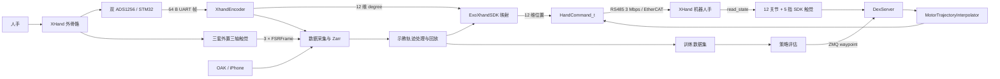

# DexUMI 中的 XHand：机制、代码实现与 SDK 调用技术白皮书

> 文档状态：基于当前仓库 `main` 分支提交 `acddb8f` 和本机 `real_robot` 环境，于 2026-08-15 进行静态审阅与 SDK 绑定检查。未连接、驱动或移动真实硬件。

## 目录

1. [阅读说明与事实边界](#1-阅读说明与事实边界)
2. [核心结论](#2-核心结论)
3. [系统组成与术语](#3-系统组成与术语)
4. [端到端架构与数据流](#4-端到端架构与数据流)
5. [XHand 外骨骼嵌入式采集机制](#5-xhand-外骨骼嵌入式采集机制)
6. [主机端外骨骼编码器实现](#6-主机端外骨骼编码器实现)
7. [两套触觉机制](#7-两套触觉机制)
8. [XHand SDK 封装](#8-xhand-sdk-封装)
9. [关节定义与外骨骼到机器人手映射](#9-关节定义与外骨骼到机器人手映射)
10. [标定机制](#10-标定机制)
11. [实时服务与轨迹插值](#11-实时服务与轨迹插值)
12. [数据采集、回放、训练与策略部署](#12-数据采集回放训练与策略部署)
13. [运行与诊断指南](#13-运行与诊断指南)
14. [已确认的问题与风险](#14-已确认的问题与风险)
15. [SDK API 与数据结构速查](#15-sdk-api-与数据结构速查)
16. [关键文件索引](#16-关键文件索引)
17. [验证记录与未验证事项](#17-验证记录与未验证事项)

---

## 1. 阅读说明与事实边界

### 1.1 文档目标

本文集中解释 DexUMI 项目中所有与 XHand 直接相关的机制，包括：

- XHand 外骨骼的 12 路关节采集；
- 外骨骼侧独立三轴触觉采集；
- XHand 机器人手的 Python SDK 封装；
- 外骨骼角度到机器人手 12 维电机位置的映射与标定；
- ZMQ 控制服务、轨迹插值和策略侧调用；
- 数据采集、回放、训练数据生成及在线推理；
- 当前代码中会影响正确性、可运行性、安全性和可复现性的已知问题。

### 1.2 证据等级

本文采用以下标记区分事实强度：

| 标记 | 含义 |
|---|---|
| **源码事实** | 可由当前仓库中的 Python/C/配置代码直接证明 |
| **本机 SDK 事实** | 通过本机已安装 Python 绑定的类型、方法或 docstring 进行只读检查所得 |
| **代码意图** | 来自变量名、注释或调用方式，但仓库中没有更底层定义 |
| **推论** | 由多处实现共同支持的工程判断，会明确写出推论依据 |
| **未验证** | 需要厂商文档或真实硬件实验才能确认 |

### 1.3 不应混淆的三个“XHand”对象

本项目中的 `xhand` 至少指向三个不同对象：

1. **XHand 外骨骼**：人手佩戴的采集装置，输出 12 路角度；它不是机器人手 SDK 的状态源。
2. **XHand 机器人手**：通过 `xhand_controller` 原生扩展控制的 12 关节灵巧手，能够回读 5 指触觉。
3. **XHand 外骨骼触觉模块**：数据采集阶段使用的三套独立串口三轴力传感器，只覆盖拇指、食指和中指。

如果不区分这三者，很容易误以为 `XhandEncoder`、`XhandTactile` 和 `XhandSDK.get_tactile()` 来自同一设备；实际上它们的硬件、协议、端口、维度和用途都不同。

---

## 2. 核心结论

### 2.1 设计主线

DexUMI 对 XHand 的核心设计是：

```text
人手动作
  → XHand 外骨骼 12 路角度（degree）
  → 固定零位/方向规则 + 可选逐关节回归模型
  → XHand 机器人手 12 路目标位置（项目按 radian 使用）
  → SDK HandCommand_t
  → RS485 3 Mbps 或 EtherCAT
  → 机器人手执行
```

机器人手的官方五指触觉还会通过同一 SDK 的 `read_state()` 回读，用作在线策略的力观测。外骨骼侧三路触觉则主要服务于示教数据采集和后续数据集生成。

### 2.2 当前实现成熟度

从模块覆盖看，项目已经包含外骨骼固件、主机解析、标定、直接遥操作、数据回放、训练数据生成、实时服务和策略推理的完整研究流水线。但当前实现仍属于实验原型：

- README 所给手服务启动入口存在确定的参数名失配，当前代码会在构造 `DexServer` 时失败；
- SDK 连接、读取和发送错误没有可靠上传到调用方；
- SDK 对象可能被读取线程和控制线程并发访问；
- 串口 checksum 被计算但不用于拒绝损坏帧；
- SDK 依赖未写入环境文件，本机不同 Python 环境中的绑定版本也不一致；
- 多个脚本硬编码端口、补偿值、初始姿态和控制参数，存在配置漂移。

因此，本文既说明系统“设计上如何工作”，也单独标明“当前提交实际上能否按该方式工作”。

---

## 3. 系统组成与术语

### 3.1 组件总表

| 子系统 | 主要实现 | 输入 | 输出 | 默认通信/频率 |
|---|---|---|---|---|
| 外骨骼嵌入式采集 | [`embedded_system/Core/Src/main.c`](embedded_system/Core/Src/main.c#L43) | 2 个 ADS1256 的模拟采样 | 64 字节角度原始帧 | UART 921600, 8N1 |
| 外骨骼角度解析 | [`dexumi/encoder/encoder.py`](dexumi/encoder/encoder.py#L142) | `/dev/ttyACM0` 字节流 | 12 维 `joint_angles` | 后台线程，队列 20 帧 |
| 外骨骼独立触觉 | [`dexumi/encoder/xhand_tactile.py`](dexumi/encoder/xhand_tactile.py#L118) | 3 个 UART 设备 | 每指 `[fx, fy, fz]` | UART 921600 |
| 机器人手 SDK 适配 | [`dexumi/hand_sdk/xhand/hand_api_cls.py`](dexumi/hand_sdk/xhand/hand_api_cls.py#L59) | 12 维位置命令 | 关节状态、官方五指触觉 | RS485 3 Mbps / EtherCAT；读取默认 30 Hz |
| 外骨骼映射 | [`ExoXhandSDK`](dexumi/hand_sdk/xhand/hand_api_cls.py#L324) | 12 维外骨骼角度（degree） | 12 维机器人手目标（项目按 radian 使用） | 每次控制前计算 |
| 手控制服务 | [`dexumi/real_env/common/dexhand.py`](dexumi/real_env/common/dexhand.py#L25) | ZMQ 请求/waypoint | 插值后的 SDK 命令 | 默认控制 20 Hz；入口配置为 30 Hz |
| 采集入口 | [`record_exoskeleton.py`](real_script/data_collection/record_exoskeleton.py#L70) | 相机、外骨骼、可选触觉/位姿 | Zarr + 视频 | CLI 默认 60 FPS |
| 回放入口 | [`1_replay_hand.py`](real_script/data_generation_pipeline/1_replay_hand.py#L71) | 插值示教数据 | XHand 命令、回放视频、`hand_motor_value` | 外层默认 4 FPS，手内环 30 Hz |
| 策略评估 | [`eval_xhand.py`](real_script/eval_policy/eval_xhand.py#L135) | 图像、官方触觉、策略动作 | UR5 与 XHand waypoints | CLI 默认 10 Hz |

### 3.2 关键数据单位

| 数据 | 代码中的单位/表达 | 证据与限制 |
|---|---|---|
| 外骨骼 `joint_angles` | degree | 主机按 `voltage/reference_voltage*360` 计算 |
| XHand 位置目标 | 项目按 radian 使用 | 标定目标先除以 180 乘 π；SDK 官方单位未在仓库中给出 |
| SDK `position` 回读 | 未在仓库中独立定义 | 项目直接作为与命令同域的位置使用 |
| 外骨骼三轴触觉 | 原始整数量 | 无物理单位或标定系数定义 |
| SDK 官方触觉 | SDK 数值 | 仓库没有证明其 N、mN 或其他物理单位 |
| 固件时间戳 | 1 ms tick 的 16 位计数 | 约 65.536 秒回绕 |
| 主机采集时间 | `time.monotonic()` 秒 | 不受系统时间校正影响 |
| waypoint API 时间 | Unix wall-clock 秒 | 服务端转换为 monotonic 时间 |

---

## 4. 端到端架构与数据流

### 4.1 总体架构



### 4.2 采集链路

```text
STM32 ADC 原始值
  → 64-byte UART frame
  → UARTReader 后台线程
  → XhandEncoder.process_block()
  → JointFrame(capture_time, receive_time, joint_angles, raw_voltage)
  → NumericRecorder 以设备索引写入 episode_N/numeric_i
```

`NumericRecorder` 不要求所有 source 使用同一具体帧类：开始 episode 时，如果已经拿到一帧，就通过 `vars(frame_data)` 动态建立字段列表；因此 `JointFrame` 和 `FSRFrame` 可以出现在不同 `numeric_i` 组中，参见 [`numeric_recorder.py`](dexumi/data_recording/numeric_recorder.py#L75)。

### 4.3 直接遥操作链路

直接遥操作不经过 `DexServer`：

```text
XhandEncoder.get_numeric_frame()
  → ExoXhandSDK.predict_motor_value()
  → write_hand_angle_position_from_motor()
  → XhandSDK.write_hand_angle()
  → XhandSDK.send_command()
```

这一链路见 [`teleoperation.py`](real_script/teleoperation/teleoperation.py#L153) 和 [`overlay.py`](real_script/teleoperation/overlay.py#L126)。

### 4.4 在线策略链路

在线评估将策略预测出的多个未来动作转换为带绝对 wall-clock 时间的 waypoint：

```text
eval_xhand.py
  → DexClient.schedule_waypoint(target_pos, target_time)
  → ZMQ DEALER/ROUTER + pickle
  → DexServer.input_queue
  → wall-clock 转 monotonic
  → MotorTrajectoryInterpolator
  → 每个控制周期构造并发送 HandCommand_t
```

策略客户端与机器人手进程默认通过：

- 发布端：`ipc:///tmp/dex_stream`
- 请求端：`ipc:///tmp/dex_req`
- topic：`dexhand`

通信实现使用 Python `pickle` 序列化。IPC 用于同机进程时风险相对受限；如果切换 TCP 并暴露给不可信网络，反序列化不可信 pickle 可能导致任意代码执行，这是服务层的安全边界，而不是普通数据格式。

---

## 5. XHand 外骨骼嵌入式采集机制

### 5.1 固件变体

固件通过 [`BUILD_FOR_XHAND`](embedded_system/Core/Src/main.c#L43) 选择 XHand 数据布局：

```c
#define BUILD_FOR_XHAND

#ifdef BUILD_FOR_XHAND
__IO uint32_t data[16] = {0};
#else
__IO uint32_t data[10] = {0};
#endif
```

因此：

- XHand 固件使用 `16 × uint32_t = 64` 字节；
- 非 XHand 分支使用 `10 × uint32_t = 40` 字节，对应 Inspire 编码器默认布局。

仓库还提供预编译的 [`DexUMI_XHand.hex`](embedded_system/assets/DexUMI_XHand.hex)，嵌入式说明要求 XHand 模型烧录该固件，参见 [`DexUMI_Embedded_System.md`](embedded_system/DexUMI_Embedded_System.md#L4)。

### 5.2 ADC 采集

启动时固件初始化两个 ADS1256：

```c
dbh_ADS1256_Init(0);
dbh_ADS1256_Init(1);
```

XHand 分支循环读取 14 路值。`i=1..12` 使用 `(i-1)%8` 和 `(i-1)/8` 选择通道/ADC，`i=13..14` 使用 `(i+1)%8` 和 `(i+1)/8`，即有意跳过部分物理通道。具体接线含义不在仓库文字文档中定义，不能仅依据索引推断每个 ADC 引脚对应哪一机械关节。

### 5.3 64 字节线协议

固件将 `data[0]` 设为 `0x55AA`，然后原样将 64 字节内存发到 UART。STM32 目标为小端架构，所以主机观察到的 4 字节帧头为 `AA 55 00 00`，与 Python 默认帧头一致。

| 字节范围 | 固件字段 | Python 解包 | 说明 |
|---:|---|---|---|
| 0–3 | `data[0] = 0x55AA` | 固定头 `AA 55 00 00` | 同步标记，占一个 32 位字 |
| 4–59 | `data[1:15]` | `<14i` | 14 个 32 位 ADC 原始值 |
| 60–61 | `data[15]` 高 16 位 | checksum | 14 路数据求和后截断到 16 位 |
| 62–63 | `data[15]` 低 16 位 | timestamp | 毫秒计数器 |

固件字段声明为 `uint32_t`，Python 使用有符号 `int32` 解包。在线上二进制表示层面二者仍是同一组 32 位比特；主机选择有符号解释，与 ADS1256 可能产生的有符号采样相符。不过仓库没有额外解释这一类型差异。

### 5.4 时间戳与看门狗

SysTick 每 1 ms 调用 `dbh_IncTimestampInMS()`，时间戳类型为 `uint16_t`，见 [`delay.c`](embedded_system/Users/delay.c#L62) 和 [`stm32f0xx_it.c`](embedded_system/Core/Src/stm32f0xx_it.c#L128)。

理论回绕周期为：

```text
65536 ms = 65.536 s
```

同一个 SysTick handler 每 300 次刷新独立看门狗。固件主循环本身没有显式采样周期控制；实际发送率取决于 14 次 ADS1256 采样耗时和同步 `HAL_UART_Transmit()` 耗时，而不是固定的固件帧率。

### 5.5 UART 参数

USART1 在 [`usart.c`](embedded_system/Core/Src/usart.c#L31) 中配置为：

| 参数 | 值 |
|---|---:|
| Baud rate | 921600 |
| Data bits | 8 |
| Stop bits | 1 |
| Parity | None |
| Hardware flow control | None |
| Mode | TX/RX |

---

## 6. 主机端外骨骼编码器实现

### 6.1 `UARTReader` 线程与缓存

[`UARTReader`](dexumi/encoder/UARTReader.py#L8) 在构造时立即打开 `serial.Serial(uart_port, baud_rate, timeout=1)`，并设置：

- 一个可增长的字节 `bytearray`；
- `running=True`；
- 一个容量为 20 的帧队列；
- 一个读取线程，持续读取 `serial_port.in_waiting` 中的全部字节；
- 队列满时丢弃最旧帧，保留最新数据。

`start()` 创建的是非 daemon 线程；`stop()` 将 `running=False`、无超时 `join()`，然后关闭串口。

### 6.2 帧同步

`JointEncoder.process_buffer()` 不只检查当前缓冲区开头，还寻找下一个帧头，并要求两个帧头间距恰好等于 `block_size`：

- 找不到帧头：保留最多一个 block 的尾部数据；
- 帧头在缓冲区中部：丢弃帧头之前的数据；
- 下一个帧头距离不等于 64：把当前候选帧视为损坏并跳到下一个头；
- 距离等于 64：解析当前帧。

这意味着解析器通常需要看到下一帧的帧头，才会提交当前帧；其代价是至少一个帧边界的确认延迟。

### 6.3 数值转换

`XhandEncoder.process_block()` 的主要步骤见 [`encoder.py`](dexumi/encoder/encoder.py#L167)：

```python
data = struct.unpack("<14iI", block[4:])
data_values = data[:-1]
crc = data[-1]

voltages = [float(val) * 5.0 / 0x7FFFFF for val in data_values]
checksum = (crc >> 16) & 0xFFFF
timestamp = crc & 0xFFFF

reference_voltage = voltages[-2]
joint_angles = [v / reference_voltage * 360 for v in voltages
                if reference_voltage != 0]
joint_angles = joint_angles[:-2]
```

正常情况下结果为：

- `raw_voltage`：14 维；
- `joint_angles`：12 维，单位 degree；
- `capture_time` 与 `receive_time`：同一个 `time.monotonic()` 值。

如果参考电压为 0，列表推导返回空列表，再执行 `[:-2]` 仍为空；代码不会抛出明确的“参考电压无效”错误。

### 6.4 checksum 的实际作用

主机计算：

```python
expected_checksum = sum(data_values) & 0xFFFF
```

并在 verbose 模式打印是否匹配，但无论匹配与否都会先创建并入队 `JointFrame`。因此当前 checksum 只用于观察，不构成数据完整性门控。

---

## 7. 两套触觉机制

### 7.1 机器人手官方五指触觉

这是 `XhandSDK._get_current_state()` 通过 SDK `read_state(hand_id, True)` 取得的数据，见 [`hand_api_cls.py`](dexumi/hand_sdk/xhand/hand_api_cls.py#L171)。

每次成功读取包含：

- `finger_state`：12 个关节状态；
- `sensor_data`：5 个指尖状态；
- 每个指尖有一个 `calc_force` 三轴向量；
- 每个指尖有 120 个 `raw_force` 三轴向量；
- 每个指尖还有计算温度，SDK 原始类型中另有温度数组。

项目包装后的形状为：

| 调用 | NumPy 形状 | 内容 |
|---|---:|---|
| `get_current_position()` | `(12,)` | 12 个 `joint.position` |
| `get_tactile(calc=True)` | `(5, 3)` | 每指 `[fx, fy, fz]` 计算力 |
| `get_tactile(calc=False)` | `(5, 120, 3)` | 每指 120 个原始三轴力点 |

`read_state()` 的第二个布尔参数在本机绑定 docstring 中没有名称或语义描述。代码固定传 `True`，并随后读取 `sensor_data`；本文不进一步声称该参数的厂商定义。

### 7.2 外骨骼独立三轴触觉

数据采集脚本在 XHand 模式下创建三个 [`XhandTactile`](dexumi/encoder/xhand_tactile.py#L118)：

| 设备名 | 默认端口 | 对应手指 |
|---|---|---|
| `xhand_thumbs` | `/dev/ttyACM3` | 拇指 |
| `xhand_index` | `/dev/ttyACM2` | 食指 |
| `xhand_middle` | `/dev/ttyACM1` | 中指 |

端口映射来自 [`record_exoskeleton.py`](real_script/data_collection/record_exoskeleton.py#L136)，依赖 Linux 当前枚举顺序，并没有 udev 稳定别名。

`XhandTactile` 将基类参数覆盖为：

```text
header     = 55 AA
block_size = 8
baud_rate  = 921600
```

8 字节帧按小端 `<2b B H B` 解包：

| 字节范围 | 类型 | 字段 |
|---:|---|---|
| 0–1 | 2 bytes | 帧头 `55 AA` |
| 2 | `int8` | `fx` |
| 3 | `int8` | `fy` |
| 4 | `uint8` | `fz` |
| 5–6 | `uint16` | timestamp |
| 7 | `uint8` | checksum |

解析器计算 `sum(block[2:-1]) & 0xFF`，但同编码器一样，即使 checksum 无效仍创建并入队 `FSRFrame`。帧的 `capture_time` 和 `receive_time` 分别调用两次 `time.monotonic()`，所以二者会有极小差值。

`XhandUARTReader.__init__()` 自身还保留了旧的 `block_size=728` 默认值和关于 120 点矩阵的注释，但实际使用的 `XhandTactile` 默认传入 8，当前有效协议是上面的 8 字节布局，而不是 728 字节布局。

### 7.3 两套触觉在流水线中的用途

| 场景 | 使用的触觉源 | 覆盖手指 | 代码行为 |
|---|---|---:|---|
| 外骨骼示教采集 | 三个 `XhandTactile` | 3 | 分别写入 `numeric_1..3` |
| 回放/训练数据生成 | 示教阶段的三路触觉 | 3 | 插值、合并或做模长/调整 |
| 在线 XHand 策略评估 | SDK `get_tactile(calc=True)` | SDK 返回 5，策略取前 3 | 求三轴欧氏模长，再按阈值二值化 |

在线评估的默认阈值为 `[10, 10, 10]`，见 [`eval_xhand.py`](real_script/eval_policy/eval_xhand.py#L418) 和 [`README.md`](README.md#L181)。这些数值的物理单位未在仓库中定义。

---

## 8. XHand SDK 封装

### 8.1 抽象接口与继承关系

[`DexterousHand`](dexumi/hand_sdk/dexhand.py#L5) 定义统一接口：

- `connect()` / `disconnect()`；
- `get_current_position()`；
- `send_command()`；
- `write_hand_angle()`。

[`ExoDexterousHand`](dexumi/hand_sdk/dexhand.py#L45) 增加：

- pickle 标定模型加载；
- `predict_motor_value()` 抽象方法；
- `write_hand_angle_position_from_motor()`，其实现只是调用 `write_hand_angle(motor_values)`。

本机 `real_robot` 环境确认的 MRO 为：

```text
ExoXhandSDK
  → XhandSDK
  → ExoDexterousHand
  → DexterousHand
  → ABC
  → object
```

因此 `ExoXhandSDK` 复用 `XhandSDK` 的连接/读写，并通过 `ExoDexterousHand` 获得“电机位置到命令”的转发接口。

### 8.2 原生绑定加载

模块首先执行：

```python
from xhand_controller import xhand_control
```

之后才把源码目录下的 `xhand/lib` 添加到 `LD_LIBRARY_PATH`。当前仓库没有该 `lib` 目录，而且修改发生在原生扩展导入之后，所以它无法帮助解析该扩展在首次加载时缺失的共享库。当前实际依赖来自 Python 环境中安装的 `xhand_controller` 包。

导入模块还会无条件打印完整 `LD_LIBRARY_PATH`，这属于 import-time 副作用。

### 8.3 构造函数

`XhandSDK` 默认参数：

| 参数 | 默认值 | 用途 |
|---|---|---|
| `hand_id` | `0` | 初始字段；连接后会被发现列表首项覆盖 |
| `port` | `/dev/ttyUSB0` | RS485 串口设备 |
| `protocol` | `RS485` | 仅实现 `RS485` 和 `EtherCAT` 分支 |
| `state_queue_size` | `10` | 最新状态 deque 长度 |
| `update_frequency` | `30` Hz | reader 目标频率 |

构造函数只创建 SDK 对象和内存状态，不打开硬件。

### 8.4 RS485 连接流程

`connect()` 的当前顺序是：

```python
device_identifier = {
    "protocol": "RS485",
    "serial_port": self.port,
    "baud_rate": 3_000_000,
}
self.open_device(device_identifier)
self.list_hands_id()
return True
```

`open_device()` 调用：

```python
rsp = self._device.open_serial(serial_port, 3_000_000)
```

然后只打印 `rsp.error_code == 0`。无论 `rsp` 是否表示失败，`connect()` 都继续调用 `list_hands_id()[0]` 并最终返回 `True`。

### 8.5 EtherCAT 连接流程

当 `protocol == "EtherCAT"`：

1. 调用 `enumerate_devices("EtherCAT")`；
2. 如果列表为空，只打印提示；
3. 仍访问 `ether_cat[0]`；
4. 调用 `open_ethercat(ether_cat[0])`；
5. 随后 `connect()` 继续执行 `list_hands_id()`。

当前实现没有处理未知协议，也没有把 `ErrorStruct` 返回给上层。

### 8.6 手 ID

`list_hands_id()` 总是执行：

```python
self._hand_id = self._device.list_hands_id()[0]
```

这有三个实际含义：

- 构造参数 `hand_id` 会在连接后被覆盖；
- 空列表会触发 `IndexError`；
- 多手总线只选择发现列表的第一项，没有显式选择策略。

`set_hand_id(new_id)` 同样假设列表非空，以首项作为 old ID；只有 SDK 返回 `error_code == 0` 时才更新本地字段。

### 8.7 状态读取与队列

`start_reader()` 启动 daemon thread，循环目标周期为 `1/update_frequency`。每轮：

1. 调用 SDK `read_state(self._hand_id, True)`；
2. 成功时将原生结构复制到 Python dataclass；
3. 在 `_lock` 保护下追加到 deque；
4. 用 `time.time()` 估算本轮耗时并补足 sleep。

队列锁只保护 deque 的读写，不保护 SDK `_device` 本身。控制线程可以同时执行 `send_command()`。

`get_current_position()` 和 `get_tactile()` 都只返回队尾最新帧；队列为空时直接抛 `ValueError("Queue is empty")`，不会按 docstring 所说“尝试直接读取”。

### 8.8 Python 状态包装

关节 dataclass [`JointState`](dexumi/hand_sdk/xhand/hand_api_cls.py#L21) 完整复制原生字段：

```text
id, position, raw_position, sensor_id, temperature, torque,
commboard_err, jonitboard_err, tipboard_err,
default5, default6, default7
```

`jonitboard_err` 的拼写来自 SDK 原始字段，代码刻意保留。

每个 [`FingertipState`](dexumi/hand_sdk/xhand/hand_api_cls.py#L44) 保存：

- `calc_pressure`：`calc_force.fx/fy/fz`；
- `raw_pressure`：遍历 `raw_force` 得到的三轴数组；
- `sensor_temperature`：`calc_temperature`。

虽然定义了 `Force` dataclass，当前实现并未使用它，而是保存普通 list。

### 8.9 命令构造

`write_hand_angle(angles, **kwargs)` 首先检查 `len(angles) == 12`。失败时打印错误并返回 `False`；成功时创建 `xhand_control.HandCommand_t()`，遍历 12 个 `finger_command`。

| 字段 | 关节 0–10 默认值 | 关节 11 |
|---|---:|---:|
| `id` | 索引 | 11 |
| `position` | `angles[i]` | `angles[11]` |
| `kp` | 150 | 100 |
| `ki` | 0 | 0 |
| `kd` | 0 | 0 |
| `tor_max` | 400 | 400 |
| `mode` | 3 | 3 |

字段可由 `kp`、`ki`、`kd`、`tor_max`、`mode` 关键字整体覆盖，但关节 11 的 `kp/kd` 会在之后再次覆盖为 100/0。

代码注释称 `mode=3` 是位置控制模式；仓库没有厂商枚举定义，因此这里只记录项目代码意图。类似地，`tor_max=400` 的物理单位没有在仓库定义。

### 8.10 命令发送和断开

`send_command()` 调用：

```python
self._device.send_command(self._hand_id, command)
```

它只打印 `error_code == 0`，没有返回 `ErrorStruct`、布尔值或抛出异常。控制循环无法据此采取重试、停机或降级措施。

`disconnect()` 只停止 reader 并打印 `disconnect`，没有调用本机 SDK 已提供的 `close_device()`。

### 8.11 最小 SDK 调用形态

以下示例只展示当前封装的调用形态，不代表当前代码已具备生产级安全检查。连接真实硬件前应先修复第 14 章中的错误传播和关节限位问题。

```python
import numpy as np

from dexumi.hand_sdk.xhand.hand_api_cls import XhandSDK

hand = XhandSDK(port="/dev/ttyUSB0", protocol="RS485")
try:
    hand.connect()
    hand.start_reader()

    target = np.zeros(12, dtype=float)  # 项目按 radian 位置使用
    command = hand.write_hand_angle(target)
    if command is False:
        raise ValueError("XHand target must contain exactly 12 values")
    hand.send_command(command)

    position = hand.get_current_position()
    tactile = hand.get_tactile(calc=True)
finally:
    hand.disconnect()
```

注意：当前 `disconnect()` 不会关闭 SDK 设备句柄，示例反映的是现有接口，而不是建议的最终实现。

---

## 9. 关节定义与外骨骼到机器人手映射

### 9.1 12 维索引分组

`ExoXhandSDK.calibrate_angle` 中的注释给出如下分组：

| 索引 | 手指分组 | 固定零位（degree） | 解析映射是否翻转符号 | 可选回归模型 |
|---:|---|---:|---:|---|
| 0 | Thumb | 260 | 是 | `joint_to_motor_index_0.pkl`，变量名为 thumb swing |
| 1 | Thumb | 85 | 否 | `joint_to_motor_index_1.pkl`，变量名为 thumb bend1 |
| 2 | Thumb | 81 | 否 | 无 |
| 3 | Index | 186 | 是 | 无；最终不执行 `[0, π]` 裁剪 |
| 4 | Index | 276.5 | 是 | `joint_to_motor_index_4.pkl` |
| 5 | Index | 84 | 否 | 无 |
| 6 | Middle | 281 | 是 | `joint_to_motor_index_6.pkl` |
| 7 | Middle | 82 | 否 | 无 |
| 8 | Ring | 282 | 是 | `joint_to_motor_index_8.pkl` |
| 9 | Ring | 87 | 否 | 无 |
| 10 | Pinky | 278 | 是 | `joint_to_motor_index_10.pkl` |
| 11 | Pinky | 277 | 是 | 无；命令层另有 `kp=100` 特例 |

除 0、1 的变量名和脚本中的主要弯曲模型命名外，仓库没有完整、权威的“每个索引对应具体机械轴”表。不能仅依据手指分组把所有偶数/奇数通道进一步命名为屈伸或侧摆。

### 9.2 无标定模型时的解析映射

输入 `joint_angles` 来自外骨骼，正常为 12 维 degree。基础映射为：

```python
motor_values = (joint_angles - calibrate_angle) / 180 * np.pi
```

然后翻转索引：

```text
0, 3, 4, 6, 8, 10, 11
```

最后：

1. 暂存索引 3；
2. 对完整数组执行 `np.clip(motor_values, 0, np.pi)`；
3. 恢复未裁剪的索引 3。

因此索引 3 可以为负，也可以超过 π；其他 11 个通道被限制在 `[0, π]`。

### 9.3 有标定模型时的覆盖顺序

代码先计算完整解析映射及符号翻转，再用六个模型覆盖索引 `0, 1, 4, 6, 8, 10`。所以对被模型覆盖的索引而言，先前的解析结果和符号翻转不再影响最终值；未覆盖索引继续使用解析映射。

模型输入形式为：

```python
model.predict([[joint_angles[i] + per_finger_adj_val[i]]])
```

回归输出直接写入目标数组，随后同样执行裁剪规则。

### 9.4 经验补偿值

服务入口和主要回放脚本使用：

| 索引 | 补偿（degree） |
|---:|---:|
| 0 | +4.5 |
| 1 | -4.8 |
| 4 | -1 |
| 6 | +2 |
| 8 | +3.5 |
| 10 | +4 |
| 其他 | 0 |

这些补偿只进入有模型覆盖的通道。直接遥操作脚本使用全零补偿；[`overlay.py`](real_script/teleoperation/overlay.py#L42) 使用索引 1 为 `-3` 而非 `-4.8`。这是已存在的配置漂移，本文不尝试判断哪一组在机械上更正确。

### 9.5 可变默认参数

`ExoXhandSDK.__init__()` 使用 `per_finger_adj_val=np.zeros(12)` 作为函数默认值。这个 NumPy 数组在函数定义时只创建一次；当前实现不修改它，所以尚未出现跨实例污染，但从 API 设计上仍属于可变默认参数风险。

---

## 10. 标定机制

### 10.1 标定目标

标定的目标不是求完整 12×12 耦合模型，而是为六个指定关节分别学习一维映射：

```text
外骨骼某一路角度（degree）
  → 一维 PolynomialFeatures(degree=10)
  → LinearRegression
  → 对应 XHand 关节位置（radian）
```

### 10.2 采样流程

[`calibrate_xhand_mapping.py`](real_script/teleoperation/calibrate_xhand_mapping.py#L25) 的流程为：

1. 创建两个 OAK 相机用于对照显示；
2. 在 `/dev/ttyACM0` 启动 `XhandEncoder`；
3. 在 `/dev/ttyUSB0` 连接 `ExoXhandSDK`；
4. 根据 `joint_index` 生成一组机器人手目标角；
5. 每个控制周期持续下发当前目标；
6. 操作者按 `r` 记录当前外骨骼角度；
7. 按 `s` 进入下一目标；
8. 完成后拟合十阶多项式并保存 pickle；
9. 绘制采样点和预测曲线。

### 10.3 目标范围

脚本中的 XHand 目标范围为：

| `joint_index` | degree 范围 | 样本目标数 |
|---:|---:|---:|
| 0 | 15 到 110 | 15 |
| 1 | 0 到 90 | 10 |
| 2 | 0 到 105 | 10 |
| 3 | -10 到 10 | 10 |
| 其他 | 5 到 110 | 10 |

目标随后转换为 radian。脚本虽允许任意 `joint_index`，但 `ExoXhandSDK` 运行时只加载 0、1、4、6、8、10 六个模型。

采样时其他通道大多设为 0；索引 5、7、9、11 固定为 5°。当标定索引为 1 或 2 时，索引 0 固定为 75°，以设置拇指姿态。

### 10.4 模型文件与加载失败

输出文件名为：

```text
<model_dir>/joint_to_motor_index_<joint_index>.pkl
```

`ExoDexterousHand.load_model()` 使用 Python pickle 加载。加载异常时会打印并直接 `exit()`，而不是向调用方抛出可处理异常。pickle 还要求模型文件来自可信来源；加载恶意 pickle 可以执行任意代码。

### 10.5 模型风险

十阶多项式配合 10–15 个手工样本有以下工程风险：

- 样本误差可能被高阶项放大；
- 训练区间边界附近可能振荡；
- 区间外外推可能迅速发散；
- 代码未验证映射单调性；
- 最终 `[0, π]` 裁剪只能限制幅值，不能消除区间内非单调；
- 每个关节独立拟合，不表达关节间机械耦合或回差。

这些是模型形式带来的风险，不代表当前 pickle 一定存在异常；仓库未包含所用实际标定数据和全部模型，本文无法评价其拟合质量。

---

## 11. 实时服务与轨迹插值

### 11.1 ZMQ 基础层

[`ZMQServerBase`](dexumi/real_env/common/base.py#L49) 建立：

- PUB socket：发布历史帧，`SNDHWM=1`；
- ROUTER socket：处理请求/响应；
- 独立发布线程和请求线程；
- ring buffer，用于发布最近 K 帧；
- `pickle.dumps()` / `pickle.loads()` 序列化。

[`ZMQClientBase`](dexumi/real_env/common/base.py#L295) 使用 SUB + DEALER，并通过后台发送线程和响应线程维护 request ID。

### 11.2 `DexRequestType`

当前定义的手请求类型为：

| 请求 | 参数 | 服务端行为 |
|---|---|---|
| `STOP` | 无 | 放入控制队列；控制循环分支不改变状态 |
| `SCHEDULE_WAYPOINT` | `target_pos`, `target_time` | 排入插值轨迹 |
| `SEND_POS` | `pos` | 立即构造并发送一次命令 |
| `GET_POS` | 无 | 返回最新 12 维 SDK 位置 |
| `GET_TACTILE` | 可选 `calc` | 返回官方五指触觉 |
| `PREDICT_POS_FROM_JOINT` | `joint_angles` | 服务端执行外骨骼映射 |

`DexClient.get_state()` 还尝试访问 `DexRequestType.GET_STATE`，但枚举中没有该成员，因此该方法会在构造请求前触发 `AttributeError`，随后被包装为 `RuntimeError`。

### 11.3 控制循环

`DexServer.run()` 启动时必须先从 reader 队列取得当前位置：

```python
curr_pos = self.hand.get_current_position()
motor_interp = MotorTrajectoryInterpolator(
    times=[time.monotonic()],
    values=[curr_pos],
)
```

随后每个周期：

1. 在当前 monotonic 时间上查询插值目标；
2. 构造 `HandCommand_t`；
3. 下发命令；
4. 最多等待一个 `dt` 从输入队列取一条请求；
5. 更新轨迹或发送即时位置命令。

如果 reader 尚未产生第一帧，`get_current_position()` 抛异常，整个控制循环进入最外层 `except`。当 `verbose=False` 时异常不会打印，线程会静默结束。

### 11.4 waypoint 时间转换

客户端传入 Unix wall-clock `target_time`。服务端转换为：

```python
target_time = time.monotonic() - time.time() + target_time
```

这是用调用瞬间的 wall-clock 与 monotonic 差值，把绝对墙钟时刻映射到单调时钟域。之后把 `curr_time` 设置为 `t_now + dt`，避免修改已经进入当前控制周期的部分。

### 11.5 插值器行为

[`MotorTrajectoryInterpolator`](dexumi/real_env/common/motor_trajectory_interpolator.py#L8) 的行为包括：

- 只有一个点时返回常值；
- 多个点时使用 `scipy.interpolate.interp1d(..., axis=0)` 线性插值；
- 查询超出轨迹范围时先 clip 到首尾时间；
- 新 waypoint 早于或等于 `curr_time` 时直接忽略；
- 新 waypoint 可以替换未执行的未来轨迹；
- 速度限制根据整个目标向量的欧氏距离计算，而不是逐关节限制。

速度约束公式为：

```text
value_dist = ||target - end_value||₂
min_duration = value_dist / max_speed
```

对于 12 维 XHand，这意味着 `max_motor_speed` 是 12 维向量范数的限制。默认值 1000 与项目中的 radian 位置尺度相比极大，实际接近不限制速度；其单位没有显式写入配置。

### 11.6 PUB 数据流现状

`DexServer._get_data()` 当前固定返回 `[0, 0, 0]`，真实位置发布代码已被注释。因此：

- REQ/REP 的 `get_pos()` 和 `get_tactile()` 可设计为返回真实数据；
- SUB 订阅到的 `dexhand` topic 数据始终是占位数组，而不是手状态。

### 11.7 停止流程

`DexServer.stop()` 先把 `STOP` 放入队列，再等待控制线程最多 5 秒。然而控制循环收到 `STOP` 后只执行 `pass`，`self.running` 仍为 `True`，所以线程不会因此退出。5 秒超时后才调用 `super().stop()` 将 `running=False`。这使停止过程至少可能产生一次不必要的 5 秒等待，并在等待期间继续下发位置命令。

---

## 12. 数据采集、回放、训练与策略部署

### 12.1 外骨骼示教采集

README 推荐通过 [`record_exoskeleton.py`](real_script/data_collection/record_exoskeleton.py#L70) 采集。XHand 模式下数据源为：

- `numeric_0`：`XhandEncoder`，设备名为 `xhand`；
- `numeric_1`：`xhand_thumbs` 外置触觉；
- `numeric_2`：`xhand_index` 外置触觉；
- `numeric_3`：`xhand_middle` 外置触觉；
- OAK 相机；
- 可选 iPhone tracking pose。

如果省略 `-ef/--enable_fsr`，只创建角度 source，不创建三个触觉 source。

`NumericRecorder` 用独立线程以 `stream_fps` 拉取各 source 最新帧，再以 `record_fps` 选取 `receive_time` 更新的帧。保存时按字段写入：

```text
episode_N/
  numeric_0/
    capture_time
    receive_time
    joint_angles
    raw_voltage
  numeric_1..3/
    capture_time
    receive_time
    fsr_values
```

实际存在的组和字段取决于启用项及是否成功收到数据。

### 12.2 回放前处理

项目的数据处理流程会生成或使用：

- `joint_angles_interp`：按统一时间轴插值后的外骨骼角度；
- `pose_interp`：腕部/机器人位姿；
- `fsr_values_interp_1..3`：外骨骼三路触觉；
- `valid_indices`：有效时间索引；
- 相机视频和后续分割/修复结果。

README 的目标目录结构见 [`README.md`](README.md#L95)。

### 12.3 XHand 动作回放

[`1_replay_hand.py`](real_script/data_generation_pipeline/1_replay_hand.py#L71) 的 XHand 路径：

1. 从 `episode_N/numeric_0/joint_angles_interp` 读取 12 维外骨骼角度；
2. 创建带标定模型和经验补偿的 `ExoXhandSDK`；
3. 连接机器人手；
4. 连续 10 个周期发送 `XHAND_SEG_VAL`，拍摄用于分割的初始图像；
5. 连续 10 个周期移动到第一帧映射目标；
6. 外层按 replay `fps` 推进示教帧，内层以 30 Hz 重复发送当前映射目标；
7. 等待 `camera_latency` 后抓取图像；
8. 把每帧目标保存为 `hand_motor_value`。

XHand 分割姿态常量为：

```python
XHAND_SEG_VAL = [0.4] * 12
XHAND_SEG_VAL[0] = 0.8
XHAND_SEG_VAL[1] = 0.8
XHAND_SEG_VAL[3] = 0.175
```

见 [`constants.py`](dexumi/constants.py#L16)。这些值按项目的 XHand 位置域使用。

### 12.4 训练数据动作缩放

生成最终训练数据时，XHand 使用：

```python
XHAND_HAND_MOTOR_SCALE_FACTOR = 3
hand_motor_value = hand_motor_value * 3
```

随后保存：

- `hand_action = hand_motor_value[1:]`；
- `proprioception = hand_motor_value[:-1]`；
- `pose = pose[1:]`；
- 视觉观测也移除最后一帧，以形成当前观测到下一时刻动作的配对。

实现见 [`6_generate_dataset.py`](real_script/data_generation_pipeline/6_generate_dataset.py#L160)。

### 12.5 策略推理中的动作还原

[`eval_xhand.py`](real_script/eval_policy/eval_xhand.py#L464) 对策略手动作除以 3：

- 相对动作：`virtual_hand_pos + policy_action / 3`；
- 绝对动作：`policy_action / 3`。

相对动作模式不读取 XHand 实际位置，而是使用代码维护的 `virtual_hand_pos`；源码中的 `dexhand_client.get_pos()` 已注释。这意味着命令未执行、跟踪误差或通信失败不会反馈到相对动作积分状态。

### 12.6 策略触觉处理

在线评估读取 SDK 计算触觉 `(5,3)`，对最后一维求欧氏范数，取前 3 指：

```python
force_magnitude = np.linalg.norm(fsr_raw_obs, axis=2)
fsr_value = force_magnitude[0, :3]
fsr_binary = (fsr_value >= [10, 10, 10]).astype(np.float32)
```

触觉历史 `obs_horizon` 当前为 1，因此策略只保留最新一帧二值触觉。

### 12.7 waypoint 调度

策略一次预测多个未来动作，并分别为 UR5 和 XHand 计算执行时刻。早于：

```text
当前执行时间 + action_latency + dt
```

的动作会被丢弃；剩余动作转换为 wall-clock 时间后逐一调用 `schedule_waypoint()`。XHand 默认 `hand_action_latency=0.3 s`，UR5 默认 `robot_action_latency=0.170 s`。

---

## 13. 运行与诊断指南

### 13.1 环境事实

仓库 [`environment.yml`](environment.yml#L155) 指定 Python 3.10.16，并包含 NumPy、SciPy、pyzmq、scikit-learn 和 pyserial，但没有列出 `xhand-controller`。

本机检查结果：

| 环境 | Python binding 包 | 原生 SDK `get_sdk_version()` |
|---|---|---|
| Conda `real_robot` / Python 3.10 | `xhand-controller 1.1.8` | `1.4.6` |
| 系统 Python 3.12 | `xhand-controller 1.5.2` | `1.4.2` |

Python wheel/包版本与原生 SDK 自报版本不是同一版本概念，但两套环境各自都不同，说明运行结果可能受激活环境影响。项目代码应在明确的 Conda 环境中运行，不应依赖 `python`/`python3` 恰好指向哪套安装。

### 13.2 建议的只读预检

以下命令不连接机器人手，可先确认解释器和绑定：

```bash
conda run -n real_robot python -c \
  "from xhand_controller import xhand_control as x; print(x.XHandControl().get_sdk_version())"

conda run -n real_robot python -c \
  "import xhand_controller; print(xhand_controller.__file__)"
```

检查设备节点和权限：

```bash
ls -l /dev/ttyUSB0 /dev/ttyACM0 /dev/ttyACM1 /dev/ttyACM2 /dev/ttyACM3
```

设备号由枚举顺序决定；不要仅凭名称假设某一 `/dev/ttyACM*` 必然对应指定手指。长期部署应使用 USB 序列号或 udev 规则创建稳定别名。

### 13.3 分层诊断顺序

建议按以下顺序隔离问题：

1. **外骨骼编码器**：单独运行 `dexumi/encoder/encoder.py`，确认连续产生 12 维角度、参考电压非零、checksum 稳定。
2. **外置触觉**：逐个端口运行 `xhand_tactile.py`，核对三轴数据和 checksum。
3. **SDK 枚举**：只执行 SDK 设备枚举与版本读取，不发送关节命令。
4. **机器人手状态**：连接后启动 reader，确认能产生 `(12,)` 位置和期望触觉形状。
5. **标定模型**：离线加载每个 pickle，对训练区间采样并检查输出有限、连续、近似单调且在机械允许范围内。
6. **单点低风险动作**：在明确机械限位、低增益/转矩和急停条件下验证单关节；当前默认值不应自动视为安全值。
7. **直接映射**：再启用 overlay/teleoperation。
8. **实时服务**：修复第 14.1 节阻断问题后测试 ZMQ 请求与停止流程。
9. **策略评估**：最后验证动作缩放、初始姿态、延迟和触觉阈值。

### 13.4 README 命令的当前状态

README 给出：

```bash
python DexUMI/real_script/open_server.py --dexhand --ur5
```

该命令有两层问题：

1. `--hand-type` 默认是 `inspire`，它不会选择 XHand；
2. 无论选择哪种手，当前入口都以不存在的 `inspire=` 参数构造 `DexServer`，会触发 `TypeError`。

设计上，XHand 服务还需要 `--hand-type xhand` 和标定模型目录；但在修复构造参数前，不应把任何完整启动命令标记为“当前可运行”。

### 13.5 安全停机注意

当前软件没有实现以下可证明的安全机制：

- 命令 watchdog 或通信超时后自动卸力；
- SDK 错误达到阈值后停止发送；
- 逐关节速度/加速度/机械限位校验；
- 触觉或转矩阈值触发急停；
- 服务进程退出时可靠调用 `close_device()`；
- 控制循环与 reader 的统一生命周期管理。

因此，真实硬件测试必须依赖设备侧已有保护、机械急停和人工监控；不能把当前 Python 停止流程视为安全停机保证。

---

## 14. 已确认的问题与风险

### 14.1 阻断级

#### B-1：`open_server.py` 使用错误构造参数

- **证据**：[`open_server.py`](real_script/open_server.py#L92) 调用 `DexServer(inspire=hand, ...)`；[`DexServer.__init__`](dexumi/real_env/common/dexhand.py#L25) 参数为 `hand`。
- **结果**：启动手服务时确定触发 `TypeError: unexpected keyword argument 'inspire'`。
- **范围**：XHand 和 Inspire 两条分支都会受影响。

#### B-2：状态读取错误路径调用不存在的方法

- **证据**：[`_get_current_state()`](dexumi/hand_sdk/xhand/hand_api_cls.py#L171) 在 SDK 错误时调用 `self.parse_error_code()`；类和父类均未定义该方法。
- **结果**：第一次非零 SDK read error 会触发 `AttributeError`，reader daemon 线程退出。
- **补充**：本机 SDK 的 `ErrorStruct` 已包含 `error_code` 和 `error_message`。

### 14.2 高风险

#### H-1：连接结果不可信

- `open_serial()`/`open_ethercat()` 的错误只被打印；
- `connect()` 无条件返回 `True`；
- 失败后仍访问 `list_hands_id()[0]`；
- 空设备列表会产生下标异常，不能形成结构化诊断。

#### H-2：断开未关闭 SDK 设备

- `disconnect()` 只停止 reader；
- 本机 SDK 明确提供 `close_device()`，但项目没有调用；
- 串口/EtherCAT 资源和设备状态依赖进程退出或 SDK 对象析构释放。

#### H-3：SDK 对象并发访问

- reader 线程调用 `_device.read_state()`；
- 控制线程或主线程调用 `_device.send_command()`；
- `_lock` 只保护 Python deque；
- 仓库和本机绑定 docstring 都没有声明 `XHandControl` 的线程安全性。

因此是否安全属于未验证项；在没有厂商保证时应视为并发风险。

#### H-4：命令错误不向上传播

- `send_command()` 返回 `None`；
- SDK error 仅被格式化为一次布尔打印；
- `DexServer` 无法重试、计数、降级或停止；
- 30 Hz 持续打印本身会增加控制线程 I/O 抖动。

#### H-5：缺少命令安全校验

- 只检查长度是否为 12；
- 不拒绝 NaN/Inf；
- `send_pos()` 只检查外层对象是 list 或 ndarray；
- 服务 waypoint 没有维度检查；
- 除映射函数外，直接目标没有关节范围限制；
- 第 3 关节在映射中刻意跳过裁剪；
- 没有逐关节速度、加速度或 jerk 限制。

#### H-6：服务异常可能静默退出

`DexServer.run()` 的最外层异常只有在 `verbose=True` 时打印，而 `open_server.py` 传入 `verbose=False`。reader 尚未准备好、命令类型错误、插值断言失败等都可能让控制线程无声停止。

#### H-7：pickle 信任边界

- ZMQ 请求和响应使用 pickle；
- 标定模型也使用 pickle；
- TCP 模式绑定 `tcp://*:<port>`；
- 反序列化不可信 pickle 可执行代码。

服务和模型文件必须限制在可信主机、可信用户和可信网络内。

### 14.3 中风险

#### M-1：checksum 只记录、不拒绝

外骨骼角度与独立触觉解析器都在 checksum 验证前或不考虑验证结果的情况下入队。损坏数据可能进入记录、标定或控制链路。

#### M-2：reader 线程没有异常边界

`_read_loop()` 未捕获 SDK、转换、数组访问或未定义方法异常；daemon 线程失败后不会重启，也没有 health 状态供上层检查。

#### M-3：状态新鲜度不可见

`get_current_position()` 和 `get_tactile()` 返回最新缓存值，但 `HandState` 不保存主机采集时间。上层无法判断状态是否已经陈旧，也无法发现 reader 已停止但 deque 仍非空。

#### M-4：PUB 流是假数据

`DexServer._get_data()` 固定发布 `[0,0,0]`。任何把 SUB topic 当作真实手状态的消费者都会得到误导性数据。

#### M-5：`DexClient.get_state()` 不可用

该方法引用不存在的枚举成员。可用接口是 `get_pos()` 与 `get_tactile()`，不是 `get_state()`。

#### M-6：停止请求不停止控制循环

`STOP` 分支为 `pass`，导致 `stop()` 的首次 join 可能等待满 5 秒，期间仍继续发送命令。

#### M-7：速度限制语义不适合逐关节安全

插值器用整个 12 维向量的 L2 距离和单一 `max_speed`，无法分别表达不同关节限速；默认 1000 对 radian 尺度几乎不起约束作用。

#### M-8：相对策略动作使用虚拟状态

相对模式把动作累加到 `virtual_hand_pos`，而不是实际 `get_pos()`。执行误差和命令失败会造成策略内部状态与真实手状态漂移。

#### M-9：端口与设备身份硬编码

`/dev/ttyUSB0`、`/dev/ttyACM0..3` 依赖枚举顺序。重新插拔、USB hub 或启动顺序变化都可能交换设备。

#### M-10：标定模型缺少运行时验证

加载后没有检查模型类型、输入输出 shape、有限性、单调性、版本或训练区间；十阶回归输出只在最后做幅值裁剪。

### 14.4 低风险与维护问题

- `Force` dataclass 未使用；
- `get_current_position()` docstring 与实际“队列空即抛错”不一致；
- `write_hand_angle()` docstring 声称返回 bool，但成功时返回 `HandCommand_t`；
- `XhandUARTReader` 的 728 字节默认值和大阵列注释已经与有效 8 字节子类协议脱节；
- 多处日志仍写作 `InspireServer`/`Starting Inspire control loop`，但类已用于两类手；
- `open_server.py`、回放和 overlay 中存在重复且不一致的经验补偿；
- `replay_exoskeleton_trajectory.py` 会把 CLI 传入的 `hand_type` 强制改为 `xhand`；
- 模块导入时打印并修改 `LD_LIBRARY_PATH`；
- `xhand-controller` 缺失于 `environment.yml`，环境不可完整复现；
- `ExoXhandSDK` 使用可变 NumPy 默认参数；
- 校准加载失败直接 `exit()`，不利于库式调用和清理已打开设备。

### 14.5 建议修复优先级

```text
P0  修复 DexServer 参数名、parse_error_code 错误路径、连接/空 ID 检查
P1  统一 SDK I/O 锁、错误返回、close_device、reader health 与停止流程
P1  增加目标有限性/维度/逐关节限位与逐关节速度限制
P1  checksum 失败帧拒绝入队，并暴露丢帧/错误计数
P2  修复 PUB 状态与 GET_STATE，统一 wall/monotonic 时间和状态时间戳
P2  集中管理端口、补偿、PID、初始姿态、触觉阈值与 SDK 版本
P2  为标定模型增加元数据、范围、单调性和回放前验证
P3  清理日志、注释、死代码、旧协议默认值和类型标注
```

---

## 15. SDK API 与数据结构速查

### 15.1 本机 `real_robot` 绑定暴露的方法

下表来自本机 `xhand-controller 1.1.8` 绑定的只读 introspection。参数名在 pybind docstring 中仅显示为 `arg0...`，这里按位置记录，未知语义不补写。

| API | 绑定签名摘要 | 项目是否调用 |
|---|---|---:|
| `get_sdk_version()` | `() -> str` | 否，仅本次检查使用 |
| `enumerate_devices(protocol)` | `(str) -> list[str]` | 是 |
| `open_serial(port, baud)` | `(str, int) -> ErrorStruct` | 是 |
| `open_ethercat(device)` | `(str) -> ErrorStruct` | 是 |
| `close_device()` | `() -> None` | 否 |
| `list_hands_id()` | `() -> list[int]` | 是 |
| `set_hand_id(old_id, new_id)` | `(int, int) -> ErrorStruct` | 是 |
| `get_hand_name(hand_id)` | `(int) -> (ErrorStruct, str)` | 否 |
| `set_hand_name(hand_id, name)` | `(int, str) -> ErrorStruct` | 否 |
| `get_hand_type(hand_id)` | `(int) -> (ErrorStruct, str)` | 否 |
| `get_serial_number(hand_id)` | `(int) -> (ErrorStruct, str)` | 否 |
| `read_device_info(hand_id)` | `(int) -> (ErrorStruct, DeviceInfo_t)` | 否 |
| `read_parameters(hand_id)` | `(int) -> (ErrorStruct, HandParam_t)` | 否 |
| `set_parameters(hand_id, params)` | `(int, HandParam_t) -> ErrorStruct` | 否 |
| `read_state(hand_id, bool)` | `(int, bool) -> (ErrorStruct, HandState_t)` | 是 |
| `send_command(hand_id, command)` | `(int, HandCommand_t) -> ErrorStruct` | 是 |
| `reset_sensor(hand_id, sensor_id)` | `(int, int) -> ErrorStruct` | 是 |
| `read_version(hand_id, int)` | `(int, int) -> (ErrorStruct, str)` | 否 |
| `calibrate_joint(hand_id, int, list[int])` | 见绑定 docstring | 否 |
| `calibrate_joint_by_mold(...)` | 见绑定 docstring | 否 |
| `upgrade_device(...)` | 见绑定 docstring | 否 |

系统 Python 3.12 的较新绑定还暴露 action group、firmware state 和 action count 等方法，但它不是仓库声明环境，且 `real_robot` 的 1.1.8 绑定没有这些方法，故不应在项目代码中无条件调用。

### 15.2 `ErrorStruct`

本机绑定可见成员：

| 字段/方法 | 默认值/类型 |
|---|---|
| `error_code` | `0` |
| `error_message` | 空字符串 |
| `reset()` | pybind 方法 |

项目当前大多只读取 `error_code`，没有利用 `error_message`。

### 15.3 `HandCommand_t` 与 `FingerCommand_t`

`HandCommand_t.finger_command` 是长度 12 的列表。单个 `FingerCommand_t` 本机可见字段：

```text
id, kp, ki, kd, position, tor_max, mode,
res0, res1, res2, res3
```

保留字段 `res0..res3` 在项目中保持默认值 0。

### 15.4 `HandState_t`

本机可见结构：

```text
HandState_t
  finger_state: list[FingerState_t], length 12
  sensor_data:  list[SenserData_t],  length 5
```

`FingerState_t` 字段与项目 `JointState` 一致。`SenserData_t` 本机可见：

```text
calc_force:       PXSR_ForceData
calc_temperature
raw_force:        list[PXSR_ForceData], length 120
temperature:      list[int], length 20
```

`PXSR_ForceData` 具有 `fx`、`fy`、`fz`。

### 15.5 `HandParam_t` 与 `DeviceInfo_t`

虽然项目未使用，本机绑定可见：

```text
HandParam_t
  angle_closing[12]
  angle_stretching[12]
  position_closing[12]
  position_init[12]
  position_stretching[12]
  position_zero[12]

DeviceInfo_t
  hand_id
  hand_param
  is_calibrated
  name[32]
  serial_number[32]
  ev_hand
  iap_flag
  resverse
```

这些字段的单位和枚举含义没有在仓库中定义。

---

## 16. 关键文件索引

| 文件 | 主要职责 |
|---|---|
| [`dexumi/hand_sdk/xhand/hand_api_cls.py`](dexumi/hand_sdk/xhand/hand_api_cls.py) | XHand 原生 SDK 适配、状态包装、命令构造、外骨骼映射 |
| [`dexumi/hand_sdk/dexhand.py`](dexumi/hand_sdk/dexhand.py) | 灵巧手和外骨骼手抽象接口、pickle 模型加载 |
| [`dexumi/encoder/encoder.py`](dexumi/encoder/encoder.py) | Inspire/XHand 外骨骼角度串口解包 |
| [`dexumi/encoder/UARTReader.py`](dexumi/encoder/UARTReader.py) | 通用 UART 读取线程和最新帧队列 |
| [`dexumi/encoder/xhand_tactile.py`](dexumi/encoder/xhand_tactile.py) | 外骨骼独立三轴触觉协议 |
| [`dexumi/encoder/numeric.py`](dexumi/encoder/numeric.py) | `JointFrame`、`FSRFrame` 数据结构 |
| [`embedded_system/Core/Src/main.c`](embedded_system/Core/Src/main.c) | 双 ADS1256 采集、XHand/Inspire 帧打包和 UART 发送 |
| [`embedded_system/Users/delay.c`](embedded_system/Users/delay.c) | 16 位毫秒时间戳 |
| [`real_script/teleoperation/calibrate_xhand_mapping.py`](real_script/teleoperation/calibrate_xhand_mapping.py) | 单关节人工采样和十阶回归标定 |
| [`real_script/teleoperation/overlay.py`](real_script/teleoperation/overlay.py) | 双相机对照下的外骨骼到机器人手直接映射 |
| [`real_script/teleoperation/teleoperation.py`](real_script/teleoperation/teleoperation.py) | iPhone 位姿 + 外骨骼手的直接遥操作 |
| [`dexumi/real_env/common/dexhand.py`](dexumi/real_env/common/dexhand.py) | 手 ZMQ server/client 与控制循环 |
| [`dexumi/real_env/common/motor_trajectory_interpolator.py`](dexumi/real_env/common/motor_trajectory_interpolator.py) | 多维 waypoint 线性插值 |
| [`dexumi/real_env/common/base.py`](dexumi/real_env/common/base.py) | PUB/ROUTER/SUB/DEALER 通信和 pickle 协议 |
| [`real_script/open_server.py`](real_script/open_server.py) | 相机、手、UR5 服务启动入口 |
| [`real_script/data_collection/record_exoskeleton.py`](real_script/data_collection/record_exoskeleton.py) | 外骨骼示教采集入口 |
| [`dexumi/data_recording/numeric_recorder.py`](dexumi/data_recording/numeric_recorder.py) | 多 numeric source 的拉取、录制和 Zarr 保存 |
| [`real_script/data_generation_pipeline/1_replay_hand.py`](real_script/data_generation_pipeline/1_replay_hand.py) | 示教动作映射到机器人手并记录目标动作 |
| [`real_script/data_generation_pipeline/6_generate_dataset.py`](real_script/data_generation_pipeline/6_generate_dataset.py) | 最终训练数据生成与 XHand 动作缩放 |
| [`real_script/eval_policy/eval_xhand.py`](real_script/eval_policy/eval_xhand.py) | XHand 在线策略、触觉处理和 waypoint 调度 |
| [`dexumi/constants.py`](dexumi/constants.py) | XHand 动作缩放与分割姿态常量 |

---

## 17. 验证记录与未验证事项

### 17.1 已执行的只读/静态验证

- 搜索并审阅仓库中全部主要 `XhandSDK`、`ExoXhandSDK`、`XhandEncoder`、`XhandTactile`、`DexServer` 和 `DexClient` 调用点；
- 对 XHand SDK 包和 pybind 原生扩展执行只读类型/方法 introspection；
- 在 `real_robot` 环境读取 Python 包版本和 `get_sdk_version()`；
- 对系统 Python 的另一套绑定做版本对照；
- 检查嵌入式 XHand 条件编译、UART 帧尺寸、checksum 和时间戳实现；
- 对关键 Python 模块执行 `compileall` 语法编译检查；
- 对 `DexServer` 构造调用进行 AST/签名比对，确认参数名失配；
- 搜索确认仓库中不存在 `parse_error_code()` 实现和 `DexRequestType.GET_STATE` 定义。

### 17.2 未执行的实机验证

本次调研没有：

- 打开 `/dev/ttyUSB*` 或 `/dev/ttyACM*`；
- 调用 `open_serial()`、`open_ethercat()` 或 `list_hands_id()`；
- 发送任何关节、PID、转矩或校准命令；
- 读取真实关节位置、温度、转矩、错误码或触觉；
- 烧录或修改 STM32 固件；
- 验证各通道的实际机械方向、物理限位或传感器单位；
- 验证 SDK 的线程安全、设备关闭行为或通信故障恢复；
- 验证标定 pickle 的拟合质量；
- 启动完整相机、UR5、XHand 策略部署。

### 17.3 必须由厂商资料或实机确认的事项

- SDK `mode=3` 的正式枚举定义；
- `kp/ki/kd/tor_max` 的单位、范围和设备侧约束；
- `read_state(hand_id, True)` 第二参数的精确定义；
- `position`、`torque` 和触觉数值的正式物理单位；
- `sensor_id`、三个 error byte 和保留字段的位定义；
- 同一 `XHandControl` 实例并发执行 `read_state()` 与 `send_command()` 是否被官方支持；
- RS485 总线多手枚举顺序和多设备并发约束；
- EtherCAT 设备字符串格式和运行所需系统配置；
- 真实机械关节索引、正方向、软硬限位和安全 PID/转矩参数。

---

## 总结

DexUMI 的 XHand 路径实现了从人手外骨骼采集到机器人灵巧手复现的完整研究闭环：STM32 和双 ADS1256 输出 12 路角度，主机按参考电压换算为 degree，`ExoXhandSDK` 再通过固定零位、方向规则和六个可选回归模型生成 12 维 XHand 位置目标；机器人手由原生 `xhand_controller` 通过 RS485 或 EtherCAT 控制，并回读 12 关节状态和 5 指触觉。该动作域贯穿示教回放、训练数据和在线策略服务。

当前最需要注意的是“功能链路完整”并不等于“当前提交可直接安全运行”。服务构造参数失配和错误路径缺失会直接阻断或破坏运行；设备关闭、SDK 并发、错误传播、数据校验、关节约束、状态新鲜度和依赖复现仍需系统化补强。在这些问题修复并完成实机验证前，应把现有代码视为研究原型，并始终在明确的机械保护和人工监督下进行硬件实验。
