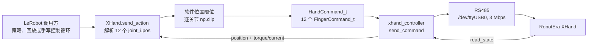
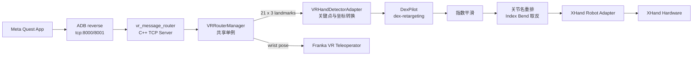

# LeFranX XHand 技术指南

> 审计日期：2026-08-15
>
> 审计对象：LeFranX 当前工作区、仓库锁定的 `vr-dex-retargeting` 子模块版本，以及本机可读取的 RobotEra XHand Python SDK
>
> 文档性质：当前实现事实说明。文中的“支持”“未实现”“未使用”均以实际执行路径为准，不以类名、字段名或注释中的设计意图代替代码行为。

## 目录

1. [项目定位与范围](#1-项目定位与范围)
2. [系统总体架构](#2-系统总体架构)
3. [代码组成与注册入口](#3-代码组成与注册入口)
4. [XHand 硬件抽象与数据契约](#4-xhand-硬件抽象与数据契约)
5. [XHand 配置模型](#5-xhand-配置模型)
6. [RobotEra SDK 及其调用方式](#6-robotera-sdk-及其调用方式)
7. [XHand 生命周期与控制路径](#7-xhand-生命周期与控制路径)
8. [状态读取、动作发送与错误处理](#8-状态读取动作发送与错误处理)
9. [VR 数据接入与共享路由](#9-vr-数据接入与共享路由)
10. [手部关键点预处理](#10-手部关键点预处理)
11. [DexPilot 重定向、平滑与关节映射](#11-dexpilot-重定向平滑与关节映射)
12. [VR 数据缺失与异常时的动作](#12-vr-数据缺失与异常时的动作)
13. [Franka FER 与 XHand 组合机器人](#13-franka-fer-与-xhand-组合机器人)
14. [组合 VR 遥操作](#14-组合-vr-遥操作)
15. [数据录制、训练、部署与回放](#15-数据录制训练部署与回放)
16. [当前工作区、依赖与可运行条件](#16-当前工作区依赖与可运行条件)
17. [实现状态汇总](#17-实现状态汇总)
18. [接口速查](#18-接口速查)
19. [术语表](#19-术语表)
20. [参考文件与外部资料](#20-参考文件与外部资料)

## 1. 项目定位与范围

LeFranX 是面向 Franka FER 机械臂与 RobotEra XHand 灵巧手的 LeRobot 扩展。仓库 README 指定的基础版本是 Hugging Face LeRobot commit `ce3b9f627e55223d6d1c449d348c6b351b35d082`，预期使用方式是把本仓库内容合并到该 LeRobot 源码树，而不是把当前仓库单独作为完整 LeRobot 包运行。

XHand 在项目中有三种使用形态：

- 独立 XHand 机器人：通过 LeRobot `Robot` 接口发送 12 个关节位置并读取 12 个关节位置与 12 个电流值。
- 独立 XHand VR 遥操作器：将 Meta Quest 提供的 21 个手部关键点转换为 XHand 的 12 个关节位置动作。
- Franka FER + XHand 组合机器人：把 Franka 的 7 个关节与 XHand 的 12 个关节合并为一套带前缀的 19 维动作接口。

本文覆盖以下内容：

- XHand 的 LeRobot 配置、连接、控制、观测和生命周期。
- RobotEra `xhand_controller` SDK 在项目中的实际调用方式。
- VR TCP 消息、ADB reverse、共享路由器与关键点处理。
- DexPilot 重定向、关节顺序转换、平滑和无数据回退行为。
- Franka+XHand 组合控制以及录制、训练、部署和回放入口。
- 当前工作区与本机 Python 环境中实际可验证的依赖状态。

本文不把未被调用的配置字段视作已实现能力，也不推断厂商未在本仓库解释的数值语义。例如，项目将 `default_mode` 设为 `3`，但仓库中没有对 SDK 模式编号的权威定义，因此本文只记录“下发模式值 3”，不把它命名为某种具体控制模式。

## 2. 系统总体架构

### 2.1 独立 XHand 控制链路



独立驱动不做轨迹插值、速度规划或基于反馈的到位等待。每次调用 `send_action()` 都是一次 12 关节目标位置下发。

### 2.2 VR 遥操作链路



VR 路由器同时保存腕部位姿和手部关键点。独立 XHand 只使用关键点；组合遥操作时，Franka 使用腕部数据，XHand 使用关键点数据。

### 2.3 组合机器人链路

组合机器人对外提供一份动作字典，再按前缀拆分：

```text
arm_joint_0.pos ... arm_joint_6.pos
hand_joint_0.pos ... hand_joint_11.pos
```

动作发送的实际顺序是 Franka 在先、XHand 在后。配置名 `synchronize_actions` 表示走“组合发送”分支，但该分支没有并行线程、统一时间戳或硬件同步屏障。

## 3. 代码组成与注册入口

### 3.1 XHand 机器人层

| 文件 | 作用 |
|---|---|
| [`src/lerobot/robots/xhand/xhand_config.py`](src/lerobot/robots/xhand/xhand_config.py) | 定义通信参数、命令参数、软件限位和 home 姿态 |
| [`src/lerobot/robots/xhand/xhand.py`](src/lerobot/robots/xhand/xhand.py) | 实现 LeRobot `Robot` 接口及 SDK 调用 |
| [`src/lerobot/robots/xhand/__init__.py`](src/lerobot/robots/xhand/__init__.py) | 导出 `XHand` 和 `XHandConfig` |

`XHandConfig` 通过 `@RobotConfig.register_subclass("xhand")` 注册配置类型；工厂函数在 [`src/lerobot/robots/utils.py`](src/lerobot/robots/utils.py) 中根据 `config.type == "xhand"` 创建 `XHand`。

### 3.2 XHand VR 遥操作层

| 文件 | 作用 |
|---|---|
| [`src/lerobot/teleoperators/xhand_vr/config_xhand_vr.py`](src/lerobot/teleoperators/xhand_vr/config_xhand_vr.py) | 定义 retargeting、手型、平滑和 VR 端口配置 |
| [`src/lerobot/teleoperators/xhand_vr/xhand_vr_teleoperator.py`](src/lerobot/teleoperators/xhand_vr/xhand_vr_teleoperator.py) | 从共享路由器取关键点，执行重定向并生成动作 |
| [`src/lerobot/teleoperators/xhand_vr/vr_hand_detector_adapter.py`](src/lerobot/teleoperators/xhand_vr/vr_hand_detector_adapter.py) | 把 VR landmarks 转换为 dex-retargeting 使用的 MANO 坐标 |

配置类型名是 `xhand_vr`，对应工厂分支位于 [`src/lerobot/teleoperators/utils.py`](src/lerobot/teleoperators/utils.py)。

### 3.3 组合机器人与组合遥操作层

| 文件 | 作用 |
|---|---|
| [`src/lerobot/robots/franka_fer_xhand/franka_fer_xhand_config.py`](src/lerobot/robots/franka_fer_xhand/franka_fer_xhand_config.py) | 嵌套 Franka、XHand 和组合相机配置 |
| [`src/lerobot/robots/franka_fer_xhand/franka_fer_xhand.py`](src/lerobot/robots/franka_fer_xhand/franka_fer_xhand.py) | 合并两个子机器人生命周期、feature、观测和动作 |
| [`src/lerobot/teleoperators/franka_fer_xhand_vr/config_franka_fer_xhand_vr.py`](src/lerobot/teleoperators/franka_fer_xhand_vr/config_franka_fer_xhand_vr.py) | 组合 VR 参数 |
| [`src/lerobot/teleoperators/franka_fer_xhand_vr/franka_fer_xhand_vr_teleoperator.py`](src/lerobot/teleoperators/franka_fer_xhand_vr/franka_fer_xhand_vr_teleoperator.py) | 合并 Franka 与 XHand 的 VR 动作 |
| [`src/lerobot/teleoperators/vr_router_manager.py`](src/lerobot/teleoperators/vr_router_manager.py) | 共享单例路由器及引用计数 |

对应注册类型分别为 `franka_fer_xhand` 和 `franka_fer_xhand_vr`。

## 4. XHand 硬件抽象与数据契约

### 4.1 自由度与逻辑关节顺序

XHand 驱动将硬件抽象成 12 个编号关节：`joint_0` 到 `joint_11`。驱动层只使用编号；VR 层给出了与这些编号对应的 URDF 逻辑名称。

| SDK/动作索引 | 逻辑名称 | URDF 目标关节名 |
|---:|---|---|
| 0 | Thumb Bend | `right_hand_thumb_bend_joint` |
| 1 | Thumb Rotation 1 | `right_hand_thumb_rota_joint1` |
| 2 | Thumb Rotation 2 | `right_hand_thumb_rota_joint2` |
| 3 | Index Bend | `right_hand_index_bend_joint` |
| 4 | Index Joint 1 | `right_hand_index_joint1` |
| 5 | Index Joint 2 | `right_hand_index_joint2` |
| 6 | Middle Joint 1 | `right_hand_mid_joint1` |
| 7 | Middle Joint 2 | `right_hand_mid_joint2` |
| 8 | Ring Joint 1 | `right_hand_ring_joint1` |
| 9 | Ring Joint 2 | `right_hand_ring_joint2` |
| 10 | Pinky Joint 1 | `right_hand_pinky_joint1` |
| 11 | Pinky Joint 2 | `right_hand_pinky_joint2` |

### 4.2 动作 feature

`XHand.action_features` 固定返回 12 个浮点字段：

```text
joint_0.pos
joint_1.pos
...
joint_11.pos
```

- 数据类型：`float`
- 单位：弧度
- 语义：绝对目标位置，而非增量
- 完整性要求：`send_action()` 要求 12 个键全部存在，任何一个缺失都会抛出 `ValueError`

字典中额外的非 XHand 键不会被驱动读取；驱动只按固定 `joint_names` 顺序提取目标。

### 4.3 观测 feature

不配置相机时，XHand 声明 24 个标量观测：

```text
joint_0.pos ... joint_11.pos
joint_0.torque ... joint_11.torque
```

位置直接来自 `FingerState_t.position`，代码认为其单位已经是弧度。名为 `.torque` 的字段来自 `FingerState_t.torque`，实现注释说明该值实际是电流，按 mA 使用。因此数据集里的字段名称是 torque，但当前驱动赋予它的实际含义是电机电流读数。

若在 `XHandConfig.cameras` 中配置相机，`observation_features` 还会增加相机名，shape 为 `(height, width, 3)`；采集时调用相机的 `async_read()`。

### 4.4 软件位置限位

限位在配置中以角度常量定义，在 `position_limits` 属性中转换成弧度：

| 关节 | 最小值 | 最大值 |
|---:|---:|---:|
| 0 | 0° | 105° |
| 1 | -60° | 90° |
| 2 | -10° | 105° |
| 3 | -10° | 10° |
| 4 | 0° | 110° |
| 5 | 5° | 110° |
| 6 | 0° | 110° |
| 7 | 5° | 110° |
| 8 | 0° | 110° |
| 9 | 5° | 110° |
| 10 | 0° | 110° |
| 11 | 5° | 110° |

`_apply_safety_limits()` 对每个目标执行 `np.clip()`。此处只限制位置范围，没有检查：

- 输入是否为有限数值；NaN 经 `np.clip()` 后仍是 NaN。
- 单帧位置变化量。
- 速度或加速度。
- 当前读数与目标之间的误差。
- 电流读数是否超过某个阈值。

### 4.5 Home 姿态

默认 home 姿态以度保存，读取时转换为弧度：

| 关节 | Home |
|---:|---:|
| 0 | 0° |
| 1 | 80.66° |
| 2 | 33.2° |
| 3 | 0° |
| 4 | 5.11° |
| 5 | 5° |
| 6 | 6.53° |
| 7 | 5° |
| 8 | 6.76° |
| 9 | 5° |
| 10 | 10.13° |
| 11 | 5° |

`reset_to_home()` 把这组值组成普通动作并调用 `send_action()`。它不生成过渡轨迹，不等待反馈到位，也不校验最终状态。

## 5. XHand 配置模型

`XHandConfig` 的字段及实际使用状态如下。

| 字段 | 默认值 | 实际执行状态 |
|---|---:|---|
| `protocol` | `"RS485"` | 已使用；在 RS485 与 EtherCAT 分支间选择 |
| `serial_port` | `"/dev/ttyUSB0"` | 已用于 `open_serial()` |
| `baud_rate` | `3000000` | 已用于 `open_serial()` |
| `hand_id` | `0` | 只设置初值；RS485 连接后被发现列表的第一个 ID 覆盖 |
| `default_kp` | `80` | 已写入每个 `FingerCommand_t.kp` |
| `default_ki` | `0` | 已写入每个 `FingerCommand_t.ki` |
| `default_kd` | `0` | 已写入每个 `FingerCommand_t.kd` |
| `default_tor_max` | `400` | 已写入每个 `FingerCommand_t.tor_max` |
| `default_mode` | `3` | 已写入每个 `FingerCommand_t.mode`；仓库未解释编号语义 |
| `max_torque` | `300.0` | 当前驱动没有读取该字段 |
| `control_frequency` | `30.0` | 当前驱动没有据此限频；频率由外层循环控制 |
| `timeout` | `1.0` | 当前驱动没有读取该字段 |
| `home_position_deg` | 12 元组 | 已由 `reset_to_home()` 使用 |
| `cameras` | 空字典 | 已用于构造、连接、读取和断开相机 |

`max_torque` 与 `default_tor_max` 是两个不同字段。当前命令真正下发的是 `default_tor_max=400`；脚本中设置 `max_torque=250` 或 `300` 不会改变 `HandCommand_t.tor_max`。

## 6. RobotEra SDK 及其调用方式

### 6.1 包与版本

项目通过以下导入访问 SDK：

```python
from xhand_controller import xhand_control
```

README 给出的 wheel 示例为 `xhand_controller-1.1.7-cp312-cp312-linux_x86_64.whl`。审计时本机存在：

- Conda `real_robot`：`xhand_controller 1.1.8`，Python 3.10。
- Conda `sim`：`xhand_controller 1.1.8`，Python 3.10。
- 系统 Python 3.12：`xhand-controller 1.5.2`。

本机 introspection 确认项目使用的核心类型和方法在 1.1.8 与 1.5.2 中均存在。仓库本身没有依赖锁文件把 SDK 固定到某一版本，也没有针对不同 SDK 版本的自动兼容测试。

### 6.2 项目实际使用的类型

| SDK 类型 | 项目使用的内容 |
|---|---|
| `XHandControl` | 创建控制器实例，打开设备、枚举手、发送命令、读取状态 |
| `HandCommand_t` | 包含长度为 12 的 `finger_command` |
| `FingerCommand_t` | 使用 `id/kp/ki/kd/position/tor_max/mode` 字段 |
| `ErrorStruct` | 使用 `error_code` 与 `error_message` |
| `HandState_t` | 读取 `finger_state` |
| `FingerState_t` | 读取 `position` 与 `torque` |

`FingerCommand_t` 在本机 SDK 中还包含 `res0` 到 `res3`，项目不设置这些保留字段。`FingerState_t` 还提供 raw position、temperature 和多个板级错误字段，项目没有把它们暴露为 LeRobot 观测。

### 6.3 核心方法签名

本机 SDK 给出的相关签名是：

```text
XHandControl.open_serial(path: str, baud_rate: int) -> ErrorStruct
XHandControl.open_ethercat(device: str) -> ErrorStruct
XHandControl.list_hands_id() -> list[int]
XHandControl.send_command(hand_id: int, command: HandCommand_t) -> ErrorStruct
XHandControl.read_state(hand_id: int, read_sensor: bool) -> (ErrorStruct, HandState_t)
XHandControl.close_device() -> None
```

### 6.4 与项目一致的最小 SDK 调用示例

以下示例表达项目采用的调用顺序；它不是仓库中的独立脚本：

```python
from xhand_controller import xhand_control

device = xhand_control.XHandControl()

error = device.open_serial("/dev/ttyUSB0", 3_000_000)
if error.error_code != 0:
    raise RuntimeError(error.error_message)

hand_ids = device.list_hands_id()
if not hand_ids:
    raise RuntimeError("No XHand devices found")
hand_id = hand_ids[0]

command = xhand_control.HandCommand_t()
for i in range(12):
    finger = command.finger_command[i]
    finger.id = i
    finger.kp = 80
    finger.ki = 0
    finger.kd = 0
    finger.position = 0.0
    finger.tor_max = 400
    finger.mode = 3

# 每个控制周期更新位置并发送
for i, target in enumerate(target_positions_rad):
    command.finger_command[i].position = float(target)

error = device.send_command(hand_id, command)

# 项目将第二个参数设为 True
error, state = device.read_state(hand_id, True)
positions = [state.finger_state[i].position for i in range(12)]
currents_ma = [state.finger_state[i].torque for i in range(12)]

device.close_device()
```

项目当前的 `disconnect()` 没有执行示例最后的 `close_device()`。

### 6.5 SDK 中存在但项目未使用的能力

本机 SDK 还暴露：

- `open_ethercat()`
- `read_device_info()`、`get_hand_name()`、`get_hand_type()`、`get_serial_number()`
- `read_parameters()`、`set_parameters()`
- `calibrate_joint()`、`calibrate_joint_by_mold()`
- `reset_sensor()`
- `read_firmware_state()`、`set_firmware_state()`、`read_version()`
- 动作组设置、执行和计数接口
- 固件升级接口

这些接口的存在不表示 LeFranX 当前已集成相应功能。

## 7. XHand 生命周期与控制路径

### 7.1 构造

`XHand.__init__()` 执行：

1. 保存配置。
2. 根据 `config.cameras` 创建相机对象。
3. 把连接状态设为 `False`。
4. 创建固定的 `joint_0...joint_11` 名称列表。
5. 将 SDK device 和 command 初始化为 `None`。
6. 将内部 hand ID 初始化为 `config.hand_id`。

构造阶段不会导入 XHand SDK，也不会访问硬件。

### 7.2 连接

`connect(calibrate=True)` 的实际流程是：

1. 已连接时抛出 `DeviceAlreadyConnectedError`。
2. 在方法内部延迟导入 `xhand_controller.xhand_control`。
3. SDK 导入失败时进入 stub，设置 `_is_connected=True` 后直接返回。
4. 创建 `XHandControl()`。
5. 根据 `protocol` 选择 RS485 或 EtherCAT。
6. RS485 调用 `open_serial(serial_port, baud_rate)`。
7. 调用 `list_hands_id()`，采用返回列表中的第一个 ID。
8. 创建一个 `HandCommand_t`，初始化 12 个 finger command。
9. 设置 `_is_connected=True`。
10. 调用当前为空操作的 `configure()`。
11. 连接配置的相机。
12. 当 `calibrate=True and not is_calibrated` 时调用 `calibrate()`。

`is_calibrated` 当前固定返回 `True`，因此正常 `connect(calibrate=True)` 不会进入标定调用。

### 7.3 RS485

RS485 是当前唯一完成 SDK 接线的通信路径。若 `open_serial()` 返回非零错误码，则连接失败；若手 ID 列表为空，同样连接失败。

配置中的 `hand_id` 不用于从列表中筛选目标设备。只要枚举成功，内部 ID 就会变为 `hands_id[0]`。

### 7.4 EtherCAT

配置允许 `protocol="EtherCAT"`，SDK 本身也提供 `open_ethercat()`；但项目 `_connect_ethercat()` 只记录 warning 并抛出 `NotImplementedError`，没有调用 SDK。

### 7.5 Stub

SDK 导入失败时自动启用 stub：

- `_device=None`
- `_hand_command=None`
- `_is_connected=True`
- 状态读取固定返回 12 个零位置和 12 个零电流
- 命令发送记录 debug 日志并返回成功

Stub 不保存最近发送的目标，因此发送非零动作后再次读取观测，仍会得到全零。

测试脚本的 `--stub` 选项则直接调用私有 `_connect_stub()`，不经过正常 `connect()`。

### 7.6 配置与标定

`configure()` 和 `calibrate()` 都只检查连接状态并记录开始/完成日志，没有 SDK 操作。PID、`tor_max` 和 `mode` 并非通过 `configure()` 设置，而是在构造 `HandCommand_t` 时写进每个关节命令，随 `send_command()` 一起发送。

### 7.7 断开、停止和恢复

- `disconnect()`：把 `_is_connected` 设为 `False`，并断开相机；没有调用 SDK `close_device()`，也没有清空 `_device` 或 `_hand_command`。
- `stop()`：记录 `NOT IMPLEMENTED` 并返回 `True`，没有 SDK 命令。
- `recover_from_errors()`：记录 `NOT IMPLEMENTED` 并返回 `True`，没有 SDK 命令。
- `reset_to_home()`：调用普通 `send_action()`；只要方法没有抛异常就返回 `True`，不会根据底层 `_send_position_command()` 的布尔结果判断是否真正发送成功。

## 8. 状态读取、动作发送与错误处理

### 8.1 状态读取

`get_observation()` 首先调用 `_get_joint_states()`，之后逐关节写入位置和 `.torque`。相机观测在手部状态之后采集。

真实硬件读取调用：

```python
error_struct, state = self._device.read_state(self._hand_id, True)
```

随后按数组索引 `0...11` 读取 `state.finger_state[i]`，不使用 `FingerState_t.id` 对状态重新排序。

### 8.2 被忽略的 SDK 错误文本

当 `read_state()` 或 `send_command()` 返回非零错误码时，代码以错误消息子串判断是否继续。以下文本被列为可忽略：

```text
Sensor fails to read the combined force
Sensor fails to read the distributed force
Sensor fails to read temperature
Communication data CRC error
This hardware version does not support force control mode
```

若错误文本包含上述任一子串：

- 状态读取继续解析 `state`。
- 命令发送继续返回 `True`。

其他非零错误：

- `_get_joint_states()` 记录 warning 并返回 `None`。
- `_send_position_command()` 记录 warning 并返回 `False`。

方法抛出的其他异常也会被局部捕获，分别转换为 `None` 或 `False`。

### 8.3 状态失败后的 observation 形态

当 `_get_joint_states()` 返回 `None` 时，`get_observation()` 不写入任何 `joint_i.pos` 或 `joint_i.torque`，但仍可能返回相机字段。因此返回字典可能缺少 `observation_features` 已声明的 24 个手部标量键。

### 8.4 动作发送

`send_action()` 执行：

1. 检查连接状态。
2. 按固定名称读取 12 个目标位置。
3. 转换为 NumPy 数组。
4. 执行逐关节软件限位。
5. 调用 `_send_position_command()`。
6. 发送失败时只记录 warning。
7. 返回经裁剪的 12 字段动作字典。

因此 `send_action()` 的返回值表示“驱动尝试发送的裁剪目标”，并不证明硬件已接受或执行该动作。底层发送返回 `False` 时，外层调用仍会正常获得动作字典。

### 8.5 命令对象复用

`HandCommand_t` 在连接时只创建一次。每帧发送前只更新 12 个 `position` 字段，其余字段保持连接时的配置值：

```text
id=i, kp=80, ki=0, kd=0, tor_max=400, mode=3
```

该类本身没有锁；项目当前控制脚本在单线程循环中调用它。

## 9. VR 数据接入与共享路由

### 9.1 C++ 扩展

[`franka_xhand_teleoperator/src/vr_message_router.cpp`](franka_xhand_teleoperator/src/vr_message_router.cpp) 通过 pybind11 构建 `vr_message_router` 模块。构建定义在 [`franka_xhand_teleoperator/setup.py`](franka_xhand_teleoperator/setup.py)，同一包还构建 Franka 使用的 `weighted_ik_bridge`。

路由器公开：

- `VRRouterConfig`
- `VRWristData`
- `VRLandmarks`
- `VRMessages`
- `VRMessageRouter.start_tcp_server()`
- `VRMessageRouter.stop()`
- `VRMessageRouter.get_messages()`
- `VRMessageRouter.get_status()`

### 9.2 TCP 消息格式

路由器绑定 `INADDR_ANY`，默认监听 TCP 8000，队列长度为 1。它用正则识别：

```text
Right wrist:, x, y, z, qx, qy, qz, qw, leftFist: state
Right landmarks: x1,y1,z1,x2,y2,z2,...
```

腕部数据包含：

- 三维位置。
- 四元数 `[x, y, z, w]`。
- `fist_state` 字符串。
- 内部时间戳与 validity。

landmarks 被按每三个浮点值组成一个三维点。C++ 解析层没有要求恰好 21 个点；Python adapter 后续会检查第一维是否为 21。

### 9.3 TCP 接收行为

接收线程每次调用：

```cpp
recv(client_socket_, buffer, 4095, 0)
```

每个 `recv()` 返回块被直接交给正则解析，没有跨调用的累积缓冲、长度前缀或逐行 framing。TCP 数据若被拆分或多条消息粘连，解析结果取决于该次接收块的具体内容。

客户端断开时，线程关闭 client socket 并重新等待连接。`stop()` 关闭 client/server socket 并 join 接收线程。

### 9.4 消息有效期

C++ 默认 timeout 是 100 ms；Python `VRRouterManager` 注册 XHand 或 Franka 时实际传入 1000 ms。

`get_messages()` 会在返回副本上把超时的 wrist/landmarks validity 设为 `False`。`get_status()` 直接返回内部当前 validity 标志，没有执行同一套超时计算。因此 `get_messages()` 与 `get_status()` 对过期数据的 validity 表达可能不同。

### 9.5 ADB reverse

[`src/lerobot/teleoperators/adb_setup.py`](src/lerobot/teleoperators/adb_setup.py) 执行：

```text
adb devices
adb reverse tcp:<port> tcp:<port>
```

最后一个 teleoperator 注销时，manager 尝试执行：

```text
adb reverse --remove tcp:<port>
```

ADB 不存在、没有设备或命令失败时只记录 warning；router 仍会继续尝试启动本地 TCP server。

### 9.6 共享单例与引用计数

`VRRouterManager` 使用类级 `_instance` 和 `_lock` 实现进程内单例。注册流程为：

1. 引用计数先加一。
2. 第一个注册者创建并启动 router。
3. 后续注册者复用现有 router。
4. 后续配置只检查 TCP 端口是否一致，不比较 verbose、timeout 或 ADB 设置。
5. 引用计数降为零时停止 router 并清理 ADB reverse。

第一次 `_initialize_router()` 返回失败时，注册路径没有把引用计数减回零。端口不匹配的后续注册则会主动回退本次增加的引用计数。

Teleoperator 名称只用于日志，没有按名称维护独立注册集合；每次注册/注销直接修改整数引用计数。

### 9.7 独立与组合端口

- `XHandVRTeleoperatorConfig` 默认端口是 8001，用于避免与默认 8000 的 Franka 独立遥操作冲突。
- XHand 测试脚本的命令行默认值实际是 8000。
- 组合 VR 配置默认使用 8000，并让 Franka 与 XHand 注册到同一个 manager；XHand 子配置关闭自己的 ADB setup，由 Franka 侧首次注册负责。

## 10. 手部关键点预处理

### 10.1 Adapter 初始化

`VRHandDetectorAdapter` 在模块顶层直接 `import vr_message_router`。因此 C++ 扩展不可导入时，失败发生在模块导入阶段，而不是只发生在构造函数的 `try/except ImportError` 内。

当前 `XHandVRTeleoperator` 使用共享 manager 模式，构造 adapter 时传入 `router=None`。此时：

- adapter 不启动自己的 TCP server。
- `detect()` 不用于主路径。
- 主路径调用 `process_landmarks_data()` 处理 manager 返回的 landmarks。

Adapter 中仍保留“传入 router 并自行启动 server”的 legacy 分支。

### 10.2 输入检查

`process_landmarks_data()` 要求对象存在 `.landmarks`，且列表非空。转换为 `float32` NumPy 数组后检查关键点数量为 21。

`detect()` 路径还显式检查第二维为 3；共享 manager 的 `process_landmarks_data()` 没有单独写第二维检查，但后续矩阵运算失败时会被 `_process_landmarks_internal()` 捕获并返回 `None`。

verbose 模式会打印原始 shape、前三个点、wrist 和 index tip，并检查：

- wrist 是否接近 `[0, 0, 0]`。
- 所有关键点中是否少于 5 个不同位置。

这两项只产生日志，不阻止处理。

### 10.3 坐标处理顺序

内部处理顺序固定为：

1. 复制输入数组。
2. 全体坐标乘以 `1.05`。
3. 当 `hand_type == "Right"` 时，将 X 坐标取反。
4. 所有点减去 wrist 点，使 wrist 位于原点。
5. 用 wrist、index MCP（索引 5）、middle MCP（索引 9）估计手掌坐标系。
6. 乘手掌旋转矩阵和 `OPERATOR2MANO_RIGHT`。
7. 当 `robot_name` 字符串包含 `xhand` 时，对小指执行自适应缩放。

右手固定转换矩阵为：

```text
[[ 0, 0, -1],
 [-1, 0,  0],
 [ 0, 1,  0]]
```

### 10.4 手掌姿态估计

`estimate_frame_from_hand_points()`：

1. 选取索引 `[0, 5, 9]`。
2. 用 wrist 到 middle MCP 的方向构造初始 X 向量。
3. 对三点中心化后做 SVD，以第三个右奇异向量为平面法向量。
4. 用 Gram–Schmidt 将 X 投影到手掌平面并归一化。
5. 计算叉积得到 Z。
6. 根据 index MCP 到 middle MCP 的方向统一坐标系朝向。

若点退化导致 SVD、归一化或矩阵运算失败，调用链最终返回 `None`。

### 10.5 XHand 小指自适应缩放

小指使用 landmarks 索引：

```text
17: MCP
18: PIP
19: DIP
20: TIP
```

算法根据 MCP 到 TIP 的距离计算伸展比例：

```text
min_extension = 0.03
max_extension = 0.10
extension_ratio = clip((extension - 0.03) / 0.07, 0, 1)
adaptive_scale = 1.2 + (2.2 - 1.2) * extension_ratio
```

随后按 MCP→PIP、PIP→DIP、DIP→TIP 顺序逐段更新点坐标，每段使用同一个 `adaptive_scale`。后两段的向量计算使用前一步已经更新后的上游点。

### 10.6 左手配置的实际范围

配置类型允许 `HandType.left`，但当前 XHand 主链路仍是右手专用：

- C++ 正则只识别 `Right wrist` 和 `Right landmarks`。
- Adapter 固定保存 `OPERATOR2MANO_RIGHT`。
- 目标关节列表全部使用 `right_hand_*`。
- 锁定的外部子模块只包含 `xhand_right_dexpilot.yml`，没有 XHand left 或 XHand vector 配置。

因此，仅把 `hand_type` 改为 left 不能形成完整的左手数据通路。

## 11. DexPilot 重定向、平滑与关节映射

### 11.1 外部依赖

仓库把 [`wengmister/vr-dex-retargeting`](https://github.com/wengmister/vr-dex-retargeting/tree/664abe2a77eebdad56641c69a9313d8102b63b10) 固定为 git submodule commit：

```text
664abe2a77eebdad56641c69a9313d8102b63b10
```

该 fork 在 `RobotName` 中增加 `xhand`，并将其映射到 `xhand` 资产目录。XHand 的可用 teleop 配置是 [`xhand_right_dexpilot.yml`](https://github.com/wengmister/vr-dex-retargeting/blob/664abe2a77eebdad56641c69a9313d8102b63b10/src/dex_retargeting/configs/teleop/xhand_right_dexpilot.yml)。

### 11.2 Retargeting 初始化

`XHandVRTeleoperator.__init__()`：

1. 获取共享 `VRRouterManager`。
2. 计算默认 URDF 根目录，或采用 `config.robot_dir`。
3. 调用 `get_default_config_path(robot_name, retargeting_type, hand_type)`。
4. 全局设置 `RetargetingConfig` 的默认 URDF 目录。
5. 从 YAML 加载配置并 `build()`。
6. 根据构建结果中的 `joint_names` 创建 XHand 输出映射。

默认 `robot_dir` 是从当前文件向上定位后拼接：

```text
dex_retargeting/assets/robots/hands
```

外部 YAML 中的 XHand 关键配置为：

| 项目 | 值 |
|---|---|
| `type` | `DexPilot` |
| `urdf_path` | `xhand/xhand_right_glb.urdf` |
| `wrist_link_name` | `base_link` |
| `target_joint_names` | 12 个 `right_hand_*` 关节 |
| `finger_tip_link_names` | 拇指、食指、中指、无名指、小指 tip |
| `low_pass_alpha` | `0.6` |
| `project_dist` | `0.03` |
| `escape_dist` | `0.03` |

### 11.3 Retargeting 输入

代码读取：

```python
retargeting_type = self.retargeting.optimizer.retargeting_type
indices = self.retargeting.optimizer.target_link_human_indices
```

若 optimizer 类型字符串等于 `"POSITION"`：

```python
ref_value = joint_pos[indices, :]
```

其他类型，包括默认 DexPilot，使用目标点与原点之间的相对向量：

```python
origin_indices = indices[0, :]
task_indices = indices[1, :]
ref_value = joint_pos[task_indices, :] - joint_pos[origin_indices, :]
```

随后调用：

```python
qpos = self.retargeting.retarget(ref_value)
```

### 11.4 两层平滑

外部 DexPilot YAML 自带 `low_pass_alpha=0.6`。在它之外，`XHandVRTeleoperator` 还对连续 `qpos` 执行：

```python
smoothed = smoothing_alpha * current + (1 - smoothing_alpha) * previous
```

默认 `smoothing_alpha=0.3`，即当前输出占 30%，上一输出占 70%。脚本可以设置不同值，例如组合录制脚本使用 `0.6`。

`control_frequency` 被保存到 teleoperator 实例，但 `get_action()` 内没有睡眠或节流；实际频率由调用它的外部 control loop 决定。

### 11.5 关节映射

映射建立方式是逐个目标名称在 `self.retargeting.joint_names` 中查找索引。正常情况下目标顺序就是第 4.1 节列出的 SDK 顺序。

若某个期望名称不存在：

- 记录 error。
- 将该目标的映射索引设为 `0`。
- 初始化不会因此失败。

映射后对输出索引 3 执行符号反转：

```python
xhand_joint_positions[3] = -xhand_joint_positions[3]
```

也就是只有 `Index Bend` 额外取反。最终按索引生成 `joint_0.pos...joint_11.pos`。

XHand VR teleoperator 不做软件限位；动作交给 `XHand.send_action()` 后才统一裁剪。

## 12. VR 数据缺失与异常时的动作

### 12.1 正常帧

正常帧的状态更新顺序是：

1. 得到 retargeting 原始 `qpos`。
2. 如存在上一帧，在 retargeting 顺序中执行平滑。
3. 将平滑后的、仍处于 retargeting 顺序的 `qpos.copy()` 保存到 `last_joint_positions`。
4. 重排到 XHand 顺序。
5. 对 Index Bend 取反。
6. 转为 12 字段动作。

### 12.2 TCP 未连接或没有有效 landmarks

`get_landmarks_data()` 返回的 status 若 `tcp_connected=False`，或者 landmarks 为 `None`：

- 有 `last_joint_positions`：直接把它转换成 `joint_i.pos` 字典。
- 没有历史：返回 12 个零。

这里保存的历史值是“重排前的 retargeting qpos”，而该回退分支没有再次调用 `_map_to_xhand_order()`。因此回退动作的索引语义与正常帧最终动作不同，也不会执行 Index Bend 取反。

### 12.3 landmarks 处理返回 None

若 adapter 无法处理 landmarks：

- 有历史：同样直接转换保存的 retargeting qpos。
- 无历史：返回 12 个零。

### 12.4 Retargeting 或其他异常

`get_action()` 分别捕获：

- `ValueError`
- `np.linalg.LinAlgError`
- 其他 `Exception`

这三类分支都直接返回 12 个零，不使用历史姿态。

### 12.5 “全零”与驱动限位

VR 层把全零描述为 home/open fallback，但它不同于 `XHandConfig.home_position_deg`。动作进入驱动后，关节 5、7、9、11 的下限是 5°，因此这四个零会被裁成 5°；其他零保持在各自允许范围内。

### 12.6 组合遥操作的总异常回退

组合 teleoperator 的 `get_action()` 若在合并 arm/hand 动作时捕获异常，会返回：

- 7 个值为 0 的 `arm_joint_i.pos`。
- 12 个值为 0 的 `hand_joint_i.pos`。

代码注释把 arm 部分描述为 current positions，但实际没有读取当前 Franka 观测，填入值就是数值零。

## 13. Franka FER 与 XHand 组合机器人

### 13.1 配置嵌套

`FrankaFERXHandConfig` 包含：

- `arm_config: FrankaFERConfig`
- `hand_config: XHandConfig`
- 组合机器人自己的 `cameras`
- `synchronize_actions`
- `action_timeout`
- `check_arm_hand_collision`
- `emergency_stop_both`

`__post_init__()` 只验证两个子配置的类型。

### 13.2 配置实际状态

| 字段 | 默认值 | 实际执行状态 |
|---|---:|---|
| `synchronize_actions` | `True` | 已用于选择组合分支或独立分支 |
| `action_timeout` | `0.1` | 当前组合类没有读取 |
| `check_arm_hand_collision` | `True` | 当前组合类没有读取，没有碰撞计算 |
| `emergency_stop_both` | `True` | 组合发送分支捕获异常时决定是否调用 `stop()` |
| `cameras` | 空字典 | 已用于组合相机创建、连接、读取和断开 |

### 13.3 Feature 合并

组合机器人的动作 feature 是：

- 7 个 Franka action feature，加 `arm_` 前缀。
- 12 个 XHand action feature，加 `hand_` 前缀。

因此当前标准关节位置动作共 19 个标量。

观测 feature 合并：

- Franka 非相机观测，加 `arm_` 前缀。
- XHand 非相机观测，加 `hand_` 前缀。
- 组合配置中的相机按原名加入。

过滤子机器人相机的规则是跳过键名以 `camera` 或 `cam` 开头的字段。组合类自己创建和管理 `config.cameras`；`all_cameras` 属性会汇总子配置相机并加前缀，但组合机器人构造和采集路径没有使用 `all_cameras`。

### 13.4 连接与回滚

组合连接顺序：

1. 连接 Franka。
2. 连接 XHand。
3. 连接组合相机。
4. 设置组合 `_is_connected=True`。

任一步抛异常时，会尝试断开已经连接的 arm、hand 和 camera，再抛出组合 `ConnectionError`。回滚内部的异常被忽略。

组合 `is_connected` 要求：

```text
组合标志为 True AND arm.is_connected AND hand.is_connected
```

### 13.5 组合观测

观测按以下顺序串行采集：

1. `arm.get_observation()`。
2. `hand.get_observation()`。
3. 组合相机 `read()`。

代码记录三个阶段各自耗时，但没有统一采样时间戳或并行采集。

### 13.6 组合动作

组合动作按键名前缀拆分：

- `arm_`：去掉前 4 个字符，交给 Franka。
- `hand_`：去掉前 5 个字符，交给 XHand。
- 其他键：记录 warning 并忽略。

当 `synchronize_actions=True` 时，代码注释说明未来可用线程实现真正并行；当前执行仍是：

1. `arm.send_action()`。
2. `hand.send_action()`。

两者返回值重新加前缀形成 `performed_action`。

该分支只有在子调用抛异常时才进入 `except`。XHand 底层 SDK 发送失败通常被转换成 `False` 并由 `XHand.send_action()` 吞掉，因此不会触发组合异常分支。

当 `synchronize_actions=False` 时也按 arm 后 hand 的顺序调用，只是不包在组合 `try/except` 中。

### 13.7 Reset、Stop 与 Recovery

组合类依次调用两个子机器人同名方法，并对布尔结果执行逻辑与：

```text
arm_success and hand_success
```

XHand 的 `stop()` 和 `recover_from_errors()` 当前不发送硬件命令但返回 `True`，因此组合结果中的 XHand 部分只反映方法返回值，不代表手部执行了停止或恢复。

## 14. 组合 VR 遥操作

### 14.1 子遥操作器构造

`FrankaFERXHandVRTeleoperator` 在构造时创建：

- 一个 `FrankaFERVRTeleoperator`。
- 一个 `XHandVRTeleoperator`。

组合配置把字符串映射到 dex-retargeting 枚举：

```text
xhand / xhand_left / xhand_right -> RobotName.xhand
vector -> RetargetingType.vector
dexpilot -> RetargetingType.dexpilot
left/right -> HandType.left/right
```

未识别的值分别回退为 XHand、DexPilot 和 right。

配置 dataclass 把这些字段声明为 `str`。个别示例脚本传入枚举对象；枚举对象不会命中以字符串为 key 的映射表，但由于默认回退恰好也是 XHand、DexPilot、right，该示例仍得到默认组合。

### 14.2 共享 Router

连接顺序是 Franka teleoperator 在先，XHand teleoperator 在后：

1. Franka 注册并启动共享 router，同时负责 ADB setup。
2. XHand 使用同一 TCP 端口注册，复用现有 router。

断开顺序相反：先 XHand、再 Franka。引用计数最终归零时 router 和 ADB reverse 被清理。

### 14.3 Robot Reference

`set_robot(composite_robot)` 检查对象是否具有 `arm` 和 `hand` 属性，然后把 `robot.arm` 交给 Franka teleoperator。XHand teleoperator 不接收 robot reference，因为其重定向只需要 VR landmarks 和 URDF 模型。

### 14.4 动作合并

每帧先调用 arm teleoperator，再调用 hand teleoperator，并分别添加前缀：

```text
arm_<原始 Franka action key>
hand_<原始 XHand action key>
```

该过程没有把腕部数据和 landmarks 固定为同一份 `VRMessages` 快照；两个子 teleoperator 分别调用共享 manager 取数据，可能对应不同的 `get_messages()` 时刻。

### 14.5 Feedback 与 Calibration

组合 VR teleoperator 的 `feedback_features` 为空，`send_feedback()`、`calibrate()` 和 `configure()` 都是空操作。`is_calibrated` 固定返回 `True`。

## 15. 数据录制、训练、部署与回放

### 15.1 独立 XHand 控制脚本

[`scripts/xhand/xhand_vr_teleoperator.py`](scripts/xhand/xhand_vr_teleoperator.py) 展示完整循环：

1. 创建并连接 `XHand`。
2. 创建并连接 `XHandVRTeleoperator`。
3. 调用 `reset_to_home()`。
4. 按外部 `control_frequency` 循环执行：
   - `teleop.get_action()`
   - `robot.send_action(action)`
   - `robot.get_observation()`
5. 用 sleep 维持目标频率。

脚本 `--stub` 直接调用私有 `_connect_stub()`。脚本顶部用于本地开发的 `sys.path` 由 `Path(__file__).parent.parent` 拼接；对当前文件位置 `scripts/xhand/` 而言，它指向 `scripts/src` 与 `scripts/franka_xhand_teleoperator/src`，不是仓库根目录下对应路径。已正确安装包时不依赖这两个插入路径。

### 15.2 独立 XHand 训练与回放入口

[`scripts/xhand/`](scripts/xhand) 包含：

- `train_act_policy.sh`：ACT，默认 100000 steps，8-step action chunk。
- `train_dp_policy.sh`：Diffusion Policy，默认 50000 steps，horizon 16、2 个 observation step、8 个 action step。
- `replay_xhand.sh`：调用 `lerobot-replay --robot.type=xhand`。
- `deploy_policy.sh`：通过 `lerobot.record` 加载 policy 并执行一次 episode。

`deploy_policy.sh` 还传入 `--robot.server_ip` 和 `--robot.server_port`，但 `XHandConfig` 没有这两个字段；它们不是 XHand RS485 配置的一部分。XHand 对应字段是 `protocol`、`serial_port` 和 `baud_rate`。

### 15.3 组合数据录制

[`scripts/dual_robot/dual_vr_record.py`](scripts/dual_robot/dual_vr_record.py) 绕过组合 Draccus CLI 构造问题，直接在 Python 中实例化配置。README 也明确提示组合配置可能出现循环导入，因此组合训练和部署脚本采用直接构造方式。

录制脚本：

- 默认 30 FPS。
- 默认每个 episode 60 秒。
- 默认 100 个 episodes。
- 使用 `hw_to_dataset_features()` 从机器人 feature 构造数据集 schema。
- 将机器人动作、机器人观测和相机图像传给 LeRobot `record_loop()`。
- episode 之间断开并重连 teleoperator，重新建立 VR reference。

标准组合动作是 19 个关节位置值；XHand 观测另包含 12 个位置和 12 个名义 `.torque`/实际电流字段。

### 15.4 组合回放

[`scripts/dual_robot/dual_robot_replay.py`](scripts/dual_robot/dual_robot_replay.py) 从 episode 中提取 `action`。若 action 是 tensor，脚本按下列硬编码顺序恢复字典：

```text
arm_joint_0.pos ... arm_joint_6.pos,
hand_joint_0.pos ... hand_joint_11.pos
```

该顺序与当前组合机器人的 feature 构建顺序一致。脚本没有从数据集 metadata 动态取得各索引的字段名称；它假设 tensor 使用当前 19 字段布局。

回放逐帧调用 `robot.send_action()`，按数据集 FPS 和 speed multiplier 控制 sleep。单帧发送异常会记录 error 后继续下一帧。

### 15.5 组合策略部署

`scripts/dual_robot/` 中提供 ACT 和 Diffusion Policy 的训练及部署脚本。部署脚本直接创建 Franka、XHand、组合 robot config，再把策略输出送给组合机器人。脚本中出现的 `control_frequency`、`max_torque`、`action_timeout` 和 `check_arm_hand_collision` 仍受第 5 节及第 13 节所述的实际使用状态约束。

## 16. 当前工作区、依赖与可运行条件

### 16.1 覆盖式 LeRobot 扩展

当前仓库的 `src/lerobot` 只包含扩展或替换文件，不包含完整 LeRobot。例如当前工作区缺少 `src/lerobot/robots/config.py`。直接设置 `PYTHONPATH=src` 导入时，会因缺少基础 LeRobot 模块失败。

README 要求把仓库内容复制合并到指定 LeRobot commit。因而运行条件之一是存在完整且版本匹配的 LeRobot 源码或安装包。

### 16.2 Retargeting 子模块

`.gitmodules` 声明：

```text
[submodule "vr-dex-retargeting"]
    path = vr-dex-retargeting
    url = https://github.com/wengmister/vr-dex-retargeting
```

当前工作区中该子模块尚未初始化，`git submodule status` 以 `-` 前缀显示锁定 commit。运行 XHand VR 前需要取得该固定版本及它的资产子模块，并按 README 以 editable 方式安装。

### 16.3 当前 dex-retargeting 环境

审计时 `real_robot` Conda 环境中可导入的是上游 dex-retargeting，其 `RobotName` 只有：

```text
allegro, shadow, svh, leap, ability, inspire, panda
```

其中没有 `RobotName.xhand`。因此当前环境与 `config_xhand_vr.py` 对 `RobotName.xhand` 的要求不匹配。需要安装仓库指定的 fork 才能得到 XHand enum、YAML 和 URDF 资产。

### 16.4 C++ 扩展依赖

`franka_xhand_teleoperator` 的构建要求：

- Python 3.7 或更高。
- pybind11。
- NumPy。
- 构建 weighted IK 时还会查找 Eigen3。
- Linux socket 与线程接口。

安装 `franka_xhand_teleoperator` 后，Python 应能直接导入 `vr_message_router` 和 `weighted_ik_bridge`。

### 16.5 XHand SDK 与设备

真实 XHand 控制还要求：

- 与 Python ABI 匹配的 RobotEra wheel。
- 可访问的串口，例如 `/dev/ttyUSB0`。
- 3,000,000 baud 的 RS485 链路。
- 当前用户具有串口访问权限。
- `list_hands_id()` 能发现至少一个设备。

代码没有在连接前显式验证串口文件权限或 SDK/固件版本；相关问题由 `open_serial()` 错误或异常表现出来。

### 16.6 Quest 与 ADB

USB/ADB 模式需要：

- 系统安装 Android platform-tools。
- `adb devices` 能看到状态为 device 的 Quest。
- VR App 使用与 router 一致的 TCP 端口与消息格式。

也可以在不启用自动 ADB reverse 的情况下让外部客户端直接连接主机 TCP server，但连接与网络配置不由本仓库管理。

### 16.7 测试与版本历史

当前仓库未发现针对 XHand driver、VR adapter、router manager 或组合机器人的自动化单元测试。`scripts/xhand/xhand_vr_teleoperator.py` 和 `scripts/dual_robot/dual_vr_teleoperator.py` 是交互式/硬件测试脚本，不是自动断言式测试。

XHand 相关路径的 git 历史只显示仓库 initial commit，没有后续按功能拆分的修改记录可供行为追踪。

## 17. 实现状态汇总

### 17.1 XHand 驱动

| 能力 | 当前状态 | 代码行为 |
|---|---|---|
| 12 关节位置动作 | 已接线 | 软件限位后写入 `HandCommand_t` |
| 12 关节位置观测 | 已接线 | `read_state()` 后读取 `position` |
| 12 路电流观测 | 已接线但命名为 torque | 读取 `FingerState_t.torque` |
| RS485 | 已接线 | `open_serial()` |
| EtherCAT | 未接线 | 抛 `NotImplementedError` |
| 多设备 ID 选择 | 未按配置选择 | 总是采用枚举结果第一个 ID |
| PID/模式/tor_max | 已随命令设置 | 连接时写入 command struct |
| `max_torque` 限制 | 未使用 | 不影响下发 |
| 位置范围限制 | 已实现 | 逐关节 `np.clip()` |
| 速度/加速度限制 | 未实现 | 无相关计算 |
| 标定 | 空操作 | `is_calibrated` 固定为 True |
| 急停 | 空操作 | 记录日志并返回 True |
| 错误恢复 | 空操作 | 记录日志并返回 True |
| SDK 设备关闭 | 未调用 | disconnect 只改状态并断相机 |
| SDK 缺失模拟 | 已实现 | 自动进入全零 stub |

### 17.2 VR 与重定向

| 能力 | 当前状态 | 代码行为 |
|---|---|---|
| Quest TCP landmarks | 已实现 | C++ 正则解析右手逗号分隔浮点数 |
| ADB reverse | 已实现 | 注册首个 teleoperator 时尝试建立 |
| Arm/hand 共享 router | 已实现 | 单例与引用计数 |
| TCP framing | 无显式 framing | 每个 recv 块直接解析 |
| 21 点检查 | Python 层实现 | 数量不是 21 时返回 None |
| MANO 坐标转换 | 已实现 | 右手固定矩阵 |
| XHand 小指适配 | 已实现 | 1.2～2.2 自适应缩放 |
| DexPilot right hand | 外部固定配置存在 | `xhand_right_dexpilot.yml` |
| XHand left hand | 数据链路不完整 | 解析器、矩阵、关节名和资产均为右手路径 |
| XHand vector 配置 | 固定子模块中不存在 | 配置类型可选但无对应 YAML |
| 双层平滑 | 已实现 | DexPilot low-pass + teleoperator EMA |
| Teleoperator 自主限频 | 未实现 | 由外层循环控制 |
| 无数据回退 | 已实现 | 历史 qpos 或全零，但历史未重新映射 |

### 17.3 组合机器人

| 能力 | 当前状态 | 代码行为 |
|---|---|---|
| 7+12 动作合并 | 已实现 | `arm_`/`hand_` 前缀 |
| 组合观测 | 已实现 | arm、hand、camera 串行读取 |
| 生命周期回滚 | 已实现 | 连接失败时尝试清理已连接组件 |
| `synchronize_actions` | 部分实现 | 选择组合分支，但仍串行发送 |
| `action_timeout` | 未使用 | 无超时判断 |
| arm-hand collision | 未使用 | 无碰撞检测路径 |
| 双组件 stop | 方法调用存在 | XHand stop 本身为空操作 |
| 统一采样时间戳 | 未实现 | 子组件顺序读取 |

## 18. 接口速查

### 18.1 主要类

| 类 | 类型名 | 主要公共方法 |
|---|---|---|
| `XHandConfig` | `xhand` | `position_limits`, `home_position_rad` |
| `XHand` | `xhand` | `connect`, `get_observation`, `send_action`, `reset_to_home`, `stop`, `disconnect` |
| `XHandVRTeleoperatorConfig` | `xhand_vr` | 配置 dataclass |
| `XHandVRTeleoperator` | `xhand_vr` | `connect`, `get_action`, `disconnect` |
| `VRHandDetectorAdapter` | 内部 adapter | `process_landmarks_data`, `detect`, `get_status` |
| `VRRouterManager` | 进程单例 | `register_teleoperator`, `get_vr_data`, `unregister_teleoperator` |
| `FrankaFERXHandConfig` | `franka_fer_xhand` | `all_cameras` |
| `FrankaFERXHand` | `franka_fer_xhand` | 组合 connect/observe/action/reset/stop/disconnect |
| `FrankaFERXHandVRTeleoperator` | `franka_fer_xhand_vr` | `connect`, `set_robot`, `get_action`, `disconnect` |

### 18.2 XHand 动作与观测键

```text
Action:
  joint_0.pos ... joint_11.pos                  # rad

Observation:
  joint_0.pos ... joint_11.pos                  # rad
  joint_0.torque ... joint_11.torque            # 实现按 mA 电流解释
  <optional camera name>                        # H x W x 3
```

### 18.3 组合键

```text
Action:
  arm_<Franka action key>
  hand_joint_0.pos ... hand_joint_11.pos

Observation:
  arm_<Franka observation key>
  hand_joint_0.pos ... hand_joint_11.pos
  hand_joint_0.torque ... hand_joint_11.torque
  <composite camera name>
```

### 18.4 常用运行参数

```text
XHand RS485 port:       /dev/ttyUSB0
XHand baud rate:        3000000
XHand nominal loop:     30 Hz（由外层维持）
Standalone XHand VR:    config 默认 8001；示例 CLI 默认 8000
Combined VR:            8000
VR message timeout:     1000 ms（Python manager 传入值）
Default SDK gains:      kp=80, ki=0, kd=0
Default command limit:  tor_max=400
Default SDK mode:       3（仓库未定义其厂商语义）
```

## 19. 术语表

| 术语 | 本项目中的含义 |
|---|---|
| XHand | RobotEra 的 12 DoF 灵巧手及其项目适配层 |
| SDK | `xhand_controller` Python/共享库接口 |
| LeRobot Robot | 统一声明 action/observation feature 与生命周期的机器人抽象 |
| Teleoperator | 从人类输入设备生成 robot action 的 LeRobot 抽象 |
| Landmark | VR App 输出的一个三维手部关键点；手部共 21 点 |
| MANO | 本项目用于统一人手关键点朝向的坐标约定 |
| DexPilot | 根据人手关键点相对向量优化机器人关节角的重定向类型 |
| Retargeting | 将人手姿态转换为机械手关节姿态 |
| RS485 | 当前 XHand 驱动实际接线的串行通信协议 |
| ADB reverse | 把 Android/Quest 端 TCP 端口反向映射到主机同端口 |
| Stub | 无 XHand SDK/硬件时返回全零观测并接受命令的模拟路径 |
| Home | `XHandConfig.home_position_deg` 定义的 12 关节目标，不等同于全零 |
| `.torque` | LeRobot 字段名；当前 XHand 实现把 SDK 值解释为 mA 电流 |
| Prefix | 组合机器人用 `arm_`、`hand_` 区分两个子机器人字段 |

## 20. 参考文件与外部资料

### 20.1 仓库内核心文件

- [`README.md`](README.md)：项目定位、基础 LeRobot commit、构建与依赖说明。
- [`src/lerobot/robots/xhand/xhand_config.py`](src/lerobot/robots/xhand/xhand_config.py)：XHand 配置、位置限位与 home。
- [`src/lerobot/robots/xhand/xhand.py`](src/lerobot/robots/xhand/xhand.py)：SDK 驱动和 LeRobot 接口。
- [`src/lerobot/teleoperators/xhand_vr/config_xhand_vr.py`](src/lerobot/teleoperators/xhand_vr/config_xhand_vr.py)：VR 与 retargeting 配置。
- [`src/lerobot/teleoperators/xhand_vr/xhand_vr_teleoperator.py`](src/lerobot/teleoperators/xhand_vr/xhand_vr_teleoperator.py)：DexPilot、平滑、映射与回退。
- [`src/lerobot/teleoperators/xhand_vr/vr_hand_detector_adapter.py`](src/lerobot/teleoperators/xhand_vr/vr_hand_detector_adapter.py)：关键点坐标变换与小指适配。
- [`src/lerobot/teleoperators/vr_router_manager.py`](src/lerobot/teleoperators/vr_router_manager.py)：共享 router 生命周期。
- [`franka_xhand_teleoperator/src/vr_message_router.cpp`](franka_xhand_teleoperator/src/vr_message_router.cpp)：TCP 消息结构和解析。
- [`src/lerobot/robots/franka_fer_xhand/franka_fer_xhand.py`](src/lerobot/robots/franka_fer_xhand/franka_fer_xhand.py)：组合机器人实现。
- [`src/lerobot/teleoperators/franka_fer_xhand_vr/franka_fer_xhand_vr_teleoperator.py`](src/lerobot/teleoperators/franka_fer_xhand_vr/franka_fer_xhand_vr_teleoperator.py)：组合 VR 遥操作。
- [`scripts/xhand/`](scripts/xhand)：独立 XHand 控制、回放、训练和部署示例。
- [`scripts/dual_robot/`](scripts/dual_robot)：组合录制、回放、训练和部署示例。

### 20.2 固定外部资料

- [LeRobot 基础 commit `ce3b9f6`](https://github.com/huggingface/lerobot/commit/ce3b9f627e55223d6d1c449d348c6b351b35d082)
- [项目锁定的 VR Dex Retargeting commit `664abe2`](https://github.com/wengmister/vr-dex-retargeting/tree/664abe2a77eebdad56641c69a9313d8102b63b10)
- [该版本的 XHand 右手 DexPilot 配置](https://github.com/wengmister/vr-dex-retargeting/blob/664abe2a77eebdad56641c69a9313d8102b63b10/src/dex_retargeting/configs/teleop/xhand_right_dexpilot.yml)
- [该版本的 RobotName、HandType 与配置路径定义](https://github.com/wengmister/vr-dex-retargeting/blob/664abe2a77eebdad56641c69a9313d8102b63b10/src/dex_retargeting/constants.py)
- [上游 dex-retargeting 关于关节顺序映射的说明](https://github.com/dexsuite/dex-retargeting#joint-orders-for-retargeting)

---

本文描述的是审计日期对应的仓库与本机依赖状态。外部 SDK、VR App、LeRobot 或 retargeting fork 更新后，应重新核对接口签名、配置资产和数据字段顺序。
