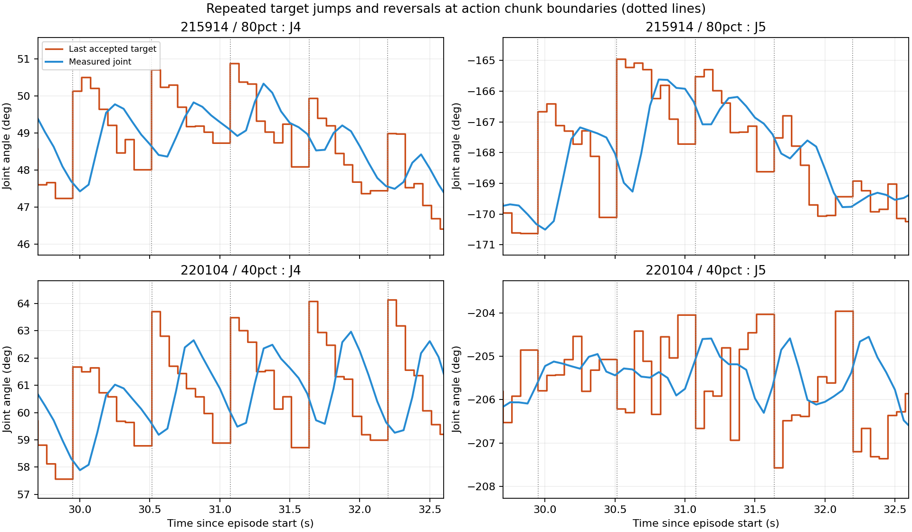
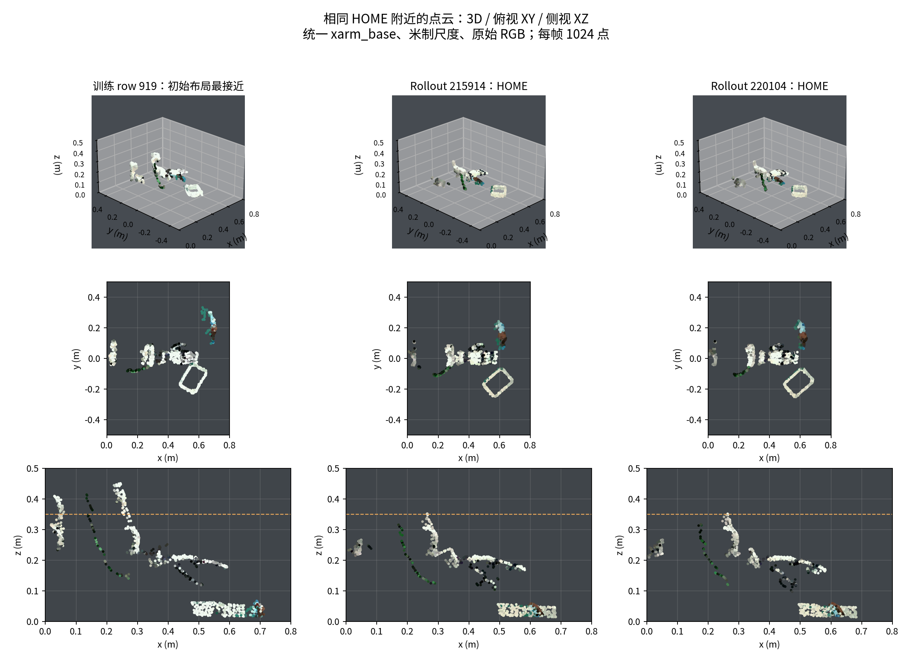
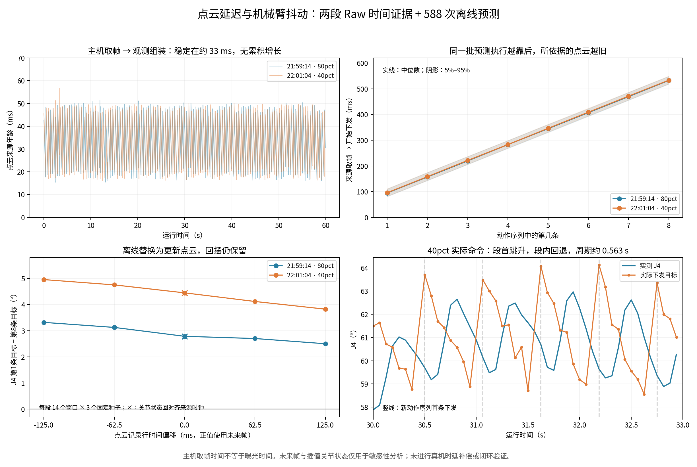
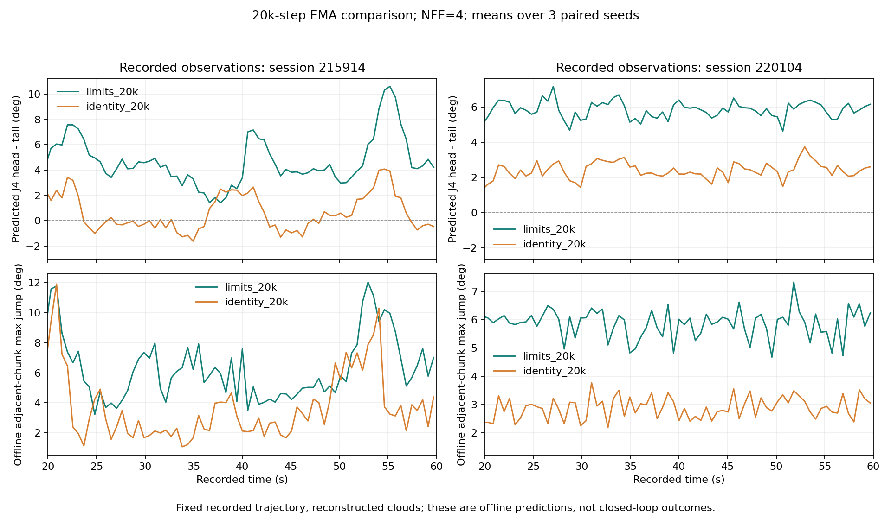

# ManiFlow 机械臂抖动诊断与点云归一化对照实验

记录日期：2026 年 10 月 11 日。任务：`pick_place_toy`。实验时间均按北京时间说明；原始 JSON 中的时间保留 UTC。

本报告汇总首次执行超时、随后两段机械臂持续抖动、训练与推理点云差异、延迟排查、时间戳修正，以及已经完成的 20k steps 点云归一化对照实验。

**当前最有力的解释是：策略在真实观测上反复输出“段首跳向一个方向、段内又回撤”的动作序列，重规划把这一模式周期性重复。训练与部署的点云分布存在明确差异，点云表示方式也会影响输出，但单一根因尚未完全分离。** 不使用点云输入归一化重新训练 20k steps 后，两段记录上的离线相邻动作块跳变量均下降；第二段仍持续回撤，尚不能宣称真机抖动或任务成功率已经改善。

## 1 主要结论与证据强度

| 问题 | 结论 | 证据范围 |
| --- | --- | --- |
| 首次 `deadline_expired` | 第一次 dispatch 内恢复机械臂 Mode 6，消耗了执行时限 | 原始异常明确为 `dispatch deadline expired after mode restoration`；与持续抖动是两个问题 |
| 持续抖动的直接机制 | 动作块之间的跳变与块内回撤反复发生，实测机械臂跟随产生周期运动 | 两段 Raw 的实际目标、关节反馈及重规划周期一致；离线预测也含回撤 |
| 点云是否与训练一致 | 数值处理配方一致，但可见机械臂几何、物体布局和颜色分布不同 | 训练 HOME 点云与 rollout 对比、相机视锥投影、输入替换实验 |
| 点云延迟是否为主因 | 延迟会改变回撤幅度；现有结果不支持它是主因 | 无持续积压；年龄相关性弱；换用更晚点云仍回撤。历史时间戳不能测全曝光到执行延迟 |
| 是否归一化参数错用或越界 | 已检查的样本不支持这两种解释 | 保存参数与训练统计精确一致；采样点云均在训练逐通道范围内；裁剪输出不变 |
| 不使用点云归一化是否更好 | 本次同预算实验改善了离线动作连续性，值得保留为候选模型 | 两段相邻动作块跳变量均值下降 41.0% 和 50.7%；只覆盖一个训练种子和两条固定观测流 |
| 是否已经解决真机抖动 | 尚未验证 | 新模型没有进行真实闭环 rollout；第二段离线 70/70 个窗口仍回撤 |

## 2 数据与实验设置

原模型实验目录：

```text
/home/zhanghaoyang/Desktop/dexmani_policy/experiments/maniflow/pick_place_toy/
2026-10-10_12-30-49-604382_8483dce6_1010
```

以下 session 均位于 `dexmani_real/rollouts/maniflow/pick_place_toy/2026-10-10_12-30-49-604382_8483dce6_1010/`。后文用末尾六位时间简称。

| Session | 当时运行的模型 | Raw 行数 | 已接受 dispatch | Query 数 | 结束原因 |
| --- | --- | ---: | ---: | ---: | --- |
| `session_20261010_214503` | 80pct EMA，80k steps | 3 | 0 | 1 | `executor_boundary`，首次下发超时 |
| `session_20261010_215914` | 80pct EMA，80k steps | 960 | 852 | 107 | 运行约 60 s 后 timeout |
| `session_20261010_220104` | 40pct EMA，40k steps | 957 | 849 | 107 | 运行约 59.80 s 后操作者停止 |

两段抖动记录都使用 `joint_state + point_cloud`，关节动作包含机械臂 7 维和手部 12 维。控制周期 62.5 ms，观测历史 2 帧，预测 horizon 16，每次执行 8 步，`sync` 模式，NFE=4，EMA 权重。用户观察到的主要抖动部位为机械臂。

训练数据为 `dexmani_policy/robot_data/pick_place_toy.zarr`，revision 为 `07ddf7f066fb463bbb554bd5ffa3b073`：60 个 episode、13,991 行、13,571 个有效训练窗口；`val_ratio=0`，没有正式验证集。点云为 `1024 × 6` 的 XYZRGB，XYZ 使用 `xarm_base` 米制坐标，RGB 在 `[0,1]`，模型内再选取 512 点。

历史 rollout 没有保存原始在线点云张量和完整预测张量。本次点云从 Raw 深度和压缩 RGB 视频重建，因此颜色不保证与当时在线输入逐位相同。训练数据抽查第 81、82、200 行，从原始数据重建的点云与 Zarr 精确一致。两段 rollout 的相机序号与点云来源相机序号在全部记录行一致。

证据：[原始 session 摘要](evidence/session_results.json)、[诊断汇总](evidence/rollout_findings.json)。

## 3 首次执行超时的原因与修正

首次运行的模型 warmup 约 19 ms，但实际首个 query 推理耗时约 29.29 ms。原始结果中的关键异常为：

```text
DispatchError: dispatch deadline expired after mode restoration
```

首次命令进入 `_send()` 时，机械臂仍需要从停止状态恢复 Mode 6。旧流程在这条命令的 deadline 内执行 `set_mode`、`set_state` 和就绪等待；恢复完成后再次检查 deadline，发现已经过期，于是停止本次 episode。Raw 保存了 3 行，实际接受的动作数为 0。

该次 dispatch 开始时已经比计划 slot 晚约 12.07 ms，dispatch 返回时晚约 30.80 ms，超过配置的 30 ms tick lateness。整个 dispatch 区间约 18.73 ms；这个区间不能全部归为 SDK 模式切换耗时，但异常位置已经明确指出恢复模式后的检查触发了退出。推理在 dispatch 前已经完成，单凭 warmup 速度无法排除这类启动路径超时。

当前修正将 `prepare_streaming()` 放到 episode 启动准备阶段，在启动策略时钟、正式进入运行状态之前恢复 Mode 6，然后重新检查观测与运动授权。准备过程中保留停止、授权撤销和异常清理检查；运行中仍执行原有 deadline 检查。

这一修正只调整启动工作的归属，不靠放宽执行时限、自动重试或额外平滑绕过失败。后续两段记录没有 dispatch 错误或 skipped slot，但出现持续抖动，因此不能把后续现象继续归因于首次恢复模式失败。

相关实现：[PolicyRunner](../../dexmani_real/deployment/runner.py)、[DexManiRobot](../../dexmani_real/robot/robot.py)、[xArm 驱动](../../dexmani_real/robot/drivers/xarm7.py)。这描述的是当前工作区实现，离线检查不能替代设备安全验证。

## 4 机械臂持续抖动的直接机制

### 4.1 抖动周期与动作块边界吻合

记录中的 sync 调度每次执行 8 个目标，块内间隔约 62.5 ms；下一轮推理包含一个 WAIT slot，所以相邻块首目标间隔为 `9 × 62.5 ms = 562.5 ms`，对应约 1.778 Hz。块尾到下一块首目标的下发间隔约 125 ms。

| 真实记录指标 | 215914，80pct | 220104，40pct |
| --- | ---: | ---: |
| 稳态 J4 速度主峰 | 1.775 Hz | 1.783 Hz |
| 块边界最大关节目标跳变中位数 | 3.304° | 4.726° |
| 块内相邻目标最大关节跳变中位数 | 0.849° | 0.966° |
| 20 s 后块首跳变与块内漂移方向相反的块数 | 65/70 | 70/70 |
| 20 s 后 J4 块首减块尾目标均值 | 2.516° | 4.751° |

“最大关节跳变”指每次相邻命令在 7 个机械臂关节上取绝对差的最大值，然后按指定样本统计。“方向相反”根据块首相对前块尾的 7 维跳变与本块首尾漂移的向量夹角判定。



图 1：橙色为最近已接受的目标，蓝色为实测关节，虚线为动作块边界。反复变化已经存在于下发目标中，机械臂反馈随之周期变化。

### 4.2 一个实际动作块

220104 的 query 55 附近，上一块尾部 J4 目标为 58.779°，query 观测时实测 J4 约 60.136°。随后实际下发：

```text
63.701 → 62.801 → 61.699 → 61.430
       → 60.878 → 60.575 → 59.965 → 58.881 度
下一块首目标：63.479 度
```

每次新预测先把目标推高，随后同一块又逐步回退；下一次预测再次推高。这能直接解释重复摆动。sync 的块边界和额外等待为这个模式提供重复周期，但还不能据此断言改变执行模式就能解决策略输出本身的问题。

排查显示：目标没有触发关节裁剪；持续执行期间没有每块重新进入 Mode 6；离线模型预测本身也含回撤。把 NFE 从 4 增加到 10、切换推理种子、比较 raw/EMA 和更晚 checkpoint，均没有稳定消除该模式。当前证据不支持将问题简单归结为触觉初始化、随机采样次数或底层伺服独立振荡。

证据：[原始动作指标](evidence/raw_rollout_metrics.json)、[离线推理步数对照](evidence/offline_nfe_comparison.json)。

## 5 Rollout 与训练样本的点云差异

### 5.1 数值处理配方一致

检查到的处理链为：深度对齐到彩色图 → 反投影 → 相机外参变换到 `xarm_base` → 桌面去除与工作空间裁剪 → 5 mm 体素及离群点过滤 → 确定性选取 1024 点 → 保存的归一化 → 模型 FPS 512 点。

训练与部署使用相同的数值配方，未发现 RGB/BGR 颠倒、米与毫米错用或模型输入关节顺序错误。参数配方一致并不能保证可见表面、场景布局和颜色分布一致。

### 5.2 同一 HOME 附近的可见机械臂几何明显改变

60 段训练数据的 HOME 机械臂姿态非常接近，最大偏差约 0.285°；训练第 0 行与 220104 HOME 的最大关节差仅约 0.000659°。即使姿态几乎相同，点云上部覆盖仍明显不同：

| HOME 点云指标 | 训练数据 | 215914 | 220104 |
| --- | ---: | ---: | ---: |
| 最高 z | 0.4475–0.4511 m | 0.3515 m | 0.3510 m |
| z > 0.35 m 的点数 | 84–154，中位数 118 | 3 | 2 |

将一个训练 HOME 点云投影到当前相机，1024 点中有 214 点落在图像上边界之外；其中 z > 0.35 m 的 131 点里，130 点已在当前视野之外。历史训练与当前标定变换的平移差范数约 136.4 mm，旋转差约 11.83°。

**已确认的是视角和可见几何改变。外参发生变化本身不等于当前标定错误**，也不能用一次历史标定数值作为当前设置必须满足的准入条件。



图 2：所有点云都按物理坐标显示，没有做配准来掩盖差异。训练 row 919 只是在 60 个 episode 首帧中低处场景较接近的例子，不代表整个训练集的最近样本。Rollout RGB 来自压缩视频。

### 5.3 目标物体仍进入模型输入

对约 30.44 s 的 row 487 检查模型实际 FPS 512 点，215914 中玩具和篮子分别保留约 55、100 点；220104 分别约 51、91 点。训练初始布局 row 919 对应约 63、107 点。这里的物体计数来自空间连通分量和外观核对，属于近似统计。

因此，问题不能解释为玩具或篮子被预处理完全滤掉。当前场景与该训练布局仍有位置差异，篮子和玩具中心约相差 4 cm、9 cm；当前物体颜色整体更暗，颜色差异还包含视频压缩影响。

### 5.4 输入敏感性实验

固定 query 55 的其他输入，只替换点云为某个训练样本，可改变 J4 首尾运动方向；只替换关节状态则没有相同效果：

| Probe | 215914，80pct | 220104，40pct |
| --- | ---: | ---: |
| 原 rollout 输入的 J4 首减尾 | +2.617° | +4.095° |
| 仅换为选定训练点云 | −4.036° | −2.532° |
| 保留 rollout 点云，仅换训练关节状态 | +2.502° | +4.103° |

正数表示本文定义的 J4 回撤；负数表示相反方向。两个 session 使用各自选定的训练样本：215914 为完整关节状态较近的 row 5834，220104 为机械臂状态较近的 row 82。这是输入敏感性探针，混合输入未必对应物理可实现状态，不能把该结果直接当作换相机后的闭环效果。

另对 7 个训练窗口，按当前相机视锥删除不可见训练点后，80pct EMA 的机械臂预测 MAE 从 0.224° 升至 1.058°，但全部窗口的 J4 首尾方向仍保持。这支持模型对可见几何敏感，却没有证明“仅丢失上部点云”足以造成实际回撤。

证据：[点云比较汇总](evidence/pointcloud_comparison.json)、[输入替换实验](evidence/observation_probes.json)。

## 6 点云延迟分析与时间戳修正

### 6.1 历史记录能测到的延迟

下表使用旧版主机取帧时间。它不是经过校准的曝光时刻，不能覆盖传感器内部、传输和 SDK 内部的全部延迟。

| 中位数指标 | 215914 | 220104 |
| --- | ---: | ---: |
| 全部记录行的取帧到观测组装 | 33.21 ms | 33.19 ms |
| 全部记录行的点云比机械臂状态旧多少 | 21.35 ms | 21.26 ms |
| 用于 query 的点云取帧到该块首次下发 | 94.81 ms | 96.12 ms |
| 用于 query 的点云取帧到该块最后下发 | 532.48 ms | 533.42 ms |
| 推理结束到该块首次下发 | 42.86 ms | 42.93 ms |

每个记录行都推进了相机来源序号，点云年龄未随运行持续增长，没有观察到队列不断积压。最后一步约 0.53 s 的观测年龄主要反映同一份预测执行 8 步的时间跨度，不应把它全部称为点云计算延迟。

20 s 后，点云年龄与块边界跳变的 Pearson 相关系数分别约 −0.043、0.102，与 J4 回撤分别约 0.122、−0.033。相关性弱只能说明这两段记录中没有明显同步变化，不能排除固定时延的影响。

### 6.2 改变点云时间的离线探针

每段选 14 个稳态窗口，每个窗口 3 个配对种子，共测试 7 种变体、两段合计 588 次预测。下表为 J4 首减尾均值：

| 点云或状态变体 | 215914，80pct | 220104，40pct |
| --- | ---: | ---: |
| 点云提前取 2 个记录行 | 3.322° | 4.959° |
| 点云提前取 1 个记录行 | 3.129° | 4.756° |
| 原始对应关系 | 2.789° | 4.451° |
| 使用后 1 个记录行的点云 | 2.704° | 4.121° |
| 使用后 2 个记录行的点云 | 2.504° | 3.828° |
| 关节状态插值回点云的旧主机时间 | 2.788° | 4.451° |
| 选离机械臂状态时间最近的点云 | 2.645° | 4.398° |

这里的“记录行”按 16 Hz 控制记录索引移动；实际相机帧时间差受 30 Hz 来源采样影响，不恒等于 62.5 ms 的整数倍。更新点云会减小平均回撤，但所有变体中，每段 14 个窗口的种子平均值仍全部回撤。使用未来帧和插值状态只用于离线探针，不是可直接部署的补偿机制。



图 3：延迟、块内观测年龄和时间移动实验。左下图横轴是名义记录行偏移，实际点云来源时差见结果 JSON。

### 6.3 已实施的时间戳优化

时间戳优化的目的，是让观测新鲜度和延迟分解反映数据来源，便于判断真实瓶颈。主要变化为：

1. 分别记录深度和彩色帧的 SDK 时间与时钟域。SDK 为 global/system 时间时，通过成对采样的主机 realtime 与 monotonic 映射为 monotonic；只有 hardware clock 时保留主机接收时间，并明确记录时钟域与原始值。
2. RGB-D 与点云使用两个通道中较旧的来源时间；重复帧保留原来源时间，回退、无效或未来时间被拒绝，单通道停滞仍可检测。点云处理结束不会把旧数据重新标成新观测。
3. 沿现有相机、点云、观测、录制链传递接收、发布与处理开始时间，支持拆分流水线等待和计算耗时。历史 Raw 未记录的部分返回缺测，不补成 0，也不回写历史数据。

实现复用现有时钟与数据结构，没有新增时钟拟合子系统、线程或队列，也没有放宽 freshness 限制。来源时间更准确后，测得的数据年龄可能增大，这是原先未计入的年龄被显露，不能直接解释为性能变差。

21 项纯离线检查已通过，包括时间域映射、重复与回退帧、过旧观测、停滞检测，以及 recorder 到 HDF5/视频再到 reader 的往返检查。这些检查没有连接真实设备；SDK 时间与曝光时刻的实际关系、不同设备时钟行为和真实闭环效果仍需验证。

证据：[延迟统计与 probe](evidence/latency_summary.json)、[时间戳检查日志](evidence/timestamp_checks.log)。实现入口：[RealSense](../../dexmani_real/sensor/camera/realsense.py)、[相机 worker](../../dexmani_real/sensor/camera/worker.py)、[点云 worker](../../dexmani_real/sensor/pointcloud_worker.py)、[Raw reader](../../dexmani_real/recording/storage/reader.py)。

## 7 点云归一化的作用

### 7.1 未发现保存参数错配或采样点云越界

原 ManiFlow 使用训练集拟合后固定的逐通道仿射变换，不是每帧重新居中或缩放。XYZ 的 scale 约为 `[2.5000, 2.0055, 4.2411]`，RGB 的 scale 为 2、offset 为 −1。

40pct 与 80pct checkpoint 的点云归一化参数完全相同，与训练有效观测行重新计算结果精确一致。每段抽查的 84 帧稳态点云和另外 22 帧分布于不同 query 的点云均位于训练逐通道 min/max 范围内；将 XYZ 裁回这些范围，所有测试预测完全不变。

这排除了所检查样本上的数值越界解释，**不能排除点云联合分布偏移**。相同坐标范围内依然可以有不同的可见机械臂部分、遮挡、物体布局与颜色。

### 7.2 归一化会改变模型实际看到的表示

归一化位于 FPS、PointNet 与 XYZ 位置编码之前。XYZ 不同轴的缩放改变 FPS 的距离度量，也改变固定正弦位置编码对应的物理空间频率。

当前最高位置编码频率在 XYZ 上对应的物理波长约为 19.63、24.48、11.57 mm；原始米制坐标下约为 49.09 mm。2 mm 的 z 扰动对应最高频率相位变化约从 1.086 rad 降为 0.256 rad。这给出了表示敏感性可能变化的机制，但不能单凭相位计算认定它造成了抖动。

只把 FPS 距离改为原始 XYZ、继续给原模型输入其训练时的归一化表示，14 窗口 × 3 种子的平均 J4 回撤仍为约 2.956°、4.445°，没有消失。因此 FPS 的距离变化不能单独解释已观察到的问题。

真正关闭点云归一化需要重新训练。对旧 checkpoint 直接取消或重拟合输入归一化会改变其训练时的输入语义，不能用于判断这种训练方案的优劣。本次使用已有配置 `normalization.point_cloud: identity`，对 XYZRGB 六个通道全部取消输入仿射变换；RGB 保持 `[0,1]`，关节和动作归一化及网络内部 LayerNorm 保留。

证据：[重训练前的归一化诊断快照](evidence/normalization_before_retraining.json)。该历史 JSON 中的“未进行重训练”只描述当时阶段；已经完成的后续实验如下。

## 8 已完成的 20k steps 对照实验

### 8.1 控制变量与训练状态

新实验目录为：

```text
/home/zhanghaoyang/Desktop/dexmani_policy/experiments/maniflow/pick_place_toy/
2026-10-10_23-30-00_pc_identity_20k_seed1010
```

| 项目 | 设置 |
| --- | --- |
| 训练起点 | 从头训练，seed 1010 |
| 改变的研究变量 | `normalization.point_cloud: limits → identity` |
| 实际预算 | 严格完成 20,000 次 optimizer update |
| 学习率计划 | 保留原 100k steps cosine schedule 的前 20k 段，通过 `max_updates=20000` 截止 |
| 其他设置 | 同 dataset revision、数据配方、架构、optimizer、dataloader、EMA；关节与动作归一化参数相同 |
| 基线 | 原实验的 20k checkpoint，同样使用 EMA |
| 离线推理 | NFE=4，CUDA float32；每个 query 使用配对种子 0、1、2 |
| 完成状态 | `job_status.json` 为 `complete`，`completed_updates=20000` |

因此，本实验比较的是同一学习率计划、相同更新数下的两种表示；它不是把 cosine schedule 压缩到 20k 并衰减到零的另一种实验。原始 40k/80k 真机记录用于提供观测流，新旧候选模型的公平对照都使用 20k 权重。

训练与离线评估控制任务于北京时间 2026-10-10 23:35:46 启动，2026-10-11 00:34:03 完成，总计约 58 分钟。新权重为：

```text
checkpoints/epoch=0188-step=00020000-milestone=20pct.pt
```

证据：[实验协议](evidence/identity20k_protocol.json)、[配置与输入核对](evidence/identity20k_preflight.json)、[完成状态](evidence/identity20k_job_status.json)。

### 8.2 评估范围与指标定义

每个 session 使用全部 107 个已记录 query，每个 query 重建两帧点云，共 214 个来源帧，配合当时实际关节状态。主要稳态统计限定在 20 s 后的 70 个完整动作块，每个模型、每段对应 210 次预测。

主要指标为：

- **J4 首尾绝对差**：每个预测块第一条与第八条 J4 目标差的绝对值，再对窗口和种子求均值。它是块内净运动大小，不是实测抖动幅度，也不是完整路径长度。
- **相邻块最大关节跳变**：同一种子下，下一个预测块的首目标与上一个预测块的尾目标之差，在 7 个机械臂关节上取最大绝对值，再统计均值。这是固定历史观测上的离线动作连续性指标。
- **段首到实测状态差**：预测首目标相对该 query 最新实测机械臂关节的最大绝对差，再取均值。

历史 rollout 动作来自失败策略，不是专家正确动作；本次没有把它们当作监督标签评估新模型“准确率”。这些指标也不等同于新策略驱动机器人后产生的轨迹。

### 8.3 连续性结果

| 观测流 | 指标 | limits 20k | identity 20k | 变化 |
| --- | --- | ---: | ---: | ---: |
| 215914 | J4 首尾绝对差均值 | 4.723° | 1.302° | 降低 72.4% |
| 215914 | 相邻块最大关节跳变均值 | 6.253° | 3.687° | 降低 41.0% |
| 220104 | J4 首尾绝对差均值 | 5.844° | 2.412° | 降低 58.7% |
| 220104 | 相邻块最大关节跳变均值 | 5.851° | 2.884° | 降低 50.7% |

这说明本次 identity 训练改善了两条已记录观测流上的平均动作连续性。仍需同时看到以下结果：

- 215914 的 identity 有符号 J4 首减尾均值只有 0.640°，但绝对差均值为 1.302°。正负方向相互抵消，所以不能只用 0.640° 描述运动幅度；70 个窗口中有 38 个种子平均值仍为回撤。
- 220104 的 identity 在 70/70 个窗口仍回撤。段首到实测机械臂状态的最大关节差均值还从 2.985° 增至 4.282°，说明块间更连续并不自动意味着起始跟踪更好。
- 215914 相邻块跳变的 P95 从 11.005° 降到 8.607°；220104 从 6.969° 降到 3.834°。部分大跳变依然存在。



图 4：上排显示有符号 J4 首减尾，下排显示相邻块最大关节跳变；曲线为每个窗口的三个配对种子均值。图中的观测时间来自旧 rollout，曲线不是新模型的实测运动。绝对差统计以上表为准。

### 8.4 拟合与噪声检查

| 补充指标 | limits 20k | identity 20k | 解读 |
| --- | ---: | ---: | --- |
| 24 个训练窗口机械臂预测 MAE | 0.559° | 0.572° | 接近，属于训练内抽查 |
| 1 段未参与训练旧视角示教的 8 个有效窗口 MAE | 5.690° | 5.252° | 略降，但仍较大；不是正式 holdout 基准 |
| 215914 加入 2 mm XYZ 噪声后的预测变化 MAE | 0.251° | 0.237° | 略降 |
| 220104 加入 2 mm XYZ 噪声后的预测变化 MAE | 0.209° | 0.219° | 略升 |

噪声检查使用每段 14 个指定窗口和 3 个配对推理种子，在 FPS 前加入同样的 2 mm Gaussian XYZ 扰动。结果没有显示一致的抗噪收益，因此“取消归一化主要通过降低位置编码噪声放大解决抖动”仍只是未被确认的机制解释。

未参与训练的旧视角示教为 `episode_20260827_195951`，因第 157 行触觉非有限值而整段排除；这里只读取 8 个模型输入和动作有限的窗口作为诊断，没有把该 episode 重新加入训练，也没有修改 Raw。

完整数值：[20k 评估结果](evidence/identity20k_assessment.json)。只完成一个训练种子的对照，三个推理种子不等于三个独立训练重复；相关窗口也不能当作独立任务试验来计算成功率或因果显著性。

## 9 当前处理策略与待验证项

启动准备与执行时限分离、点云来源时间准确传递，都是边界清楚的小改动；二者分别解决启动路径超时和延迟可观测性。identity 模型使用现有配置重新训练，没有增加模型分支或部署框架。

现阶段保留 identity 20k 作为有证据支持的候选模型，但根因研究仍需区分可见几何变化、RGB 表示变化、XYZ 位置编码和训练分布覆盖。当前实验证明了六通道 identity 这一整体改变有离线收益，尚未分离其中各项贡献。

后续优先事项为：

1. 在获得独立真机执行授权后，对当前视角下的 limits 20k 与 identity 20k 做一致条件的短程闭环对照，同时记录任务进展、段首跳变、实际关节运动和新的来源时间。已有离线结果不能替代这一步。
2. 补充当前视角和任务布局的有效示教与独立验证样本，检验数据覆盖问题；相机设置变化后确认当前标定，而非强行恢复历史外参数值。
3. 若仍需分离归一化机制，再做同预算、同数据的 XYZ 与 RGB 分开消融或训练重复。此项属于后续实验，没有在本次追加训练。

暂不加入额外 smoothing、自动重试、时延补偿或控制增益调整。这些改动会改变实验系统，且目前还没有证据确定它们是最小有效修复。

## 10 原始来源与复现入口

本目录的 `evidence/` 保存关键结果快照，`figures/` 保存报告插图；[归档清单](evidence/manifest.json) 记录文件来源和 SHA-256。历史结果文件中的阶段性 scope/limitations 保留原文，当前结论以本报告各节所述范围为准。

| 来源 | 路径或用途 |
| --- | --- |
| 原始失败和抖动数据 | 前述三个 session 的 `episode_001/data.h5`、`rgb.mp4`、`run_config.yaml`、`session_result.json` |
| 原始模型配置与基线权重 | `dexmani_policy/experiments/maniflow/pick_place_toy/2026-10-10_12-30-49-604382_8483dce6_1010/` |
| 训练数据 | `dexmani_policy/robot_data/pick_place_toy.zarr`，revision 见第 2 节 |
| 新模型配置 | 新实验目录下 `config.yaml` 与 `train_identity_20k.yaml` |
| 离线输入与来源索引 | 新实验目录下 `offline_eval/inputs/inputs.json` 及各 `.npz` |
| 全部离线预测 | 新实验目录下 `offline_eval/results/predictions.npz` |
| 评估与统计程序 | 新实验目录下 `offline_eval/scripts/prepare_inputs.py`、`evaluate.py`、`assess_results.py` |
| 最终统计与矢量图 | 新实验目录下 `offline_eval/results/assessment.json`、`rollout_comparison.svg` |

早期诊断以 CPU、NFE=4 为主，20k 对照使用 CUDA float32 和配对种子；各节保持各自协议，不能把不同章节的绝对值混为同一重复实验。原始失败记录、已发布 Raw、训练数据和已有 checkpoint 均作为证据保留；本次整理没有执行真实设备连接或新的 rollout。
